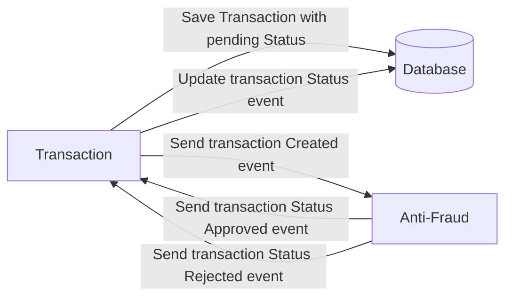

# YAPE CHALLENGE RESOLVED

## Technologies used

- NestJS
- TypeORM
- Kafka
- Zookeeper
- Docker
- GraphQL
- Dataloader (For GraphQL)
- Redis (For data cache)

Also both services have unit tests.

## Install

Just run `docker-compose up -d` this will run the following docker projects:

- Transaction Service (NestJS)
- Anti fraud micro service (NestJS)
- Postgres
- Kafka
- Zookeeper
- Redis

If you don't want to run the services at once run `docker-compose -f docker-compose-db-only.yml up -d` then go to `anti_fraud-microservices` and `transaction-microservices` to run `npm install` and `npm start`.

`(This docker composer was tested on windows 11 and Ubuntu 20)`

## Usage

This app uses GraphQL, the app will run on the port 2000 go to `http://[::1]:2000/graphql` to use the playground:

### Create a transaction

```graphql
mutation CreateTransaction($data: CreateTransactionInput!) {
  transaction(data: $data) {
    transactionExternalId
    transactionStatus {
      name
    }
    transactionType {
      name
    }
    value
  }
}
```

With the query variables:

```json
{
  "data": {
    "value": 111111545,
    "tranferTypeId": 1,
    "accountExternalIdDebit": "some-guid",
    "accountExternalIdCredit": "some-guid"
  }
}
```

`PSA: There is only 2 types of transactions 1 or 2.`

### Get a transaction

```graphql
query GetTransaction {
  transaction(transactionExternalId: "guid-of-generated-transaction") {
    transactionExternalId
    value
    transactionStatus {
      name
    }
    transactionType {
      name
    }
    createdAt
  }
}
```

Where the `transactionExternalId` is the GUID of the generated transaction.

### Get all transactions

```graphql
query GetTransactions {
  transactions {
    transactionExternalId
    value
    transactionStatus {
      name
    }
    transactionType {
      name
    }
    createdAt
  }
}
```

`PSA: The is an env file that is pushed only for the purpose of this challenge.`

# Yape Code Challenge :rocket

Our code challenge will let you marvel us with your Jedi coding skills :smile:.

Don't forget that the proper way to submit your work is to fork the repo and create a PR :wink: ... have fun !!

- [Problem](#problem)
- [Tech Stack](#tech_stack)
- [Send us your challenge](#send_us_your_challenge)

# Problem

Every time a financial transaction is created it must be validated by our anti-fraud microservice and then the same service sends a message back to update the transaction status.
For now, we have only three transaction statuses:

<ol>
  <li>pending</li>
  <li>approved</li>
  <li>rejected</li>  
</ol>

Every transaction with a value greater than 1000 should be rejected.



# Tech Stack

<ol>
  <li>Node. You can use any framework you want (i.e. Nestjs with an ORM like TypeOrm or Prisma) </li>
  <li>Any database</li>
  <li>Kafka</li>
</ol>

We do provide a `Dockerfile` to help you get started with a dev environment.

You must have two resources:

1. Resource to create a transaction that must containt:

```json
{
  "accountExternalIdDebit": "Guid",
  "accountExternalIdCredit": "Guid",
  "tranferTypeId": 1,
  "value": 120
}
```

2. Resource to retrieve a transaction

```json
{
  "transactionExternalId": "Guid",
  "transactionType": {
    "name": ""
  },
  "transactionStatus": {
    "name": ""
  },
  "value": 120,
  "createdAt": "Date"
}
```

## Optional

You can use any approach to store transaction data but you should consider that we may deal with high volume scenarios where we have a huge amount of writes and reads for the same data at the same time. How would you tackle this requirement?

You can use Graphql;

# Send us your challenge

When you finish your challenge, after forking a repository, you **must** open a pull request to our repository. There are no limitations to the implementation, you can follow the programming paradigm, modularization, and style that you feel is the most appropriate solution.

If you have any questions, please let us know.
