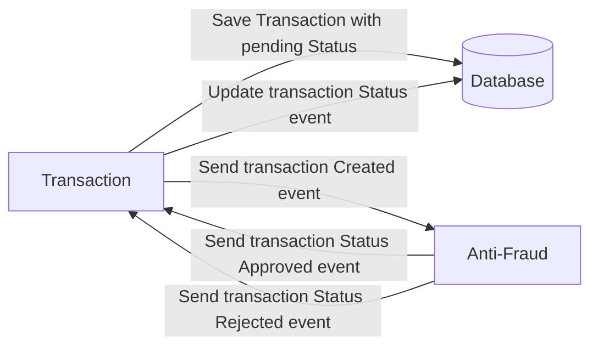
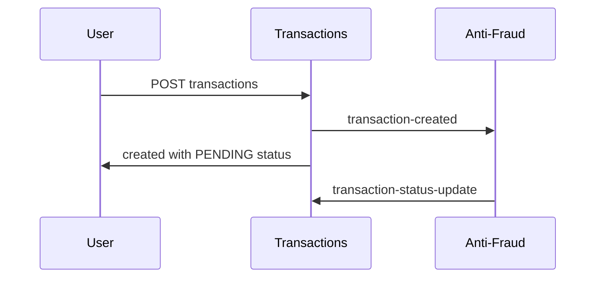
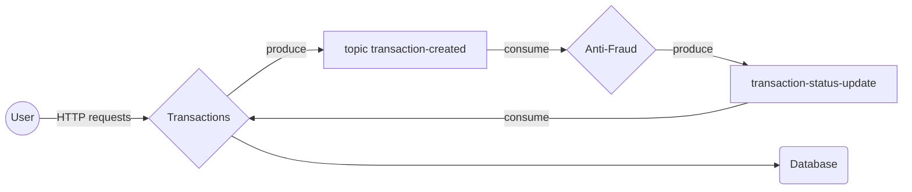

# KAFKA / NEST - transaction microservice
<a name="readme-top"></a>


<!-- PROJECT LOGO -->
<br />


<!-- ABOUT THE PROJECT -->
## About The Project


This project focuses on developing and implementing a robust anti-fraud microservice for financial transactions. The primary role of this service is to ensure the integrity and security of each transaction that occurs within our system. The service operates by validating every transaction created, followed by sending a feedback message that updates the transaction's status accordingly.
## Key Features

1.  **Transaction Validation**: Every financial transaction initiated within this system is subjected to a validation process.
    
2.  **Status Update Mechanism**: Upon completion of the validation process, our anti-fraud microservice communicates back with the system to update the status of each transaction. 
    
3.  **Transaction Status Categories**: For ease of understanding and efficient tracking, we have categorized transaction statuses into three distinct types:
    
    -   **Pending**: This status indicates that the transaction is currently under validation. It’s a temporary state while the transaction is being evaluated.
    -   **Approved**: Transactions that successfully pass our validation checks are marked as approved. This status signifies that the transaction is legitimate and has been processed.
    -   **Rejected**: In cases where a transaction fails to meet our validation criteria, it is marked as rejected. This status is crucial in flagging potentially fraudulent or problematic transactions.
    
4.  **Value-Based Rejection Criterion**: As part of our anti-fraud measures, any transaction exceeding the value of 1000 is automatically rejected. This threshold is set to mitigate high-value fraud risks and maintain financial security within our system.

<p align="right">(<a href="#readme-top">back to top</a>)</p>


### Built With


**NestJS Framework**: We utilize NestJS, a progressive Node.js framework for building efficient and scalable server-side applications. It is an excellent choice for this project due to its powerful combination of TypeScript and object-oriented programming principles.
    


**TypeScript**: The entire codebase is written in TypeScript, a language that builds on JavaScript by adding static type definitions. TypeScript's strong typing allows us to catch errors early in the development process, enhancing code quality and maintainability.


**Kafka for Inter-Service Communication**: Apache Kafka, a distributed event streaming platform, is employed for communication between microservices. Kafka provides high-throughput, fault-tolerant messaging, and enables decoupling of data streams and systems.


**Zookeeper**: We utilize Apache Zookeeper for managing our Kafka cluster. Zookeeper plays a critical role in coordinating the Kafka brokers and ensuring reliable messaging. It is essential for maintaining the cluster's state, configuration, synchronization, and naming registry.
    


**MySQL Database with Prisma ORM**: For data persistence, we rely on a MySQL database, known for its reliability and widespread use. We integrate Prisma ORM (Object-Relational Mapping) to interact with the database. Prisma ORM offers a powerful query builder, type safety, and an intuitive approach to database management, streamlining our data handling processes.
    

<p align="right">(<a href="#readme-top">back to top</a>)</p>


<!-- GETTING STARTED -->
## Getting Started


### Installation

First you must start kafka and zookeeper with 

  ```sh
  docker-compose up
  ```

This will also run kafDrop for kafka metrics on your port 9000


1. Clone the repo
   ```sh
   git clone https://github.com/hoxito/transactionsChallenge.git
   ```
3. If you want to run the app in your computer install NPM packages
   ```sh
   npm install
   ```
4. Rename the file .env.example to .env and modify it if you are running your own database service.
   ```sh
   mv .env.example .env
   ```
5. You can start both microservices conteinerized by building and running them with:
(in the transaction microservice folder)
```sh
docker build -t transaction-microservice .
```
(in the antifraud microservice folder)
```sh
docker build -t antifraud-microservice .
```
6. After you've built them, you can start the entire system by running

```sh
 docker-compose up -d

```
7. you will need to create and seed the database by running 
(in transactions folder)

```sh
npx prisma migrate dev
npm run prisma:seed
```


<p align="right">(<a href="#readme-top">back to top</a>)</p>


<!-- USAGE EXAMPLES -->
## Usage

You can test the transaction creation by creating a new External transaction.
This type of transaction is ment to transfer money between 2 external account that are not present in our system so it will not check if those accounts exist.
The request would be:

POST http://localhost:3000/transactions

headers: (no headers required yet)

body:
{
  "accountExternalIdDebit": "asd",
  "accountExternalIdCredit": "asdasd",
  "tranferTypeId": 2,
  "value": 120.12
}

Its very important to write transfer type with id 2 (external).

Else if you want to try with an internal transaction you can execute the next request:

POST http://localhost:3000/transactions

headers: (no headers required yet)

body:
{
  "debitAccountId": "balance1u1",
  "creditAccountId": "balance1u2",
  "tranferTypeId": 1,
  "value": 120.12
}

Then you can check transaction status by doing

GET http://localhost:3000/transactions/:id

If everything went right, it should have APPROVED status.

You can try stopping the antifraud microservice on your docker manager and then execute another transaction.
When fetching its status it should show something like this:

{
  "transaction": {
    "transactionId": "3383eac4-3194-4ada-a387-e0810b0e0341",
    "amount": "120.12",
    "account_id_debit": null,
    "account_id_credit": null,
    "external_account_id_debit": "balance1u1",
    "external_account_id_credit": "balance1u",
    "createdAt": "2024-01-30T21:58:23.122Z",
    "deletedAt": null,
    "snapshotId": null,
    "transactionTypeId": null
  },
  "status": {
    "TransactionStatusId": "4508b76a-2fd4-4f5c-839a-926737c7ac8e",
    "from": "2024-01-30T21:58:23.122Z",
    "To": null,
    "transactionId": "3383eac4-3194-4ada-a387-e0810b0e0341",
    "statusTransactionId": "PENDING"
  }
}
indicating its pending status.
Finally you can start the service again and check its status one last time.

<p align="right">(<a href="#readme-top">back to top</a>)</p>


<!-- ROADMAP -->
## Roadmap

- [ ] Add microservices replicas
- [ ] Add authentication
- [ ] Add metrics like graphana
- [ ] Add tests
- [ ] Add Debit Account funds verification
- [ ] Add Payouts
- [ ] Add webhook for transaction approval
- [ ] Add CI/CD
- [ ] Add HelthCheck between microservices


See the [open issues](https://github.com/othneildrew/Best-README-Template/issues) for a full list of proposed features (and known issues).

<p align="right">(<a href="#readme-top">back to top</a>)</p>


<!-- LICENSE -->
## License

Distributed under the MIT License. See `LICENSE.txt` for more information.

<p align="right">(<a href="#readme-top">back to top</a>)</p>


<!-- CONTACT -->
## Contact

Jose Aranciba - [@josearanciba](https://www.linkedin.com/in/jose-aranciba) - email@example.com


<p align="right">(<a href="#readme-top">back to top</a>)</p>


## UML diagrams

System architechture:
  




And this will produce a flow chart:


