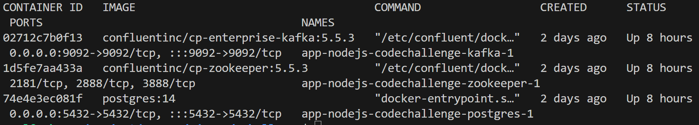
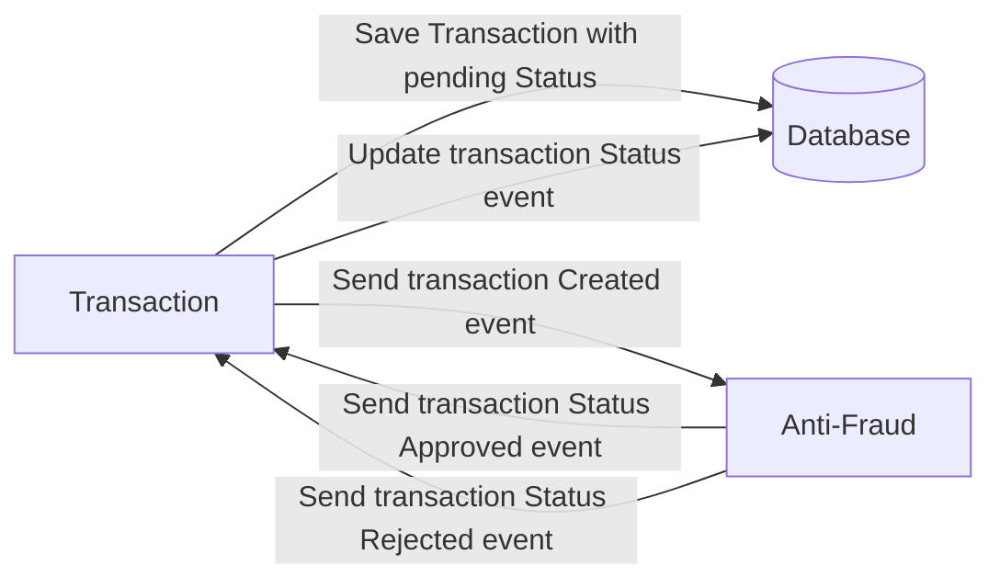
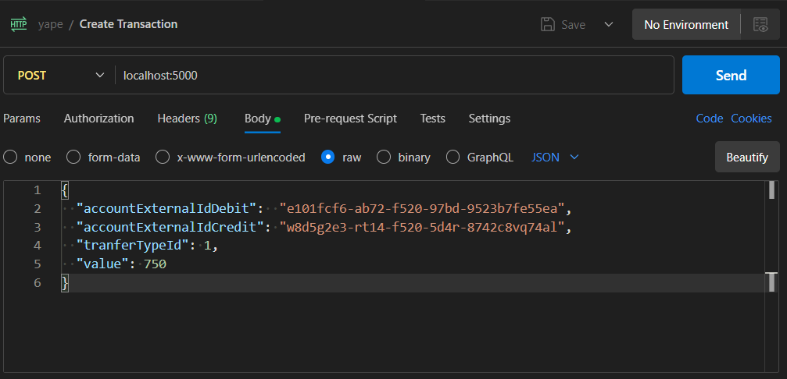
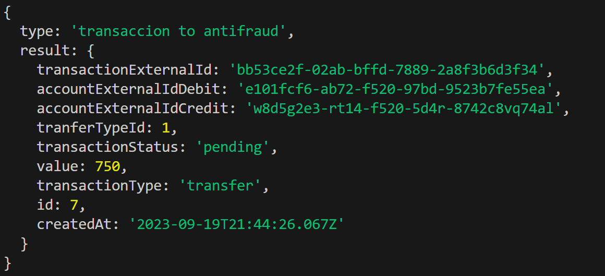
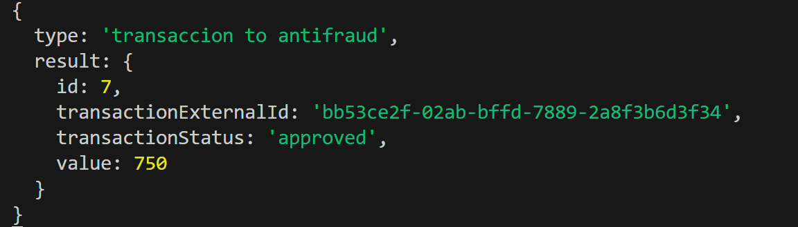
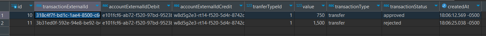

# Yape Code Challenge

## Install

### Levantar los contenedores

Nos ubicamos dentra de la carpeta donde esta docker-compose.yml eliminados los contenedor si los hay y luego levantamos

Kafka

postgress

```sh
docker-compose rm
docker-compose up
```



### Create topics in kafka

<b>created-transaction-event</b>: Evento de creación de transacciones

<b>update-status-transaction-event</b>: Evento de actualizar la transacción despues de pasar por Antifraud

```sh
docker exec -it app-nodejs-codechallenge-kafka-1 kafka-topics --create --topic created-transaction-event --partitions 1 --replication-factor 1 --bootstrap-server localhost:9092

docker exec -it app-nodejs-codechallenge-kafka-1 kafka-topics --create --topic update-status-transaction-event --partitions 1 --replication-factor 1 --bootstrap-server localhost:9092
```

### Instalando las librerias

```sh
npm install
```

### Creando la tabla transaction

```sh
npm run migration:generate --name=CREATE_TRANSACTION
npm run migration:run
```

## Estructura del proyecto

<b>Antifraud</b>

Modulo antifraud que valida el monto de la transacción menor 1000, esta atento del evento del registro de una transacción, este lo procesa y envia un evento para su actualización si fue approved o rejected

<b>Transaction</b>

Modulo que envia el evento de nueva transacción al modulo Antifraud ademas tambien procesa la actualización de la transacción de acuerdo al mensaje que procesa el modulo de AntiFraud, esto actualiza la data en el postgres

<b>config</b>

Acceso y conexion a la base de datos

<b>dtos</b>

Objetos de tranferencias de datos

<b>entities</b>

Entidades del negocio

<b>kafka</b>

Integra los servicios de consumer y producer de AntiFraud y Transaction

<b>services</b>

Contiene el proceso de la actualización del status de la transaccion


## Tabla de transacciones en postgres

## Flujo de datos



## Evidencias

Envio desde postman

```sh
{
  "accountExternalIdDebit":  "e101fcf6-ab72-f520-97bd-9523b7fe55ea",
  "accountExternalIdCredit": "w8d5g2e3-rt14-f520-5d4r-8742c8vq74al",
  "tranferTypeId": 1,
  "value": 750
}
```



Muestra de log





Base da datos




## Anexos

Revisar los mensajes que se envia por cada topico

```sh
docker exec -it app-nodejs-codechallenge-kafka-1 kafka-console-consumer --topic created-transaction-event --from-beginning --bootstrap-server localhost:9092

docker exec -it app-nodejs-codechallenge-kafka-1 kafka-console-consumer --topic update-status-transaction-event --from-beginning --bootstrap-server localhost:9092
```

Lista de topicos
```sh
docker exec app-nodejs-codechallenge-kafka-1 kafka-topics \
  --list \
  --zookeeper zookeeper:2181
```

Eliminación de mensajes por topicos
```sh
docker exec app-nodejs-codechallenge-kafka-1 kafka-topics \
  --delete \
  --zookeeper zookeeper:2181 \
  --topic update-status-transaction-event

docker exec app-nodejs-codechallenge-kafka-1 kafka-topics \
  --delete \
  --zookeeper zookeeper:2181 \
  --topic created-transaction-event
```
