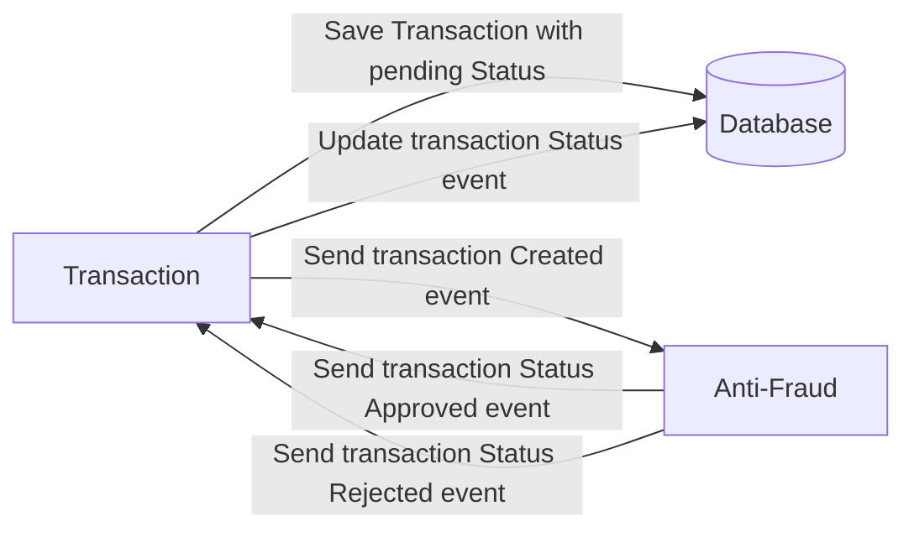

# Yape Code Challenge - TORRES CAMA JULIO CESAR

- [Problem](#problem)
- [Tech Stack](#tech_stack)
- [Usage](#usage)


# Problem

Every time a financial transaction is created it must be validated by our anti-fraud microservice and then the same service sends a message back to update the transaction status.
For now, we have only three transaction statuses:

<ol>
  <li>pending</li>
  <li>approved</li>
  <li>rejected</li>  
</ol>

Every transaction with a value greater than 1000 should be rejected.



# Tech Stack

<ol>
  <li>NestJS + Graphql</li>
  <li>PostgresQL</li>
  <li>Kafka</li>    
</ol>

You must have two resources:

1. Resource to create a transaction:

```gql
mutation CreateTransaction {
    createTransaction(input:  {
            accountExternalIdDebit: "3ED351C6-B3A3-423C-A002-A6AB8772BFB4"
            accountExternalIdCredit: "CCA26FC4-F987-4992-8C90-FD5AA13AAD21"
            transferTypeId: 1
            value: 100
        }) {
        accountExternalIdDebit
        accountExternalIdCredit
        value
        createdAt
        transactionExternalId
    }
}


```

2. Resource to retrieve a transactions
```gql
query GetTransactions {
    getTransactions {
        accountExternalIdDebit
        accountExternalIdCredit
        transferTypeId
        value
        status
        transactionExternalId
    }
}

```

# Usage

Project was developed with pnpm but the commands are the same

1. Initialize the container environment

```
docker compose up
```

2. Initialize the microservices

```
cd antifraud-validator
npm run start
```

```
cd transaction-processor
npm run start
```

3. Example transactions are in postman `Transaction Schema gq.postman_collection`

Create Transaction


Query

