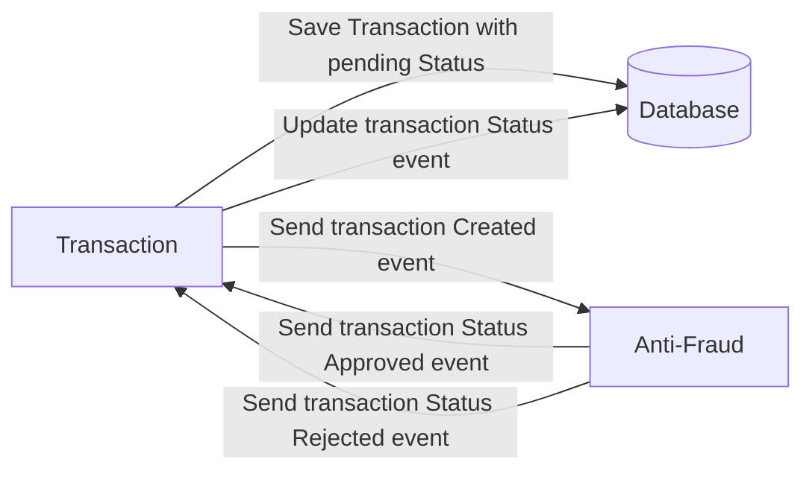

# Yape Code Challenge Solution :rocket:

# Run Solution With Docker
To run the solution using Docker, use the following command:
```bash
   docker compose up -d
```
### Note:
The first time after building the images, the transaction.rejected topic may take a while to rebalance. This topic is configured to read all unread events as soon as it connects.

If you'd rather not wait for this rebalancing process to complete, you can quickly start using the following command:

```bash
   docker compose down && docker compose up -d
```

# Run Solution Locally
### Set Up Environment Variables
Configure the environment variables based on the examples provided in the .env.example files for each microservice located in /apps.

### Install node-rdkafka Requirements
Before running the solution locally, ensure that you've met the requirements for node-rdkafka. You can find detailed installation instructions and requirements in the [node-rdkafka](https://github.com/Blizzard/node-rdkafka#readme) documentation.

### Run
```bash
 pnpm install
 pnpm run dev
```

### Run Test
```bash 
  pnpm run test
```

### Run Test With coverage
```bash 
  pnpm run test:coverage
```

# Queries Example

``` graphql
# Create Transaction
mutation Mutation($input: CreateTransactionUseCaseInput!) {
  createTransaction(input: $input) {
    transactionExternalId
    transactionStatus {
      name
    }
    transactionType {
      name
    }
    value
    createdAt
  }
}

# Retreive Transaction
query RetrieveTransaction($externalId: String!) {
  retrieveTransaction(externalId: $externalId) {
    transactionExternalId
    transactionStatus {
      name
    }
    transactionType {
      name
    }
    value
    createdAt
  }
}
```

### Data Example
Create Transaction
```json
{
    "input": {
        "accountExternalIdCredit": "0e153aae-bf3c-4293-9bdb-f117102e58b1",
        "accountExternalIdDebit": "0e153aae-bf3c-4293-9bdb-f117102e58b1",
        "tranferTypeId": 3,
        "value": 12
    }
}
```

Retreive Transaction
```json
{
  "externalId": "f9df46066be6459bba27ab9b3928b622"
}
```


# CHALLENGE
Our code challenge will let you marvel us with your Jedi coding skills :smile:. 

Don't forget that the proper way to submit your work is to fork the repo and create a PR :wink: ... have fun !!

- [Problem](#problem)
- [Tech Stack](#tech_stack)
- [Send us your challenge](#send_us_your_challenge)

# Problem

Every time a financial transaction is created it must be validated by our anti-fraud microservice and then the same service sends a message back to update the transaction status.
For now, we have only three transaction statuses:

<ol>
  <li>pending</li>
  <li>approved</li>
  <li>rejected</li>  
</ol>

Every transaction with a value greater than 1000 should be rejected.



# Tech Stack

<ol>
  <li>Node. You can use any framework you want (i.e. Nestjs with an ORM like TypeOrm or Prisma) </li>
  <li>Any database</li>
  <li>Kafka</li>    
</ol>

We do provide a `Dockerfile` to help you get started with a dev environment.

You must have two resources:

1. Resource to create a transaction that must containt:

```json
{
  "accountExternalIdDebit": "Guid",
  "accountExternalIdCredit": "Guid",
  "tranferTypeId": 1,
  "value": 120
}
```

2. Resource to retrieve a transaction

```json
{
  "transactionExternalId": "Guid",
  "transactionType": {
    "name": ""
  },
  "transactionStatus": {
    "name": ""
  },
  "value": 120,
  "createdAt": "Date"
}
```

## Optional

You can use any approach to store transaction data but you should consider that we may deal with high volume scenarios where we have a huge amount of writes and reads for the same data at the same time. How would you tackle this requirement?

You can use Graphql;

# Send us your challenge

When you finish your challenge, after forking a repository, you **must** open a pull request to our repository. There are no limitations to the implementation, you can follow the programming paradigm, modularization, and style that you feel is the most appropriate solution.

If you have any questions, please let us know.
