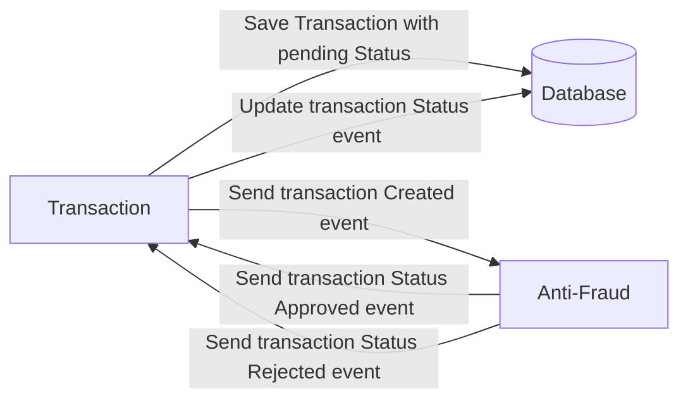

# Yape Code Challenge :rocket:

Our code challenge will let you marvel us with your Jedi coding skills :smile:. 

Don't forget that the proper way to submit your work is to fork the repo and create a PR :wink: ... have fun !!

- [Problem](#problem)
- [Tech Stack](#tech_stack)
- [Send us your challenge](#send_us_your_challenge)

# Problem

Every time a financial transaction is created it must be validated by our anti-fraud microservice and then the same service sends a message back to update the transaction status.
For now, we have only three transaction statuses:

<ol>
  <li>pending</li>
  <li>approved</li>
  <li>rejected</li>  
</ol>

Every transaction with a value greater than 1000 should be rejected.



# Tech Stack

<ol>
  <li>Node. You can use any framework you want (i.e. Nestjs with an ORM like TypeOrm or Prisma) </li>
  <li>Any database</li>
  <li>Kafka</li>    
</ol>

We do provide a `Dockerfile` to help you get started with a dev environment.

You must have two resources:

1. Resource to create a transaction that must containt:

```json
{
  "accountExternalIdDebit": "Guid",
  "accountExternalIdCredit": "Guid",
  "transferTypeId": 1,
  "value": 120
}
```

2. Resource to retrieve a transaction

```json
{
  "transactionExternalId": "Guid",
  "transactionType": {
    "name": ""
  },
  "transactionStatus": {
    "name": ""
  },
  "value": 120,
  "createdAt": "Date"
}
```

## Optional

You can use any approach to store transaction data but you should consider that we may deal with high volume scenarios where we have a huge amount of writes and reads for the same data at the same time. How would you tackle this requirement?

You can use Graphql;

## Stack
- Typescript
- NestJS
- Kafka
- Postgres
- Docker

## Setup

1. Run `docker-compose up` docker containers.

2. Enter to directory `anti-fraud` and run `yarn install` to install dependencies and run `yarn start:dev`.
3. Enter to directory `transaction` and run `yarn install` to install dependencies and run `yarn start:dev`.


# API Documentation

## Transaction

### Show API Swagger Documentation

```
GET /explorer
```

### Create transaction
```
POST /transactions
```
```
{
  "accountExternalIdDebit": "56b8f0a3-b221-408b-b496-35800db1b865",
  "accountExternalIdCredit": "56b8f0a3-b221-408b-b496-35800db1b865",
  "transferTypeId": 1,
  "value": 1200
}
```


### Get transaction
```
GET /transactions/b4187273-b2c2-4453-989d-49b286d5c0ff
```
```
{
  "transactionExternalId": "b4187273-b2c2-4453-989d-49b286d5c0ff",
  "transactionType": {
    "name": 1
  },
  "transactionStatus": {
    "name": "REJECTED"
  },
  "value": 1200,
  "createdAt": "2023-04-29T04:44:25.265Z"
}
```
