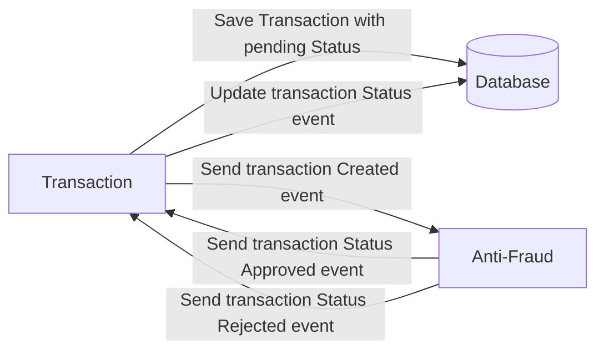

# Yape Code Challenge :rocket:

- [Problem](#problem)
- [Tech Stack](#tech_stack)
- [Send us your challenge](#send_us_your_challenge)

# Problem

Every time a financial transaction is created it must be validated by our anti-fraud microservice and then the same service sends a message back to update the transaction status.
For now, we have only three transaction statuses:

<ol>
  <li>pending</li>
  <li>approved</li>
  <li>rejected</li>  
</ol>

Every transaction with a value greater than 1000 should be rejected.



# Tech Stack

<ol>
  <li>Node. You can use any framework you want (i.e. Nestjs with an ORM like TypeOrm or Prisma) </li>
  <li>Any database</li>
  <li>Kafka</li>    
</ol>

We do provide a `Dockerfile` to help you get started with a dev environment.

You must have two resources:

1. Resource to create a transaction that must containt:

```json
{
  "accountExternalIdDebit": "Guid",
  "accountExternalIdCredit": "Guid",
  "tranferTypeId": 1,
  "value": 120
}
```

2. Resource to retrieve a transaction

```json
{
  "transactionExternalId": "Guid",
  "transactionType": {
    "name": ""
  },
  "transactionStatus": {
    "name": ""
  },
  "value": 120,
  "createdAt": "Date"
}
```

# Proposed Solution

## Endpoints

#### Create Transaction


| Path  | Type |
| ------------- | ------------- |
| $SERVER:$PORT/api/transaction  | POST |


RequestBody

```json
{
  "accountExternalIdDebit": "Guid",
  "accountExternalIdCredit": "Guid",
  "tranferTypeId": 1,
  "value": 120
}
```

Response Body
```json
{
  "transactionExternalId": "Guid",
  "transactionType": {
    "name": ""
  },
  "transactionStatus": {
    "name": ""
  },
  "value": 120,
  "createdAt": "Date"
}
```

####  Get Transaction By Id


| Path  | Type |
| ------------- | ------------- |
| $SERVER:$PORT/api/transaction/:transactionExternalId  | GET |


Response Body
```json
{
  "transactionExternalId": "Guid",
  "transactionType": {
    "name": "TRANSFER TO OWN ACCOUNT"
  },
  "transactionStatus": {
    "name": "APPROVED"
  },
  "value": 120,
  "createdAt": "Date"
}
```

Values list

| Property  | Value | Description  |
| ------------- | ------------- | ------------- |
| tranferTypeId  | 1 | TRANSFER TO OWN ACCOUNT |
| tranferTypeId  | 2 | TRANSFER TO THIRD ACCOUNT |
| tranferTypeId  | 3 | TRANSFER TO INTERBANK ACCOUNT |
| transactionStatus[name]  | 1 | PENDING |
| transactionStatus[name]  | 2 | APPROVED |
| transactionStatus[name]  | 3 | REJECTED |


### Instalation 🔧

From a command console (e.g. GitBash) execute the next steps:

A) Clone this repository

```
git clone https://github.com/victorarmas9797/app-nodejs-codechallenge.git
```

B) Access the project folder and then run the following command to get the required project dependencies

```
cd app-nodejs-codechallenge
npm install
```

C) Enable development environment

```
docker-compose up -d
```

D) Start transaction service

```
npx nx serve transaction
```

E) Start anti-fraud service

```
npx nx serve anti-fraud-microservice
```

### Postman

Postman collection to import is located in the following file

```
/postman/YapeChallenge.postman_collection.json
```
