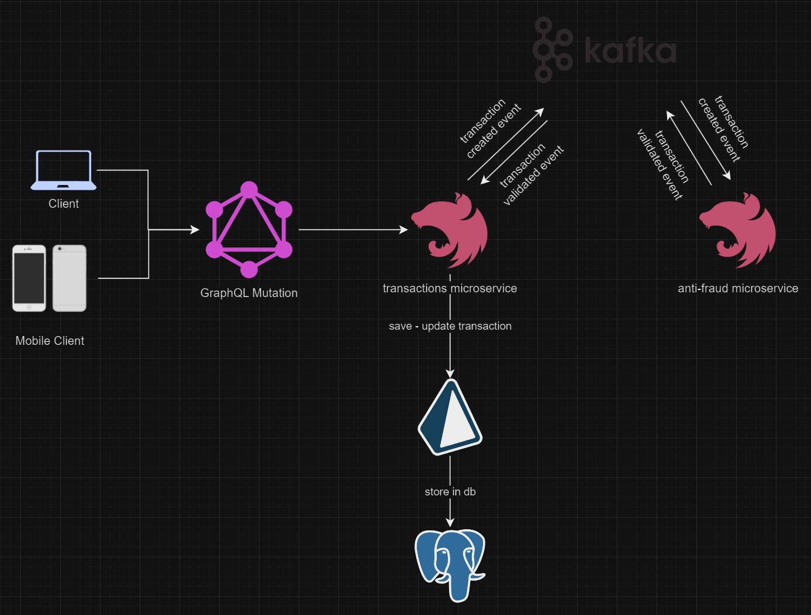
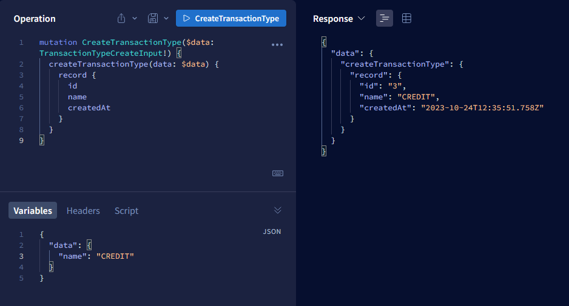
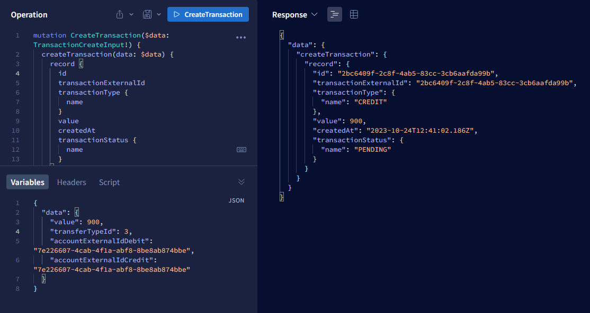

# Yape Code Challenge Solution :rocket:

This is my solution to the Yape Code Challenge. I used NestJS, Prisma, PostgreSQL, GraphQL and KafkaJS.
It contains two microservices (anti-fraud-ms and transaction-ms) that will run simultaneously.

* The anti-fraud-ms will listen to the transaction-created event and will emit a transaction-approved or transaction-rejected event.
* The transaction-ms will listen to the transaction-approved and transaction-rejected events and will update the transaction status in the database.

## App Diagram



### Tools🛠

- [Nest](https://github.com/nestjs/nest) framework TypeScript starter repository.
- [GraphQL](https://graphql.org/) query language for APIs.
- [Prisma](https://prisma.io/) a next-generation ORM.
- [Docker](https://www.docker.com/) platform for developing, packaging, and running applications in portable, isolated containers.
- [Kafka](https://kafka.apache.org/) open-source distributed event streaming platform.
- [PostgreSQL](https://www.postgresql.org/) open source object-relational database system.
- [Apollo Federation](https://www.apollographql.com/docs/federation/) a set of open-source tools for building a distributed graph of GraphQL schemas.


## Previous requirements 👀

Make sure you have the following tools installed: [Node](https://nodejs.org/es/download), [Git](https://git-scm.com/downloads) and [Docker](https://www.docker.com/products/docker-desktop/) (in this case, it should also be running) Linux preferred 👀

## Installation and Execution 🖥️

1. *Clone the Repository:*

  ```bash
    $ git clone https://github.com/jhosdev/app-nodejs-codechallenge
  ```

2. *Move to the the project directory*

  ```bash
    $ cd app-nodejs-codechallenge
  ```

3. *Rename the .env.example files to .env on both directories so you can use the environment variables, and if necessary, modify the values according to your own environment*

  ```bash
    $ mv transaction-ms/.env.example transaction-ms/.env
    # and
    $ mv anti-fraud-ms/.env.example anti-fraud-ms/.env
  ```

4. *Run all necessary services* 

  ```bash
    # inside this docker-compose.yml file there will be also created the database schema automatically
    $ docker compose up -d
  ```

5. *Next run the command*

  ```bash
    $ cd transaction-ms && yarn prisma migrate dev --name init && npm run start:dev
    # and from another terminal
    $ cd anti-fraud-ms && npm run start:dev
  ```

6. *Once all services are up, you can now create new transactions from: <http://localhost:3000/graphql>

7. Go to [Apollo Explorer](https://studio.apollographql.com/sandbox/explorer), paste the link <http://localhost:3000/graphql> and start testing the queries and mutations.

> Some examples:

### You need to first add a new transaction type



```graphql
  mutation CreateTransactionType($data: TransactionTypeCreateInput!) {
  createTransactionType(data: $data) {
    record {
      id
      name
      createdAt
    }
  }
}
```
```json
{
  "data": {
    "name": "CREDIT"
  }
}
```

### Then you can create a new transaction




```graphql
mutation CreateTransaction($data: TransactionCreateInput!) {
  createTransaction(data: $data) {
    record {
      id
      transactionExternalId
      transactionType {
        name
      }
      value
      createdAt
      transactionStatus {
        name
      }
    }
  }
}
```

>Valid input:

```json
{
  "data": {
    "value": 900,
    "transferTypeId": 1,
    "accountExternalIdDebit": "7e226607-4cab-4f1a-abf8-8be8ab874bbe",
    "accountExternalIdCredit": "7e226607-4cab-4f1a-abf8-8be8ab874bbe"
  }
}
```

>Invalid input: (value is greater than the restriction)

```json
{
  "data": {
    "value": 2000,
    "transferTypeId": 1,
    "accountExternalIdDebit": "7e226607-4cab-4f1a-abf8-8be8ab874bbe",
    "accountExternalIdCredit": "7e226607-4cab-4f1a-abf8-8be8ab874bbe"
  }
}
```

### Clean up after you're done 🧹

To stop and delete created containers:

  ```bash
    $ docker compose down
  ```

If you want to remove the containers and downloaded images, run the following instead of the above:

```bash
  $ docker compose down --rmi all
```

## Some notes and improvements

This app was designed to be scalable, so it can be improved in many ways, for example:
* The schema generated in transaction-ms was designed to be used in a federated schema, so it can be used in a bigger app, having microservices with Apollo Federation.
* Redis can be used to cache the responses of the queries and mutations, improving the performance of the app.
* We can have another microservice and database for the queries, so we can have a database (NoSQL) for reading and another one for writing (SQL), improving the performance of the app.
