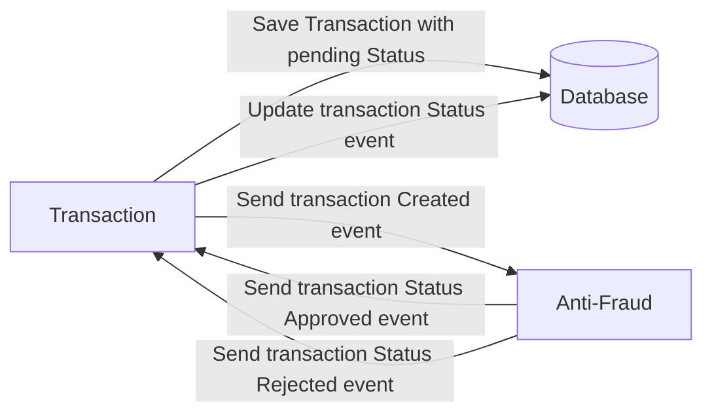

# Yape Code Challenge By Jaime Burgos Tejada

Our code challenge will let you marvel us with your Jedi coding skills :smile:.

Don't forget that the proper way to submit your work is to fork the repo and create a PR :wink: ... have fun !!

- [Problem](#problem)
- [Tech Stack](#tech_stack)
- [Send us your challenge](#send_us_your_challenge)

# Problem

Every time a financial transaction is created it must be validated by our anti-fraud microservice and then the same service sends a message back to update the transaction status.
For now, we have only three transaction statuses:

<ol>
  <li>pending</li>
  <li>approved</li>
  <li>rejected</li>  
</ol>

Every transaction with a value greater than 1000 should be rejected.



# Tech Stack

<ol>
  <li>Node. You can use any framework you want (i.e. Nestjs with an ORM like TypeOrm or Prisma) </li>
  <li>Any database</li>
  <li>Kafka</li>    
</ol>

We do provide a `Dockerfile` to help you get started with a dev environment.

You must have two resources:

1. Resource to create a transaction that must containt:

```json
{
  "accountExternalIdDebit": "Guid",
  "accountExternalIdCredit": "Guid",
  "tranferTypeId": 1,
  "value": 120
}
```

2. Resource to retrieve a transaction

```json
{
  "transactionExternalId": "Guid",
  "transactionType": {
    "name": ""
  },
  "transactionStatus": {
    "name": ""
  },
  "value": 120,
  "createdAt": "Date"
}
```

## Optional

You can use any approach to store transaction data but you should consider that we may deal with high volume scenarios where we have a huge amount of writes and reads for the same data at the same time. How would you tackle this requirement?

You can use Graphql;

# Send us your challenge

When you finish your challenge, after forking a repository, you **must** open a pull request to our repository. There are no limitations to the implementation, you can follow the programming paradigm, modularization, and style that you feel is the most appropriate solution.

If you have any questions, please let us know.

# Solution

Description of the solution

- An `API Yape Gateway` for connecting clients with create transaction & retrieve transactions functionality via HTTP (REST API).
- A `YapeTransaction MicroService`, which records transaction information in the POSTGRESQL DB and storage in cache Redis.
- An `Yape Anti-Fraud MicroService`, which extracts from the queue the transactions that have been registered to be validated and consider them approved or rejected according to the criteria (>1000 = Rejected; <=1000=Approved).

Note :
Additionally, it could be clustered to improve performance or use a container orchestrator such as Kubernetes.

# Stack

- NodeJS : NestJS , TypeORM , NPM
- PostgreSQL
- Kafka
- PostgreSQL
- Redis ( for caching transactions )

Aditional features of the solution

- Prometheus and Grafana for monitoring
- Dockerization of the project
- Wiston Logger for conservation and rotating logs if required
- GitHub Action CI for run unit test for each module and use SonarCloud for Clean Code
- Swagger for API documentation
- Stress tests with JMeter
- Unit Test validate correct operation of the logic
- ELK Stack for monitoring logs

# Deployment

Run the following command to pull up the application containers

```
 docker compose -f "docker-compose.yml" up -d --build
```


## Endpoints

Test endpoint in route `http://localhost:3002/transactions` with the method POST

```json
{
  "accountExternalIdDebit": "e7991681-16bd-4a57-b112-a96796ba4a21",
  "accountExternalIdCredit": "e7991681-16bd-4557-b112-a96796ba4a21",
  "tranferTypeId": 1, 
  "value": 555
}
```

Test endpoint in route `http://localhost:3002/transactions/YOUR_TRANSACTION_EXTERNAL_ID`

Test endpoint in route `http://localhost:3002/transactions?page=${page}&take=${take}` list transaction with paginate

| Parameters | Description  |
| ---------- | ------------ |
| page       | Page of list |
| take       | Size of list |

Other option use the collection of postman `yape_challenge.postman_collection.json` in postman folder

Other option use **Swagger** documentation deployment in the route by default `http://localhost:3002/docs`


Example Response

- Create transaction


- Find transaction by transactionExternalId


- Find All transactions


# Unit Test

Unit tests were performed for each microservice (transactions and anti-fraud) and API Gateway , in their respective folders run the command

```
 npm run test:cov
```


The result will be code coverage and report generation to be used in SonarQube/SonarCloud in the folder `coverage` for each proyect

# Grafana & Prometheus

Grafana and Prometheus were used to monitor API Gateway metrics as well as validate its correct operation at all times.

For use the build dashboard import the file `grafana-yape-gateway` of the folder `dashboard`

To use the built dashboard go to the route `http://localhost:2525/` enter the credentials

| Credentials | Value    |
| ----------- | -------- |
| user        | admin    |
| password    | changeme |


# ELK Stack

The ELK Stack was used for monitoring and log ingestion (<a href="https://github.com/deviantony/docker-elk"> Deaviantony Docker ELK repository </a> was taken for reference built)

For use the build dashboard import the file `kibana-yape-gateway` of the folder `dashboard`

To use the built dashboard go to the route `http://localhost:5601/` enter the credentials

| Credentials | Value    |
| ----------- | -------- |
| user        | elastic  |
| password    | changeme |


# Continuous Integration & SonarCloud

Github actions were used for a continuous integration process, the unit tests of each project are executed and later analyzed by the SonarCloud service


After the execution of the workflow, the artifacts-reports-unit-test are generated, which contain the coverage report generated.


Finally, the sonar is executed, taking the coverage of the generated artifacts and analyzing the code.


# Wiston Logger

Integrated winston to replace the NestJS logger to track and preserve logs as required.
By default, the folder where the logs are saved is `LOG` , the configured format is JSON.


# Stress Testing

JMeter was used to perform the stress test.

The test used can be found in the folder `jmeter` file `stress_testing.jmx`

Obtaining the following results


