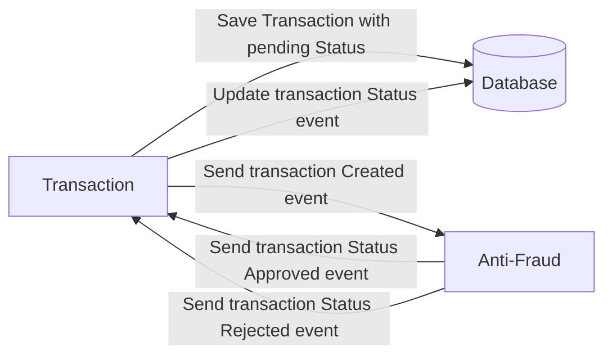

# Yape Code Challenge by Oscar Diaz Iberico

This coding challenge was submitted for the technical assessment of Yape.

## Problem

Every time a financial transaction is created it must be validated by our anti-fraud microservice and then the same service sends a message back to update the transaction status.
For now, we have only three transaction statuses:

<ol>
  <li>pending</li>
  <li>approved</li>
  <li>rejected</li>
</ol>

Every transaction with a value greater than 1000 should be rejected.



## Solution

The solution consists of two microservices:

- `transaction`: exposes a REST API to retrieve / create transactions. When a transaction is created, it is stored in the database and an message is published to a Kafka topic. Once the event is processed, the database record is updated with the result of the message processing.
- `anti-fraud`: it consumes a Kafka topic to verify transactions. Once a transaction is processed, it returns the result to be updated by the transaction service.

## Stack

- Node JS: NestJS, TypeORM, Yarn
- Postgres
- Kafka
- Docker

## Development

1. Install [Docker](https://docs.docker.com/get-docker/) and [VSCode](https://code.visualstudio.com/download)
2. Go to VSCode extensions and install [Remote - Containers](https://marketplace.visualstudio.com/items?itemName=ms-vscode-remote.remote-containers)
3. Download this repository and open it with VSCode.
4. VSCode will prompt if you want to open the project in a devcontainer.
5. The project should get configured automatically, wait until you see the process finished. Open logs to see progress, you should see a message like below when the setup is done.

```zsh
Done in 495.62s.
pre-commit installed at .git/hooks/pre-commit
Done. Press any key to close the terminal.
```

6. Once the installation process is done. Open two terminal windows to start both services separately:

```zsh
nest start transaction --watch # This application is exposed on http://localhost:3001
```

```zsh
nest start anti-fraud --watch
```

7. Go to `http://localhost:3001/docs` for more information about available endpoints.

> Note: Additionally you can use `SQLTools` and `Kafka` extensions to inspect both database table and kafka topic respectively.

## Highlights

- The development environment setup is automated using [Visual Studio Code DevContainers](https://code.visualstudio.com/docs/devcontainers/containers).
  - It packs all the dependencies required to run the project via docker compose (Postgres, Kafka).
  - The installation includes useful extensions to inspect Git, Postgres database, Kafka topics and HTTP requests.
- The project automatically runs checks to enforce commons practices and styling in the code. There are multiple checks configured in this project and they are all executed before code is committed to the repository using [pre-commit](https://pre-commit.com/).
- The repository implements a monorepo strategy keeping microservices boundaries.
- It implements a CI pipeline using Github actions, which builds the projects and executes the unit tests.
- Both application make use of environment variables for easy deployment across different environments (development, staging, production).
- API documentation for transaction micro service is available under [/docs](http://localhost:3001/docs) path.
- Application metrics are exposed on [/metrics](http://localhost:3001/metrics) path using Prometheus API.

## Next steps

- Use migrations instead of automatic synchronization.
- Use event-based message style for scalability.
- Increase code coverage with unit tests.
- Implement a security layer.
- Use structured logging.

## Comments

- It was a very interesting challenge. It is my first time building an application on NodeJS.
- It was challenging to communicate both services via Kafka. NestJS provides multiple resources to implement the communication and eventually makes it very easy to build.
