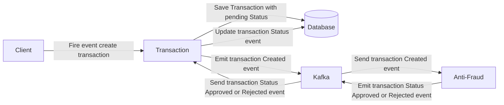

# Yape Code Challenge :rocket:

* [DETAILS OF THE PROBLEM RAISED](CHALLENGE.md)

## Solution

### Project

Project structure for the challenge
```
app-nodejs-codechallenge/
├── antifraud_microservice/
│   ├── src/
│   ├── .env
│   └── Dockerfile
├── transactional_microservice/
│   ├── src/
│   ├── test/
│   ├── .env
│   └── Dockerfile
├── README.md
├── CHALLENGE.md
└── docker-compose.yml
```

### Deployment of the project

Do not forget to place the environment variables in their respective directories.

#### Using Docker

**Requirements:**
* Docker

Assuming you are located in `app-nodejs-codechallenge`
```bash
cd transactional_microservice
docker build -t microservicio1 .
cd ../antifraud_microservice
docker build -t microservicio2 .
cd ..
docker-compose up -d
```

#### Using only Nodejs

**Requirements:**
* Nodejs >= 16.20.0
* MongoDB >= 4.4.0

Assuming you are located in `app-nodejs-codechallenge`
```bash
cd transactional_microservice
npm install
npm run test:e2e
npm run start

cd ../antifraud_microservice
npm install
npm run start
```

### Transaction flow



### Endpoints

Both next resources must request to microservicio1 `transactional_microservice`

1. Resource to create a transaction:

```json
POST

/transactions

Body
{
  "accountExternalIdDebit": "Guid",
  "accountExternalIdCredit": "Guid",
  "tranferTypeId": 1, // 1: DEBIT, 2: CREDIT
  "value": 120
}

Response
{
    "_id": "transactionExternalId",
    "accountExternalIdDebit": "Guid",
    "accountExternalIdCredit": "Guid",
    "tranferTypeId": 2,
    "value": 120,
    "tracking": [],
    "created_at": "Date",
    "updated_at": "Date",
}
```

2. Resource to retrieve a transaction:

```json
GET

/transactions/:transactionExternalId

Response
{
  "transactionExternalId": "Guid",
  "transactionType": {
    "name": ""
  },
  "transactionStatus": {
    "name": ""
  },
  "value": number,
  "createdAt": "Date"
}
```