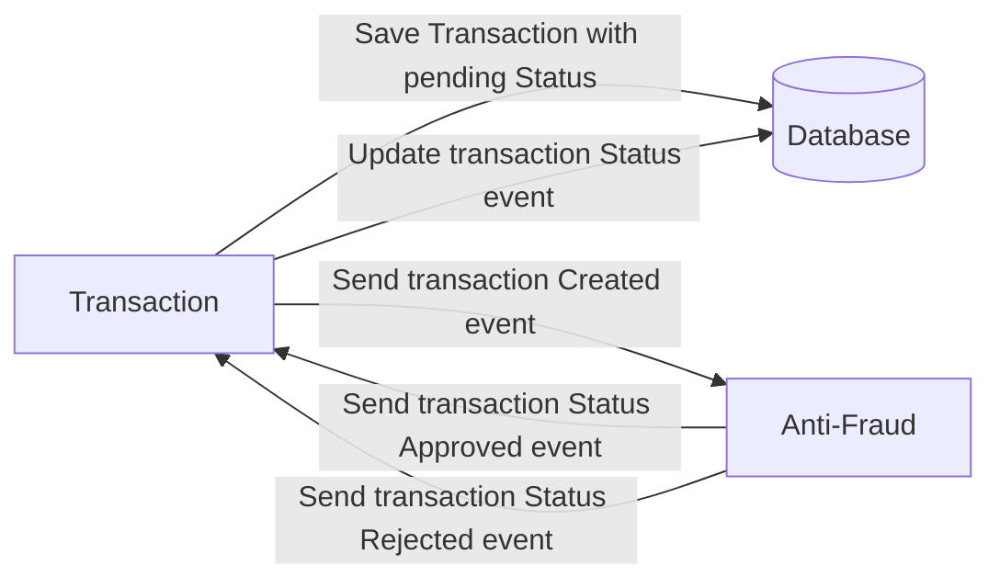
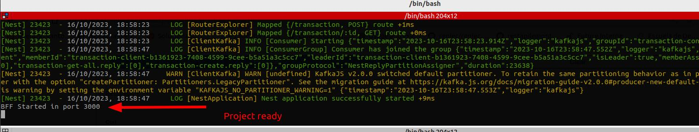

# Yape Code Challenge :rocket:

Our code challenge will let you marvel us with your Jedi coding skills :smile:. 

Don't forget that the proper way to submit your work is to fork the repo and create a PR :wink: ... have fun !!

- [Problem](#problem)
- [Tech Stack](#tech_stack)
- [Send us your challenge](#send_us_your_challenge)

# Problem

Every time a financial transaction is created it must be validated by our anti-fraud microservice and then the same service sends a message back to update the transaction status.
For now, we have only three transaction statuses:

<ol>
  <li>pending</li>
  <li>approved</li>
  <li>rejected</li>  
</ol>

Every transaction with a value greater than 1000 should be rejected.



# Tech Stack

<ol>
  <li>Node. You can use any framework you want (i.e. Nestjs with an ORM like TypeOrm or Prisma) </li>
  <li>Any database</li>
  <li>Kafka</li>    
</ol>

We do provide a `Dockerfile` to help you get started with a dev environment.

You must have two resources:

1. Resource to create a transaction that must containt:

```json
{
  "accountExternalIdDebit": "Guid",
  "accountExternalIdCredit": "Guid",
  "tranferTypeId": 1,
  "value": 120
}
```

2. Resource to retrieve a transaction

```json
{
  "transactionExternalId": "Guid",
  "transactionType": {
    "name": ""
  },
  "transactionStatus": {
    "name": ""
  },
  "value": 120,
  "createdAt": "Date"
}
```

# Solution proposal

The solution consists of an bff (Backend for frontend) and two microservices. The bff has the responsability of receiving the requests:
- Transaction creation
- Search transaction by transactionExternalId
- List all transactions

The transaction microservice creates the transaction with the initial state in PENDING, then validates the transaction created with the anti-fraud microservice which receives the value of the transaction created and if it exceeds the value of 1000 it's detected as fraud and the state change to REJECTED. In opposite case is detected as valid and the state change to APPROVED.

## Requirements
- Node 16
- Docker cli
- Docker compose cli

## Installation
First use docker compose to up database and kafka service in your local machine.
```
docker-compose -c docker-compose.yml up
```

### transaction-ms
In a new console window (`cd transaction-ms`)
```
npm i
cp .env.example .env
npm run start
```

### fraud-detection-ms
In a new console window (`cd fraud-detection-ms`)
```
npm i
npm start
```

### bff
In a new console window (`cd bff`)
```
npm i
npm start
npm run start
```
The project will be ready when in `bff` console windows show the following message
 

## Usage
After installation steps to use the project you can use the swagger implementation to create, get and get all transactions. 

Enter to [Bff host](http://localhost:3000)