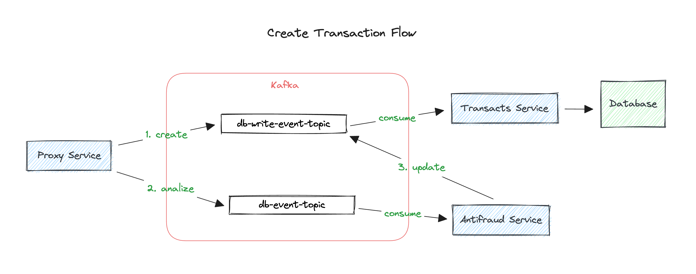
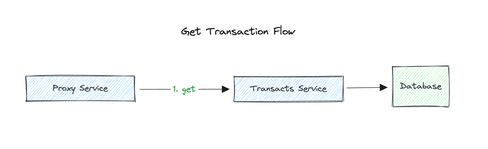
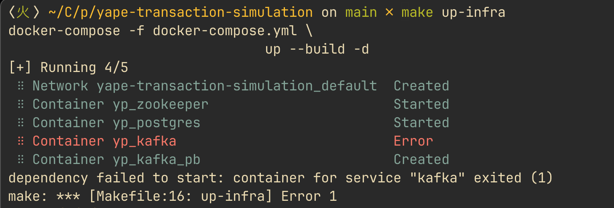

# Yape Transaction Simulation 🚀
This project is an approach to solve the `Yape Code Challenge` 
([description](./CHALLENGE.md)).

*important details:*

- We may deal with high volume scenarios where we have a huge 
amount of writes and reads for the same data at the same time.
- I'm considering two `TransferTypes`:
  - *DEBIT* `(1)`
  - *CREDIT* `(2)`

*Index:*
- [My approach](#my-approach)
  - [Create Transaction Flow](#create-transaction-flow)
  - [Get Transaction Flow](#get-transaction-flow)
- [Why?](#why-)
- [Tech Stack](#tech-stack)
- [How to run it?](#how-to-run-it)
- [Errors?](#errors)
- [Stay in touch](#stay-in-touch)

## My approach

### Create Transaction Flow



1. `Proxy Service`: acts as the API gateway, it enables to decouple 
    the infrastructure and controls the information flow.
2. `Transacts Service`: is the **core service** which execute business logic.
3. `Antifraud Service`: is the validation service.

### Get Transaction Flow



## Why? 🤔

This approach have multiple advantages:
1. The microservices infrastructure is decoupled and every service has its
   own responsability.
2. Every microservice can be **scaled** based on load.
3. The database has an only point of entry (Transact Service) which
   facilitates future improvements like having a *Read DB Instance* and 
   *Write DB Instance*.
4. Kafka acts as the main orchestrator and allows to deal with HUGE 
   amounts of requests `to the DB` and `to other microservices`. 
5. Using kafka in the transactions creation allows to save the 
   request `in case of any failure` and can be used to **apply retries**.

## Tech Stack
- Typescript
- NestJS & Express.js
- TypeORM & Postgres
- Kafka
- docker
- docker-compose
- Make

## How to run it?

All the project will run with docker:

```shell
make up-all
```
or
```shell
docker-compose -f docker-compose.yml \
                -f ./antifraud-service/docker-compose.yml \
                -f ./proxy-service/docker-compose.yml \
                -f ./transac-service/docker-compose.yml \
                up --build -d
```
After finish, you can off the project
```shell
make off-all
```

## Errors?

Is common to find this error if you run this project multiple times.



To solve it just off the project and run it again.
```shell
make off-all
```

## Stay in touch

- Author 👷🏾‍♂️- [aLucaz](https://github.com/aLucaz)
- Linkedin 🧛🏾‍♂️- [Arturo Lucas](https://www.linkedin.com/in/arturo-lucas/)
