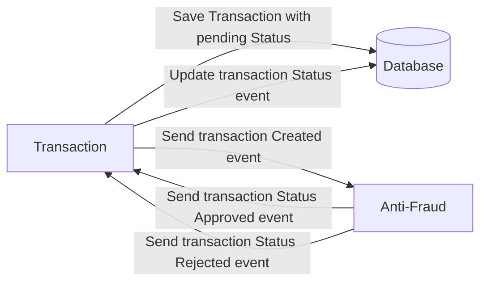
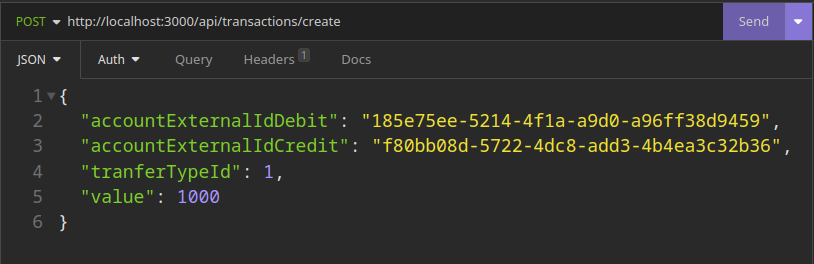
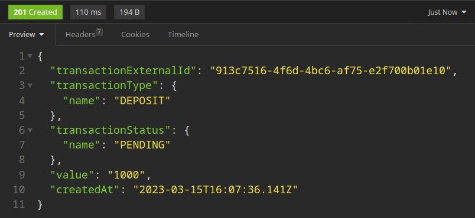
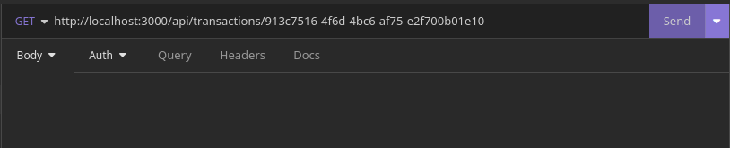
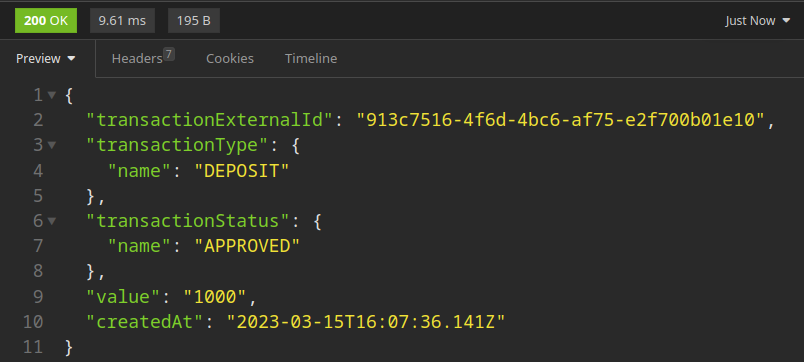
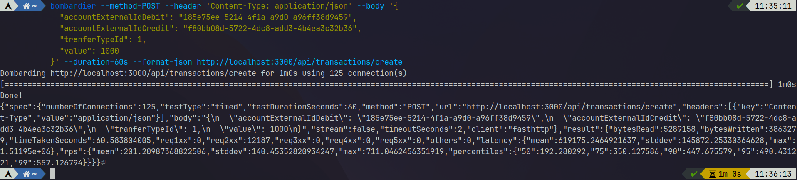
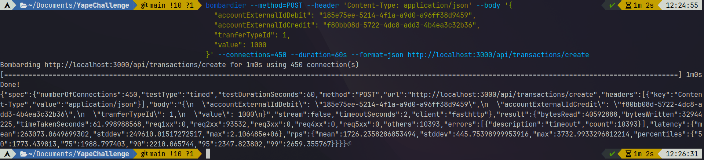

# Yape Code Challenge :rocket:

Our code challenge will let you marvel us with your Jedi coding skills :smile:.

Don't forget that the proper way to submit your work is to fork the repo and create a PR :wink: ... have fun !!

-   [Problem](#problem)
-   [Tech Stack](#tech_stack)
-   [Send us your challenge](#send_us_your_challenge)
-   [Solution](#solution)
-   [Testing](#testing)

# Problem

Every time a financial transaction is created it must be validated by our anti-fraud microservice and then the same service sends a message back to update the transaction status.
For now, we have only three transaction statuses:

<ol>
  <li>pending</li>
  <li>approved</li>
  <li>rejected</li>  
</ol>

Every transaction with a value greater than 1000 should be rejected.



# TechStack

<ol>
  <li>Node. You can use any framework you want (i.e. Nestjs with an ORM like TypeOrm or Prisma) </li>
  <li>Any database</li>
  <li>Kafka</li>    
</ol>

We do provide a `Dockerfile` to help you get started with a dev environment.

You must have two resources:

1. Resource to create a transaction that must containt:

```json
{
    "accountExternalIdDebit": "Guid",
    "accountExternalIdCredit": "Guid",
    "tranferTypeId": 1,
    "value": 120
}
```

2. Resource to retrieve a transaction

```json
{
    "transactionExternalId": "Guid",
    "transactionType": {
        "name": ""
    },
    "transactionStatus": {
        "name": ""
    },
    "value": 120,
    "createdAt": "Date"
}
```

## Optional

You can use any approach to store transaction data but you should consider that we may deal with high volume scenarios where we have a huge amount of writes and reads for the same data at the same time. How would you tackle this requirement?

You can use Graphql;

# Send us your challenge

When you finish your challenge, after forking a repository, you **must** open a pull request to our repository. There are no limitations to the implementation, you can follow the programming paradigm, modularization, and style that you feel is the most appropriate solution.

If you have any questions, please let us know.

# Solution

To start the solution first go to the root folder of the project and use the command:

## Without scaling
```
docker-compose up -d --build
```

## With scaling
```
docker-compose up -d --build --scale transactions_api=10 --scale anti_fraud_service=2
```

## Endpoints

1. Create transaction (POST): http://localhost:3000/api/transactions/create

### Example request body

```json
{
    "accountExternalIdDebit": "185e75ee-5214-4f1a-a9d0-a96ff38d9459",
    "accountExternalIdCredit": "f80bb08d-5722-4dc8-add3-4b4ea3c32b36",
    "tranferTypeId": 1,
    "value": 1000
}
```

2. Get transaction (GET): http://localhost:3000/api/transactions/transactionExternalID

## Examples using insomnia

### Create transaction request



### Create transaction response



### Get transaction request



### Get transaction response



# Testing
There's an insomnia import file under the resources folder

## Stress tests using bombardier, without scaling (1 réplica per service)



Time: 60s

Requests processed without error: 10980

Request with error: 0

Concurrent connections: 125

Mean latency: ~686ms

Max latency: ~1.83s

Mean requests per second: ~181

Max requests per second: ~647

### Details:

```json
{
    "spec": {
        "numberOfConnections": 125,
        "testType": "timed",
        "testDurationSeconds": 60,
        "method": "POST",
        "url": "http://localhost:3000/api/transactions/create",
        "headers": [{ "key": "Content-Type", "value": "application/json" }],
        "body": "{\n  \"accountExternalIdDebit\": \"185e75ee-5214-4f1a-a9d0-a96ff38d9459\",\n  \"accountExternalIdCredit\": \"f80bb08d-5722-4dc8-add3-4b4ea3c32b36\",\n  \"tranferTypeId\": 1,\n  \"value\": 1000\n}",
        "stream": false,
        "timeoutSeconds": 2,
        "client": "fasthttp"
    },
    "result": {
        "bytesRead": 4765320,
        "bytesWritten": 3480660,
        "timeTakenSeconds": 60.481050393,
        "req1xx": 0,
        "req2xx": 10980,
        "req3xx": 0,
        "req4xx": 0,
        "req5xx": 0,
        "others": 0,
        "latency": {
            "mean": 686183.4805100182,
            "stddev": 193821.82359802927,
            "max": 1.831009e6
        },
        "rps": {
            "mean": 181.0185496120047,
            "stddev": 143.2825630432947,
            "max": 647.0615318186286,
            "percentiles": {
                "50": 145.150275,
                "75": 347.803395,
                "90": 447.171106,
                "95": 491.79857,
                "99": 548.127815
            }
        }
    }
}
```

## Stress tests using bombardier, with scaling (10 réplicas for the transactions_api service and 2 réplicas for the anti_fraud service)



Time: ~61.99s

Requests processed without error: 93532

Requests with error: 10393 (timeout)

Concurrent connections: 450

Mean latency: ~263ms

Max latency: ~2.1s

Mean requests per second: ~1726

Max requests per second: ~3732

### Details:

```json
{
    "spec": {
        "numberOfConnections": 450,
        "testType": "timed",
        "testDurationSeconds": 60,
        "method": "POST",
        "url": "http://localhost:3000/api/transactions/create",
        "headers": [{ "key": "Content-Type", "value": "application/json" }],
        "body": "{\n  \"accountExternalIdDebit\": \"185e75ee-5214-4f1a-a9d0-a96ff38d9459\",\n  \"accountExternalIdCredit\": \"f80bb08d-5722-4dc8-add3-4b4ea3c32b36\",\n  \"tranferTypeId\": 1,\n  \"value\": 1000\n}",
        "stream": false,
        "timeoutSeconds": 2,
        "client": "fasthttp"
    },
    "result": {
        "bytesRead": 40592888,
        "bytesWritten": 32944225,
        "timeTakenSeconds": 61.998988568,
        "req1xx": 0,
        "req2xx": 93532,
        "req3xx": 0,
        "req4xx": 0,
        "req5xx": 0,
        "others": 10393,
        "errors": [{ "description": "timeout", "count": 10393 }],
        "latency": {
            "mean": 263073.0649699302,
            "stddev": 249610.01517272517,
            "max": 2.106485e6
        },
        "rps": {
            "mean": 1726.2358286853494,
            "stddev": 445.75398999953916,
            "max": 3732.9933296812214,
            "percentiles": {
                "50": 1773.439813,
                "75": 1988.797403,
                "90": 2210.065744,
                "95": 2347.823802,
                "99": 2659.355767
            }
        }
    }
}
```
