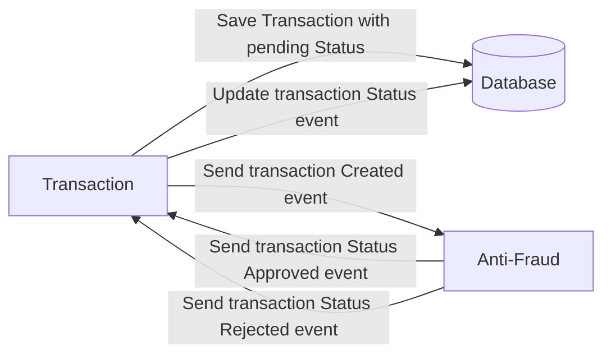

# Yape Code Challenge :rocket:

Our code challenge will let you marvel us with your Jedi coding skills :smile:.

Don't forget that the proper way to submit your work is to fork the repo and create a PR :wink: ... have fun !!

- [Problem](#problem)
- [Tech Stack](#tech_stack)
- [Send us your challenge](#send_us_your_challenge)

# Problem

Every time a financial transaction is created it must be validated by our anti-fraud microservice and then the same service sends a message back to update the transaction status.
For now, we have only three transaction statuses:

<ol>
  <li>pending</li>
  <li>approved</li>
  <li>rejected</li>
</ol>

Every transaction with a value greater than 1000 should be rejected.



# Tech Stack

<ol>
  <li>Express with TypeORM </li>
  <li>Postgres</li>
  <li>Kafka</li>
  <li>Jest</li>
</ol>

We do provide a `Dockerfile` to help you get started with a dev environment.

You must have two resources:

1. Resource to create a transaction that must containt:

```json
{
  "accountExternalIdDebit": "Guid",
  "accountExternalIdCredit": "Guid",
  "tranferTypeId": 1,
  "value": 120
}
```

2. Resource to retrieve a transaction

```json
{
  "transactionExternalId": "Guid",
  "transactionType": {
    "name": ""
  },
  "transactionStatus": {
    "name": ""
  },
  "value": 120,
  "createdAt": "Date"
}
```

## Optional

You can use any approach to store transaction data but you should consider that we may deal with high volume scenarios where we have a huge amount of writes and reads for the same data at the same time. How would you tackle this requirement?

You can use Graphql;

# Send us your challenge

When you finish your challenge, after forking a repository, you **must** open a pull request to our repository. There are no limitations to the implementation, you can follow the programming paradigm, modularization, and style that you feel is the most appropriate solution.

If you have any questions, please let us know.

# Running the app

First, you need to have docker and docker-compose installed on your machine.

Then, you need to create a `.env` file in the root of each microservice. You can use the `.env.example` file as a reference.

Finally, you can run the following command to start the app:

1. Build the docker images:

   - In dev mode:

     ```bash
       docker-compose --file docker-compose.dev.yml build
     ```

   - In production mode:

     ```bash
       docker-compose build
     ```

2. Start the apps:

   - In dev mode:

     ```bash
       docker-compose --file docker-compose.dev.yml up -d
     ```

   - In production mode:

     ```bash
       docker-compose up -d
     ```

3. Test the app with the postman collection provided in the `yape-challenge.postman_collection.json` file.

4. To stop the app, you can run the following command:

   - In dev mode:

     ```bash
       docker-compose --file docker-compose.dev.yml down
     ```

   - In production mode:

     ```bash
       docker-compose down
     ```

# Testing the app

To run the tests, you can run the following command:

First, we need to install the dependencies:

```bash
  npm install
```

1. To test the transaction microservice:

   - Unit tests:

     ```bash
       npm run test
     ```

   - End-to-end tests:

     ```bash
       npm run test:e2e
     ```

2. To test the anti-fraud microservice:

   - Unit tests:

     ```bash
       npm run test
     ```
