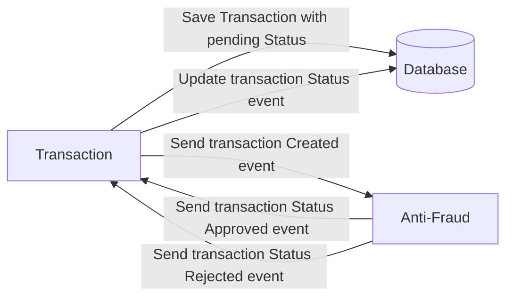

# Yape Code Challenge :rocket:

Our code challenge will let you marvel us with your Jedi coding skills :smile:. 

Don't forget that the proper way to submit your work is to fork the repo and create a PR :wink: ... have fun !!

- [Problem](#problem)
- [Tech Stack](#tech_stack)
- [Send us your challenge](#send_us_your_challenge)
- [Service transaction](#Service_transaction)
- [Service antifraud](#Service_antifraud)

# Problem

Every time a financial transaction is created it must be validated by our anti-fraud microservice and then the same service sends a message back to update the transaction status.
For now, we have only three transaction statuses:

<ol>
  <li>pending</li>
  <li>approved</li>
  <li>rejected</li>  
</ol>

Every transaction with a value greater than 1000 should be rejected.



# Tech_Stack

<ol>
  <li>Node. You can use any framework you want (i.e. Nestjs with an ORM like TypeOrm or Prisma) </li>
  <li>Any database</li>
  <li>Kafka</li>    
</ol>

We do provide a `Dockerfile` to help you get started with a dev environment.

You must have two resources:

1. Resource to create a transaction that must containt:

```json
{
  "accountExternalIdDebit": "Guid",
  "accountExternalIdCredit": "Guid",
  "tranferTypeId": 1,
  "value": 120
}
```

2. Resource to retrieve a transaction

```json
{
  "transactionExternalId": "Guid",
  "transactionType": {
    "name": ""
  },
  "transactionStatus": {
    "name": ""
  },
  "value": 120,
  "createdAt": "Date"
}
```

## Optional

You can use any approach to store transaction data but you should consider that we may deal with high volume scenarios where we have a huge amount of writes and reads for the same data at the same time. How would you tackle this requirement?

You can use Graphql;

# send_us_your_challenge

When you finish your challenge, after forking a repository, you **must** open a pull request to our repository. There are no limitations to the implementation, you can follow the programming paradigm, modularization, and style that you feel is the most appropriate solution.

If you have any questions, please let us know.


# Service_transaction

Pasos para correr este proyecto:

1. Leer el challenge de la siguiente URL: https://github.com/yaperos/app-nodejs-codechallenge/tree/main
2. Tener instalado typescript,node, kafka y postgresql dentro del sistema a probar
    1. Se puede tener instalado postgressql y kafka en docker, descargado el docker-compose.yml de la siguiente URL: https://github.com/yaperos/app-nodejs-codechallenge/blob/main/docker-compose.yml
    2. Si se va a ejecutar via docker compose ejecutar los siguientes comandos asumiendo que se tenga docker correctamente instalados:
   ```bash
      # Ejecucion de los servicios en docker
      sudo docker-compose -f docker-compose.yml up -d
      # Ejecucion de la consola interactiva de kafka desplegado
      sudo docker exec -it challenge_transaction_kafka_1 /bin/bash
      #Dentro de la consola en docker
      #Creacion de los topics
      kafka-topics --create --bootstrap-server localhost:9092 --replication-factor 1 partitions 1 --topic transaction
      kafka-topics --create --bootstrap-server localhost:9092 --replication-factor 1 partitions 1 --topic antifraud
   ```
3. correr dentro del proyecto `yarn install` command
4. Configurar los ambientes en el archivo `.env`
    1. Solo modificar los siguientes enviroments:
   ```bash
      # Puerto del API en Node js
      PORT=3000
      #Parametros de conexion de la base de datos Postgresql
      #Nota: Se debe crear la base de datos dentro de la base de datos bajo el nombre "transaction"
      PGSQL_DATABASE='transaction'
      PGSQL_USERNAME='Colocar aqui su usuario'
      PGSQL_PASSWORD='Colocar aqui su clave'
      PGSQL_SYNCHRONIZE='false'
      PGSQL_LOGGING='false'
      PGSQL_HOST='localhost'
      PGSQL_PORT=5432
      #Parametros de conexion de kafka
      KAFKA_CLIENT_ID='api-transaction'
      KAFKA_BROKERS='localhost:9092'
      KAFKA_GROUP_ID='antifraud-group'
      KAFKA_CONSUMER_ID='antifraud'
   ```
5. Correr las migraciones `yarn migration:ts`
6. Correr el ambiente de pruebas `yarn nodemon`
7. ejecutar una consulta post, del archivo yape.postman_collection.json para ejecutar la subcripcion a el canal de antifraud de kafka, solo se requiere una sola vez
8. Diagrama de componentes de conexion de los adaptadores de Kafka en cada proyecto
   

**Nota** Las tecnologias utilizadas en este proyecto son las siguientes:
- TypeORM
- Node.js
- Typescript
- Express
- Arquitectura Hexagonal/Arquitectura Limpia/Arquitectura en Capas
- Postgresql
- Kafka
- Docker

# Service_antifraud

Pasos para correr este proyecto:

1. Leer el challenge de la siguiente URL: https://github.com/yaperos/app-nodejs-codechallenge/tree/main
2. Tener instalado typescript,node, kafka y postgresql dentro del sistema a probar
    1. Se puede tener instalado postgressql y kafka en docker, descargado el docker-compose.yml de la siguiente URL: https://github.com/yaperos/app-nodejs-codechallenge/blob/main/docker-compose.yml
    2. Si se va a ejecutar via docker compose ejecutar los siguientes comandos asumiendo que se tenga docker correctamente instalados:
   ```bash
      # Ejecucion de los servicios en docker
      sudo docker-compose -f docker-compose.yml up -d
      # Ejecucion de la consola interactiva de kafka desplegado
      sudo docker exec -it challenge_transaction_kafka_1 /bin/bash
      #Dentro de la consola en docker
      #Creacion de los topics
      kafka-topics --create --bootstrap-server localhost:9092 --replication-factor 1 partitions 1 --topic transaction
      kafka-topics --create --bootstrap-server localhost:9092 --replication-factor 1 partitions 1 --topic antifraud
   ```
3. correr dentro del proyecto `yarn install` command
4. Configurar los ambientes en el archivo `.env`
    1. Solo modificar los siguientes enviroments:
   ```bash
      # Puerto del API en Node js
      PORT=3001
      #Parametros de conexion de la base de datos Postgresql
      #Nota: Se debe crear la base de datos dentro de la base de datos bajo el nombre "transaction"
      PGSQL_DATABASE='antifraud'
      PGSQL_USERNAME='Coloque su usuario aqui'
      PGSQL_PASSWORD='Coloque su clave aqui'
      PGSQL_SYNCHRONIZE='false'
      PGSQL_LOGGING='false'
      PGSQL_HOST='localhost'
      PGSQL_PORT=5432
      #Parametros de conexion de kafka
      KAFKA_CLIENT_ID='api-antifraud'
      KAFKA_BROKERS='localhost:9092'
      KAFKA_GROUP_ID='transaction-group'
      KAFKA_CONSUMER_ID='transaction'
   ```
5. Correr las migraciones `yarn migration:ts`
6. Correr el ambiente de pruebas `yarn nodemon`
7. ir a un navegador y ejecutar la URL: http://localhost:3001 y asi subscribir a el canal de kafka transaction, solo se requiere una vez
8. Diagrama de componentes de conexion de los adaptadores de Kafka en cada proyecto
   

**Nota** Las tecnologias utilizadas en este proyecto son las siguientes:
- TypeORM
- Node.js
- Typescript
- Express
- Arquitectura Hexagonal/Arquitectura Limpia/Arquitectura en Capas
- Postgresql
- Kafka
- Docker

