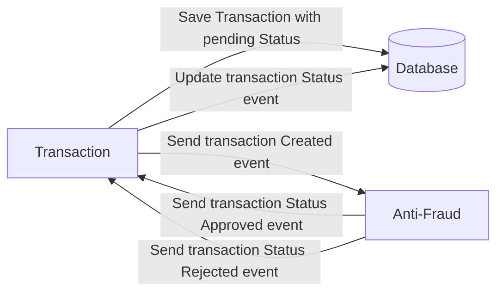

# Yape Code Challenge - LUIS FLORES

- [Problem](#problem)
- [Tech Stack](#tech_stack)
- [Usage](#usage)


# Problem

Every time a financial transaction is created it must be validated by our anti-fraud microservice and then the same service sends a message back to update the transaction status.
For now, we have only three transaction statuses:

<ol>
  <li>pending</li>
  <li>approved</li>
  <li>rejected</li>  
</ol>

Every transaction with a value greater than 1000 should be rejected.



# Tech Stack

<ol>
  <li>NestJS</li>
  <li>PostgresQL</li>
  <li>Redis</li>
  <li>Kafka</li>    
</ol>

# Usage
# HOW TO LOCAL DEPLOY
``` 
cp .env.sample .env
bash init.sh
```
# HOW TO VALIDATE ENDPOINT
``` 
#Open Api Especification
describe in oas.yml
```
