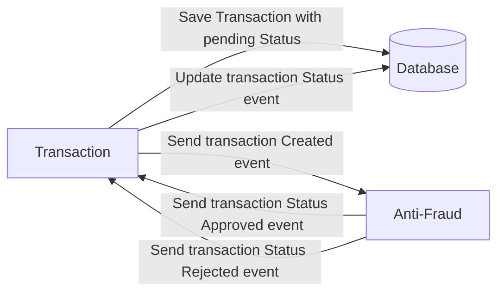

# Problem

Every time a financial transaction is created it must be validated by our anti-fraud microservice and then the same service sends a message back to update the transaction status.
For now, we have only three transaction statuses:

<ol>
  <li>pending</li>
  <li>approved</li>
  <li>rejected</li>  
</ol>

Every transaction with a value greater than 1000 should be rejected.



# Tech Stack
**Docker + Node.js + TypeScript + NestJS + TypeORM + TypeGraphQL + TSLint + PotgresSQL + Kafka**.

Next release: Jest 


### Requirements

```
$ Git --version
>= v2.32.1

$ Docker --version
>= v20.10.25

$ Docker Compose --version
>= v1.29.2

$ node --version
>= v18.16.1

$ NPM --version
>= v9.5.1

```

### How to run

From the terminal, enter the folder where you want to keep the project and perform the following steps:
```

In this section we initialize the database and kafka
$ git clone https://github.com/CristianHR/app-nodejs-codechallenge.git
$ cd app-nodejs-codechallenge
$ cp .env.example .env
$ docker-compose up

Open another terminal to start the transaction microservice
$ cd app-nodejs-codechallenge
$ npm install
$ npm start ms-transaction

Open another terminal to start the anti-fraud microservice
$ cd app-nodejs-codechallenge
$ npm start ms-antifraud
```

### Test the operation of the app
Open Playground of GraphQL in your browser http://localhost:3002/graphql and we continue to execute the following steps:

1. First we create the states of the transactions in the database, this is necessary, otherwise the app will not work:

```
$ mutation{
  createTransactionStatus(createTransactionStatusInput:{
    name: "pending"
  }){ id, name }
}

$ mutation{
  createTransactionStatus(createTransactionStatusInput:{
    name: "approved"
  }){ id, name  }
}

$ mutation{
  createTransactionStatus(createTransactionStatusInput:{
    name: "rejected"
  }){ id, name }
}

$ mutation{
  createTransactionType(createTransactionTypeInput:{
     name: "PENDING"
  }){id,name}
}

$ mutation{
  createTransactionType(createTransactionTypeInput:{
     name: "APPROVED"
  }){id,name}
}

$ mutation{
  createTransactionType(createTransactionTypeInput:{
     name: "REJECTED"
  }){id,name}
}

```

2. Finally we create the transactions that we want with the parameters established below:

```
mutation{
  createTransaction(createTransactionInput:{
    accountExternalIdDebit: "Guid",
    accountExternalIdCredit: "Guid",
    tranferTypeId: 1,
    value: 120
  }){
    transactionExternalId,
    transactionType{
    	name
    },
    transactionStatus{
      name
    },
    value,
    createdAt
  }
}
```
