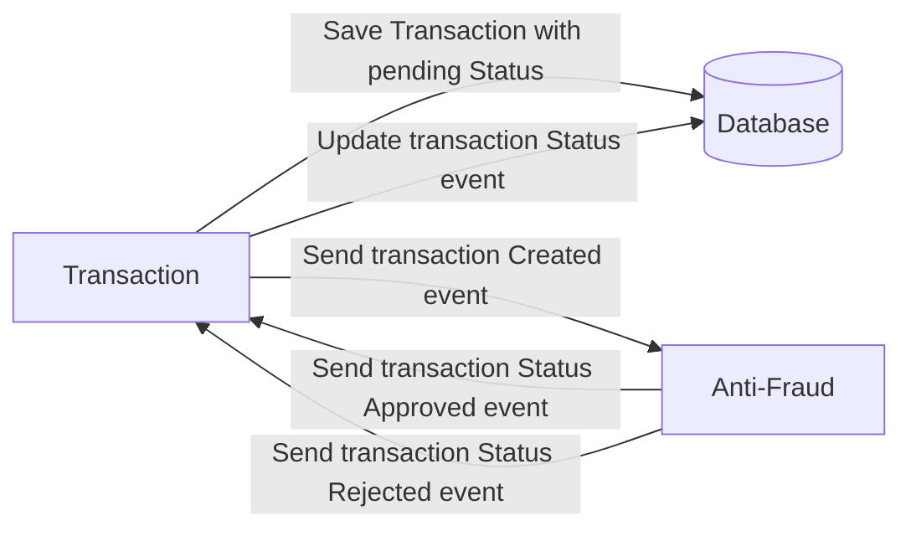

## Tecnologías:
- **NestJS:** Debido a que utiliza TypeScript, lo cual facilita mucho el desarrollo, además de ser bastante escalable y estar basado en Express, el framework más utilizado en el backend con NodeJS.

- **PostgreSQL:** Decidí utilizar una base de datos relacional debido a que, como es un proyecto relacionado con usuarios, cuentas y transacciones, en su mayoría finanzas, creo que una base de datos relacional nos da una mejor forma de organizar este tipo de datos.

- **GraphQL:** Utilicé GraphQL como respuesta a la mejora que se necesitaba para lidiar con la alta carga de escritura y lectura. Un API GraphQL es perfecto para lidiar con esto.

## Proyecto:
El proyecto lo he separado en dos partes principales, debido a que tienen responsabilidades distintas y se pueden iniciar como servicios separados o con más o menos recursos según se requiera.

### api-transactions:
Tiene como responsabilidad principal exponer el API y, en su defecto, realizar los cambios en la base de datos. Se conecta al microservicio de `anti-fraud-system`, emite el evento de creación y escucha los de aceptado y/o rechazado.

### anti-fraud-system:
Como se mencionó en el reto, el API debe conectarse a un microservicio de validación de anti-fraude. Realicé esto separado, el cual se encarga de escuchar la creación de transacciones y realizar algunas validaciones, incluida la del límite de 1000. Sé que esto puede tener una lógica más compleja o incluso usar un servicio externo de validación anti-fraude, pero intenté aplicar una lógica sencilla para simular esto.

## Iniciando el proyecto:
Considera como puntos principales agregar el archivo `.env` y también iniciar las dos aplicaciones `anti-fraud-system` y `api-transactions`. A continuación, se explica el orden y con más detalle.

```bash
# Instalar dependencias
$ npm install

# Agregar el .env. Para facilitar el tema de la prueba se puede duplicar
# directamente el archivo .env.example los datos son los mismos
# NOTA: en producción no se debe compartir este tipo de datos.
$ cp .env.example .env

# Iniciar los contenedores necesarios para probar el servicio
$ docker-compose up

# Verificar que los contenedores esten ejecutandose correctamente
$ docker ps

$ docker restart # (Solo si es necesario) en ocaciones el servicio de kafka se cierra

# NOTE: Importante iniciar hambos proyectos para iniciar el flujo completo
# Para probar el proyecto he creado un seeder que inserta los registros necesarios como estados/typos de transacion, ejecutar lo siguiente:
$ npm run seed-data

# Modo desarrollo
$ npm run start:dev
$ nest start anti-fraud-system --watch

# Modo Producción
$ npm run start:prod
$ nest start anti-fraud-system
```

## Ejemplos de uso
Una vez iniciado el proyecto el api habrá iniciado en la siguiente dirección `http://localhost:3000/graphql` en la cual podremos ver el playground para interacturar con GraphQL y tambien podemos ver la documentación y los esquemas del API.

Para empezar será necesario crear un usuario debido a que el api tiene implementada la validación por JWT.
### Creación de usuario
Para esto hay que registrarse la siguiente query
 ```
 mutation{
  signup(signUpUserInput:{
    username:"tuusuario"
    password:"tuclave"
  }){
    id
    username
  }
}
 ```
 ### Generación de Token
 ```
 mutation{
  login(loginUserInput:{
    username:"tuusuario"
    password:"tuclave"
  }){
    access_token
    user{
      username
    }
  }
}
```
Esto retornará un token el cual podrás usar para hacer uso de las otras Queries y Mutaciones disponibles en el api. Este token debe pasarte en los headers HTTP de la siguiente forma.
```
{
  "Authorization":"Bearer <token>"
}
```

### Creando una transacción
Este es un ejemplo de una transacción que será rechazada por el tema del monto limite. 
```
mutation{
  createTransaction(transactionInput:{
    accountExternalIdDebit:"3ED351C6-B3A3-423C-A002-A6AB8772BFB5"
    accountExternalIdCredit:"CCA26FC4-F987-4992-8C90-FD5AA13AAD21"
    transferTypeId:1
    value:1200
  }){
    transactionExternalId,
    transactionStatus{
      id
      name
    }
  }
}
```
Para la creación de transacciones se ha considerado los datos `accountExternalIdDebit` y `accountExternalIdCredit` con datos ficticios solamente se valida que sean datos UUID los demas datos si son considerados para la logica del reto, como el `transferTypeId` el cual es 1(Transferencia) en el ejemplo ese si deberá hacer match con los tipos de transacciones de la base de datos y el `value`(monto) que se usará para su validación o para la logica que se necesite luego de la aprovación de la transacción.

## NOTA: 
Hay muchos mas Queries y Mutaciones que se pueden usar y se puede explorar en la documentación del API.

 
