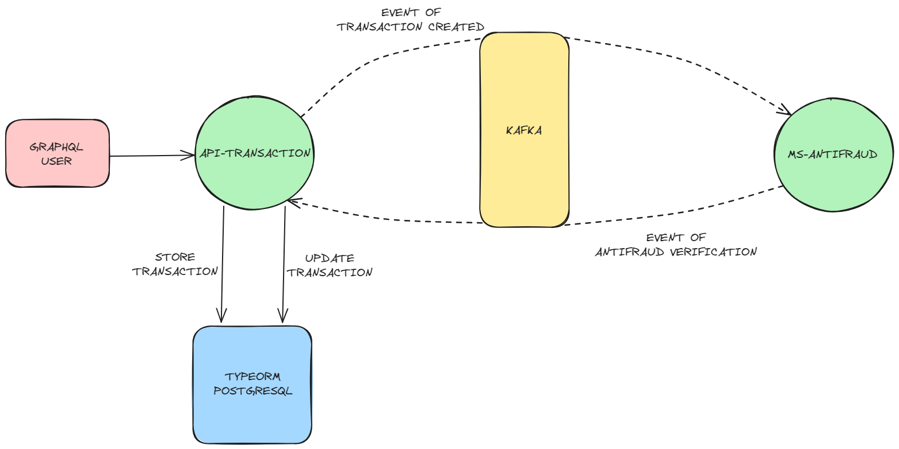

# Yape Code Challenge 🚀

If you want to see the challenge, click [here](CHALLENGE.md "Go to Challenge Section").

- [Solution](#solution "Go to Solution Section")
- [Tech Stack](#tech-stack "Go to Tech Stack Section")
- [Running the project](#running-the-project "Go to Running the project Section")
- [Documentation](#documentation "Go to Documentation Section")
- [Additional Notes](#additional-notes "Go to Additional Notes Section")

## Solution

- **Api Transaction:** Service that allow handle transactions.
- **Ms Antifraud:** Microservice that allow verify if a new transaction is valid or not.



## Tech Stack

- **NestJS (NodeJS):** Framework for server-side applications.
- **TypeOrm (PostgreSQL):** ORM for TypeScript and JavaScript
- **Apache Kafka:** Distributed data streaming platform.
- **GraphQL:** Query language for APIs.
- **Docker:** Platform for creating, deploying, and running applications in containers.
- **Apollo GraphQL:** A comprehensive platform for managing and consuming GraphQL APIs.

## Running the project

To run the complete project, make sure you have Docker and Docker Compose installed on your system. Then, follow the steps below:

1. Clone this repository to your local machine.
2. Rename file `.env.example` to `.env`.
3. Navigate to the root of the project where the `docker-compose.yml` file is located.
4. Run the following command to start the backend and frontend services:

```bash
docker-compose up
```

This will create and start Docker containers with each microservice, database, queue and dependencies running simultaneously.

5. Once all the containers are up and running, you can prove the application through the following link:

* **Backend (NestJS):** `http://localhost:3000/graphql`

This will display a Apollo Studio to prove the exposed apis with GraphQL.

## Documentation

The backend (NestJS) is documented using Apollo GraphQL, which provides an interactive interface to explore and test GraphQL endpoints. You can access the documentation at the following link:

* **Documentation (Apollo GraphQL):** `http://localhost:3000/graphql`

The Swagger-generated documentation will show you the different schemas, queries and mutations available in the backend along with details about the required parameters, and responses.

## Additional Notes

* If you want to stop the containers, you can press `Ctrl + C` in the terminal where the services are running and then execute the following command to stop and remove the containers:

```bash
docker-compose down
```
