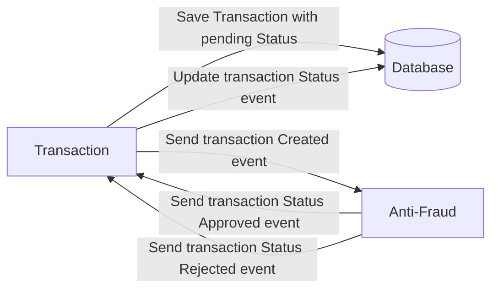

# Yape Code Challenge :rocket:

Our code challenge will let you marvel us with your Jedi coding skills :smile:. 

Don't forget that the proper way to submit your work is to fork the repo and create a PR :wink: ... have fun !!

- [Problem](#problem)
- [Tech Stack](#tech_stack)
- [Send us your challenge](#send_us_your_challenge)

# Problem

Every time a financial transaction is created it must be validated by our anti-fraud microservice and then the same service sends a message back to update the transaction status.
For now, we have only three transaction statuses:

<ol>
  <li>pending</li>
  <li>approved</li>
  <li>rejected</li>  
</ol>

Every transaction with a value greater than 1000 should be rejected.



# Tech Stack

For develop this challenge was used the following tecnologies:
<ol>
  <li> NestJS with TypeOrm. </li>
  <li>Postgres</li>
  <li>Kafka</li>   
  <li>GraphQl</li> 
</ol>

# How to run
1. Rename file `.env.example` to `.env`, its important for load environments variables.
2. To run the whole project using docker run the following command:

    ```
    docker compose up -d
    ```
    Once finished up the containers you can enter to <a href="http://localhost:3001/api/transaction" target="_blank">http://localhost:3001/api/transaction</a> or you can enter the Graphql playground <a href="http://localhost:3001/graphql" target="_blank">http://localhost:3001/graphql</a>

3. If you want to run locally run the following commands (the kafka, postgres and zookeeper services must also be running either by docker or locally)
    ```
    # For transaction-api
    cd transaction-api
    npm install
    npm run start:dev

    # For anti-fraud-microservice
    cd anti-fraud-microservice
    npm install
    npm run start:dev
    ```

# Resources

You can consume the transaction-api as a REST API or Graphql API.

1. In REST API is available the following recources:

  - `GET` <a href="http://localhost:3001/api/transaction" target="_blank">http://localhost:3001/api/transaction</a> returnthe list of transactions.
  - `POST` <a target="_blank">http://localhost:3001/api/transaction</a> create a new transaction and return the created transaction , the JSON that should be send must have the following structure:

    ```json
    {
      "accountExternalIdDebit": "Guid",
      "accountExternalIdCredit": "Guid",
      "tranferTypeId": 1,
      "value": 120
    }
    ```
  - `GET` <a target="_blank">http://localhost:3001/api/transaction/:id</a> returns data of the transaction that has an id equal to `:id` param. The response JSON is:
    ```json
    {
      "transactionExternalId": "1",
      "transactionType": {
        "name": ""
      },
      "transactionStatus": {
        "name": "APPROVED"
      },
      "value": 120,
      "createdAt": "Date"
    }
    ```


2. For Graphql API you can access to playground by `http:localhost:3001/graphql`

    The querys and mutations availables are in the next squema:

    ```gql
    type Transaction {
      id: Int!
      accountExternalIdDebit: String!
      accountExternalIdCredit: String!
      tranferTypeId: Int!
      value: Int!
      transactionStatus: Int!
      createdAt: String!
    }

    type Query {
      getTransaction(id: Int!): Transaction!
      transactions: [Transaction!]!
    }

    type Mutation {
      createTransaction(data: CreateTransactionDto!): Transaction!
    }

    input CreateTransactionDto {
      accountExternalIdDebit: String!
      accountExternalIdCredit: String!
      tranferTypeId: Int!
      value: Int!
    }
    ```
