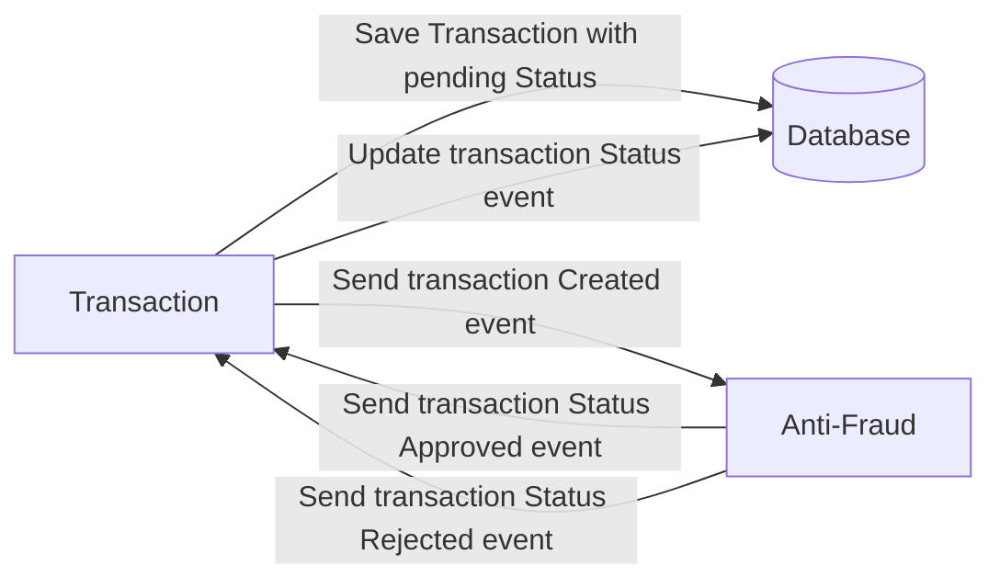

# Yape Code Challenge :rocket:

- [Problem](#problem)
- [Tech Stack](#tech_stack)
- [Send us your challenge](#send_us_your_challenge)

# Problem

Every time a financial transaction is created it must be validated by our anti-fraud microservice and then the same service sends a message back to update the transaction status.
For now, we have only three transaction statuses:

<ol>
  <li>pending</li>
  <li>approved</li>
  <li>rejected</li>  
</ol>

Every transaction with a value greater than 1000 should be rejected.



# Tech Stack

<ol>
  <li>Node. You can use any framework you want (i.e. Nestjs with an ORM like TypeOrm or Prisma) </li>
  <li>Any database</li>
  <li>Kafka</li>    
</ol>

We do provide a `Dockerfile` to help you get started with a dev environment.

You must have two resources:

1. Resource to create a transaction that must containt:

```json
{
  "accountExternalIdDebit": "Guid",
  "accountExternalIdCredit": "Guid",
  "tranferTypeId": 1,
  "value": 120
}
```

2. Resource to retrieve a transaction

```json
{
  "transactionExternalId": "Guid",
  "transactionType": {
    "name": ""
  },
  "transactionStatus": {
    "name": ""
  },
  "value": 120,
  "createdAt": "Date"
}
```

## Optional

You can use any approach to store transaction data but you should consider that we may deal with high volume scenarios where we have a huge amount of writes and reads for the same data at the same time. How would you tackle this requirement?

You can use Graphql;

# Challenge

## Diagram
1. The client do a request to Gateway, then the Gateway do a request to Transaction Microservice
2. Transaction Microservice store the data and send a message to Anti Fraud Microservice through Event Broker
3. Anti-Fraud Microservice validates the message and send a new message with status to Transaction Microservice
4. Transaction Microservice receive the message and updates the register with the new status
5. When the Gateway do a GET request, the first time the Transaction Microservice find into database, then all
requests to the same resource will be stored in cached database


## Setup project
1. set env variables
2. run scripts
```
> docker compose up -d --build
> npm run build
> npm run start:gateway
> npm run start:transaction
> npm run start:antifraud
```

## Result


