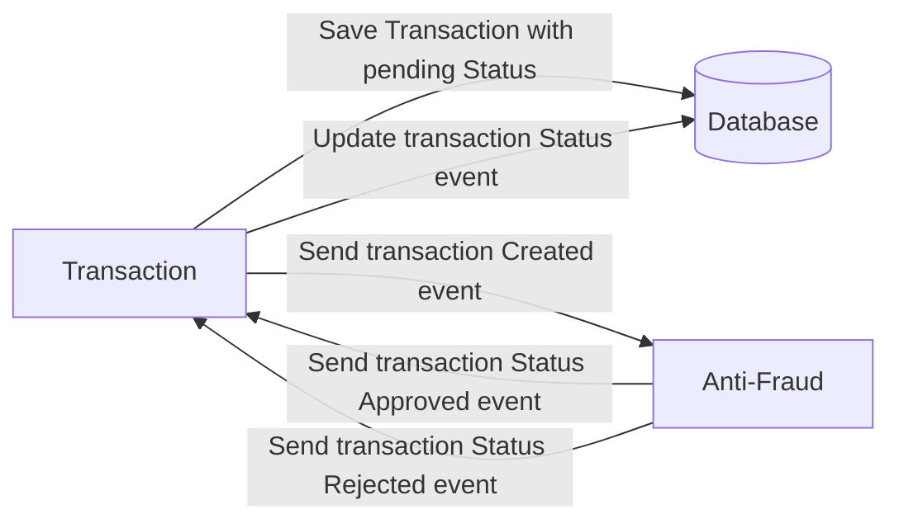

# Yape Code Challenge Solution ✅


- [Yape Code Challenge Solution ✅](#yape-code-challenge-solution-)
  - [Solution explanation](#solution-explanation)
  - [How to execute?](#how-to-execute)
  - [How to test?](#how-to-test)
- [Yape Code Challenge :rocket:](#yape-code-challenge-rocket)
- [Problem](#problem)
- [Tech Stack](#tech-stack)
  - [Optional](#optional)
- [Send us your challenge](#send-us-your-challenge)

This repository contains the following directories:

1. anti-fraud: Microservice for anti-fraud checking
2. transactions: Microservice for transactions management
3. thunder-tests: Thunder client GraphQL collection


## Solution explanation
In order to achieve the whole transaction functionality, two NestJS microservices were created (named as transactions and anti-fraud). 

These are the main features for every microservice:
1. **transactions**: Exposes a GraphQL API to create or read transactions. When a transaction is created, emits an event that represents the transaction creation. Handles the transaction approval or rejection events
2. **anti-fraud**: Handles the event creation event and checks the validation for the new transaction. Emits an event for each case (approved or rejected)

Other components:

1. **Kafka**: Used as a message broker platform to support the asynchronous communication between microservices.
2. **PostgreSQL**: Used to support the persistence layer for the transactions microservice. Indexes for faster performance query were created.
3. **Redis**: There is a Redis Store cache layer for the reading operations over the transaction microservice. Cache invalidation is performed in the transaction approval or rejection event handler.

The database index optimization and caching strategy were implemented to improve performance and support high load scenarios.
 
 Every microservice contains unit testing cases.

## How to execute?

The intended execution way of this solution is using the docker-compose file to setup all the solution locally.

1. Use the command ```docker-compose up``` in the repository root folder to start all the solution-related containers and wait until the log ```Nest application successfully started``` is shown for both microservices

Local execution can also be done by replacing the ```.env``` files in every microservice by their ```.env.local``` alternative. If you want to use this approach, then the following command will start all the containers excluding the microservices related ones ```docker-compose -f docker-compose.local.yml up```. Note that you should also execute the database migrations manually using ```yarn migration:run``` in the transactions directory.

## How to test?

The transactions service is mapped to the http://localhost:5000 URL.

You can use any graphql or rest compatible tool to test the transactions microservice GraphQL API.

This repository already contains a Thunder Client collection to test the two main functionalities (transaction creation and transaction reading). Also, you can access the default NestJS GraphQL playground feature in the following URL http://localhost:5000/graphql

You can use the following GraphQL examples so you can execute successfully the API functionalities:

1. Get transaction by id: 
   

```json
{
  transactionById(id: "2714df42-b5d2-4a53-9334-0cba66dee803") {
    transactionExternalId: accountExternalIdDebit
    transactionType: transferType {
      name
    }
    transactionStatus {
      name
    }
    value
    createdAt
  }
}
```

2. Create transaction:
  
  Mutation
```json
mutation CreateTransaction($transaction: TransactionInput!) {
  createTransaction(transaction: $transaction) {
    id
    accountExternalIdDebit
    accountExternalIdCredit
    value
    transferType {
      name
    }
  }
}
```
Variables
```json
{
  "transaction": {
    "accountExternalIdDebit": "0697fcb7-7946-4a2b-897b-eebf9346ee3b",
    "accountExternalIdCredit": "4106fc8f-7d31-464d-9351-9c8b1c1c04fc",
    "transferTypeId": 1,
    "value": 10000
  }
}
```
# Yape Code Challenge :rocket:

Our code challenge will let you marvel us with your Jedi coding skills :smile:. 

Don't forget that the proper way to submit your work is to fork the repo and create a PR :wink: ... have fun !!


# Problem

Every time a financial transaction is created it must be validated by our anti-fraud microservice and then the same service sends a message back to update the transaction status.
For now, we have only three transaction statuses:

<ol>
  <li>pending</li>
  <li>approved</li>
  <li>rejected</li>  
</ol>

Every transaction with a value greater than 1000 should be rejected.



# Tech Stack

<ol>
  <li>Node. You can use any framework you want (i.e. Nestjs with an ORM like TypeOrm or Prisma) </li>
  <li>Any database</li>
  <li>Kafka</li>    
</ol>

We do provide a `Dockerfile` to help you get started with a dev environment.

You must have two resources:

1. Resource to create a transaction that must containt:

```json
{
  "accountExternalIdDebit": "Guid",
  "accountExternalIdCredit": "Guid",
  "tranferTypeId": 1,
  "value": 120
}
```

2. Resource to retrieve a transaction

```json
{
  "transactionExternalId": "Guid",
  "transactionType": {
    "name": ""
  },
  "transactionStatus": {
    "name": ""
  },
  "value": 120,
  "createdAt": "Date"
}
```

## Optional

You can use any approach to store transaction data but you should consider that we may deal with high volume scenarios where we have a huge amount of writes and reads for the same data at the same time. How would you tackle this requirement?

You can use Graphql;

# Send us your challenge

When you finish your challenge, after forking a repository, you **must** open a pull request to our repository. There are no limitations to the implementation, you can follow the programming paradigm, modularization, and style that you feel is the most appropriate solution.

If you have any questions, please let us know.
