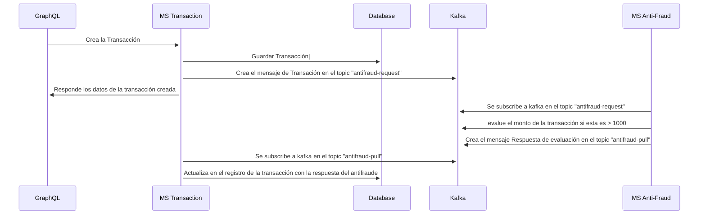

# Explicación de la solución
Se implementaron dos microservicios: uno para gestionar transacciones y actualizar la base de datos, y otro para validar transacciones contra fraudes (donde si una transacción era mayor a 1000 era "rechazada" y en caso contrario "aprobada"). Se empleó Kafka para la comunicación entre ellos, garantizando asíncronía y tolerancia a fallos. La arquitectura permite escalabilidad y mejora del rendimiento.
Para tener aún mejor rendimiento y menor carga en los servidores se utilizo GraphQL para solo traer la información necesaria para cada operación.

<ol>
  <li>A traves de GraphQL se crea una transaccción</li>
  <li>Desde el primer microservicio (transacción) se guarda la transacción en la base de datos</li>
  <li>Desde el primer microservicio  (transacción) utilizando kafka se publica un mensaje en el topic "antifraud-request"</li>
  <li>Desde el segundo microservicio  (antifraude) utilizando kafka se subscribe al topic "antifraud-request"</li>
  <li>Desde el segundo microservicio  (antifraude) se evalua la transacción si es mayor a 1000</li>
  <li>Desde el segundo microservicio  (antifraude) utilizando kafka se publica un mensaje en el topic "antifraud-pull"</li>
  <li>Desde el primer microservicio  (transacción) utilizando kafka se subscribe al topic "antifraud-pull"</li>
  <li>Desde el primer microservicio  (transacción) se actualiza el registro de esa transacción con el status de respuesta</li>
</ol>

# Diagrama de flujo de la solución

# Herramientas utilizadas
Las tecnologias que se usaron fueronh
<ol>
   <li>NodeJs</li>
   <li>Nestjs</li>
   <li>TypeOrm</li>
   <li>GraphQL</li>
   <li>Kafka</li>
   <li>PostgreSQL</li>
</ol>

# Requemientos previos del proyecto
<ol>
   <li>Node.js versión minima v18.14.2</li>
   <li>Docker</li>
</ol>

# Instrucciones de Configuración y Ejecución

## Configuración del Proyecto

### Paso 1: Iniciar Servicios Docker
En la raíz del proyecto, ejecuta el siguiente comando para iniciar los servicios Docker:

docker-compose up

### Paso 2: Configuración del Servicio de Antifraude
<ol>
  <li>Dirígete a la carpeta antifraude.</li>
  <li>Instala las dependencias ejecutando:
       npm install
</li>
  <li>Inicia el servicio con el siguiente comando:
       npm run start
  </li>  
</ol>

### Paso 3: Configuración del Servicio de Transacción
<ol>
  <li>Dirígete a la carpeta transaction</li>
  <li>Instala las dependencias ejecutando:
       npm install
</li>
  <li>Inicia el servicio con el siguiente comando:
       npm run start
  </li>  
</ol>

### Paso 4: Importar la colección postman para pruebas
Desde postman seleccione la opción de importar y arrastre el siguiente archivo colocado en la raiz del proyecto
Prueba Yape GPL.postman_collection.json

### Notas Adicionales
Si encuentras algún problema durante la configuración o ejecución, consulta la documentación del proyecto o comunícate con el equipo de desarrollo para obtener ayuda.
