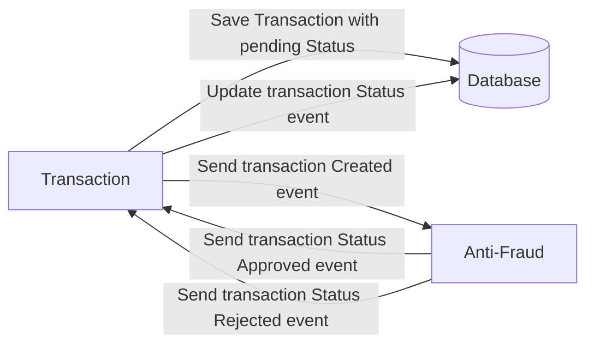

# Yape Challenge | Transaction Processing System

## Overview

This project implements a distributed transaction processing system with a focus on high availability and fault tolerance. It includes two main microservices for handling transaction storage/status update and fraud detection along with PostgreSQL for data persistence and Apache Kafka for reliable message queuing.

I used DDD for architecture. You can see the folder src/modules/ Application, Domain, and infrastructure (I/O) 

## Problems

if your docker-compose not found, you can try using a local apache kafka version. 
In the transaction-service Readme, you can get step by spept instructions.

## Prerequisites

To run this project, you will need:

- Docker - [Installation Guide](https://docs.docker.com/get-docker/)
- Docker Compose - [Installation Guide](https://docs.docker.com/compose/install/)

## Local Development Setup

### 1. Clone the Repository

To get started, clone the repository to your local machine:

```bash
git clone https://your-repository-url.git](https://github.com/maximilianokaizen/yape-fork
cd your-repository-directory
```
Rename the .env.example files to .env in both projects.

### 2. Build and Run the Services

docker-compose up --build -d

### 3. Verify the Services

docker-compose logs

### 4. Verify the Services

The microservices and Kafka broker are accessible on their respective ports as defined in the docker-compose.yml.

### 5. Stopping the Services

To stop and remove all the running services:

### 6. Tools

Create Transactions
For create transctions, we have a go script in
/producer-test, if you have go in your machine
can use go run main.go -n [1], to create 1, or
any number of transactions.

### 7 Database

in the transaction-service folder you need run

npx prisma generate --schema=./prisma/postgres-schema.prisma 
npx prisma migrate dev --name init --schema=./prisma/postgres-schema.prisma npm run seed··

### 6. Contact

rossi.maxi@gmail.com,
maximilianokaizen@gmail.com
https://www.linkedin.com/in/maximiliano-rossi-145b41b/


### Screenshots


# Yape Code Challenge :rocket:

Our code challenge will let you marvel us with your Jedi coding skills :smile:.

Don't forget that the proper way to submit your work is to fork the repo and create a PR :wink: ... have fun !!

- [Problem](#problem)
- [Tech Stack](#tech_stack)
- [Send us your challenge](#send_us_your_challenge)

# Problem

Every time a financial transaction is created it must be validated by our anti-fraud microservice and then the same service sends a message back to update the transaction status.
For now, we have only three transaction statuses:

<ol>
  <li>pending</li>
  <li>approved</li>
  <li>rejected</li>  
</ol>

Every transaction with a value greater than 1000 should be rejected.



# Tech Stack

<ol>
  <li>Node. You can use any framework you want (i.e. Nestjs with an ORM like TypeOrm or Prisma) </li>
  <li>Any database</li>
  <li>Kafka</li>    
</ol>

We do provide a `Dockerfile` to help you get started with a dev environment.

You must have two resources:

1. Resource to create a transaction that must containt:

```json
{
  "accountExternalIdDebit": "Guid",
  "accountExternalIdCredit": "Guid",
  "tranferTypeId": 1,
  "value": 120
}
```

2. Resource to retrieve a transaction

```json
{
  "transactionExternalId": "Guid",
  "transactionType": {
    "name": ""
  },
  "transactionStatus": {
    "name": ""
  },
  "value": 120,
  "createdAt": "Date"
}
```

## Optional

You can use any approach to store transaction data but you should consider that we may deal with high volume scenarios where we have a huge amount of writes and reads for the same data at the same time. How would you tackle this requirement?

You can use Graphql;
