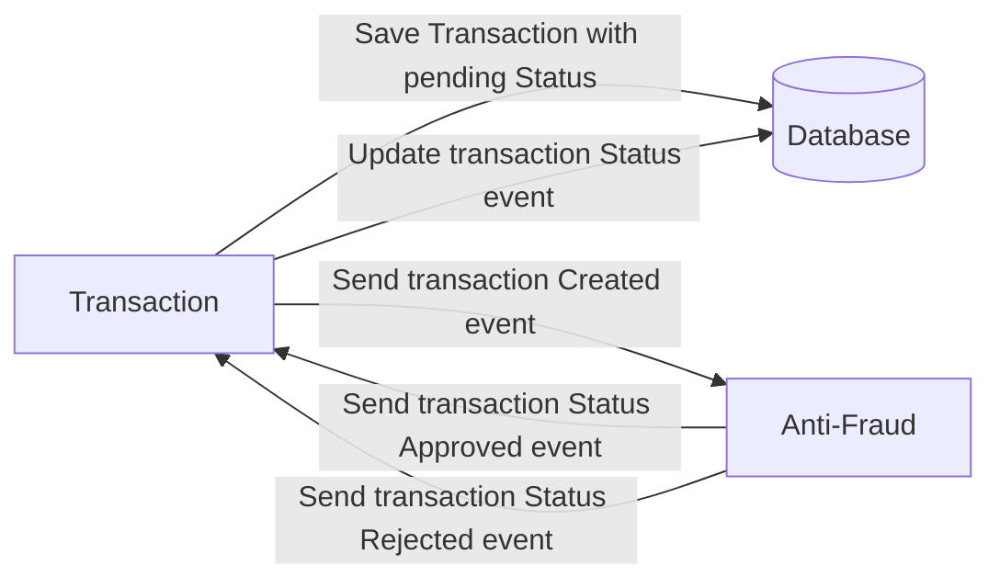

# Yape Code Challenge :rocket:

Our code challenge will let you marvel us with your Jedi coding skills :smile:. 

Don't forget that the proper way to submit your work is to fork the repo and create a PR :wink: ... have fun !!

- [Problem](#problem)
- [Tech Stack](#tech_stack)
- [Send us your challenge](#send_us_your_challenge)

# Problem

Every time a financial transaction is created it must be validated by our anti-fraud microservice and then the same service sends a message back to update the transaction status.
For now, we have only three transaction statuses:

<ol>
  <li>pending</li>
  <li>approved</li>
  <li>rejected</li>  
</ol>

Every transaction with a value greater than 1000 should be rejected.



# Tech Stack

<ol>
  <li>Node. You can use any framework you want (i.e. Nestjs with an ORM like TypeOrm or Prisma) </li>
  <li>Any database</li>
  <li>Kafka</li>    
</ol>

We do provide a `Dockerfile` to help you get started with a dev environment.

You must have two resources:

1. Resource to create a transaction that must containt:

```json
{
  "accountExternalIdDebit": "Guid",
  "accountExternalIdCredit": "Guid",
  "tranferTypeId": 1,
  "value": 120
}
```

2. Resource to retrieve a transaction

```json
{
  "transactionExternalId": "Guid",
  "transactionType": {
    "name": ""
  },
  "transactionStatus": {
    "name": ""
  },
  "value": 120,
  "createdAt": "Date"
}
```

## Optional

You can use any approach to store transaction data but you should consider that we may deal with high volume scenarios where we have a huge amount of writes and reads for the same data at the same time. How would you tackle this requirement?

You can use Graphql;

# Send us your challenge

When you finish your challenge, after forking a repository, you **must** open a pull request to our repository. There are no limitations to the implementation, you can follow the programming paradigm, modularization, and style that you feel is the most appropriate solution.

If you have any questions, please let us know.

# Assumptions
- `transactionExternalId` column depends on accountExternalIdDebit or accountExternalIdCredit.
- `tranferTypeId` determine the value of transactionType, this should be a Collection.
- The focus was changed to simulate an Anti-fraud external service, using queues and callbacks. Fine?
- Microservice avoid sending Anti-fraud validation for transactions over 1000.

# Important notes
- Was selected a NoSQL database to improve read/write data instead PostgreSQL.
- MongoDB as database but without embedded documents to be near/compatible a SQL approach.
- The solution avoids "document-blocking" storing status outside of transactions.
- A simple cache solution is implemented to show performance techniques.
- Every response from anti-fraud service store a document, allowing historical records.
- Anti-fraud service use a random method to reject 25% of transactions. Customizable.
- Kafka client was created as singleton instance to show design patterns.
- I use Typescript as much as possible, but it can be improved.
- Only one example for each Cohn's Pyramid level: Unit test, Integration test and E2E.
- Minimal documentation, but it works and have a lot of comments.
- Validation of colums in requests are manual to simplify dependencies.

# Prisma library and seed database considerations

Prisma needs to [migrate](https://www.prisma.io/docs/concepts/components/prisma-migrate/db-push) the schema to their client, for that is necessary to run the command `npx prisma db push` for work properly.

In order to populate different types of transaction, you need to run the command `npm run seed` to create (or update) this collection by Prisma library.