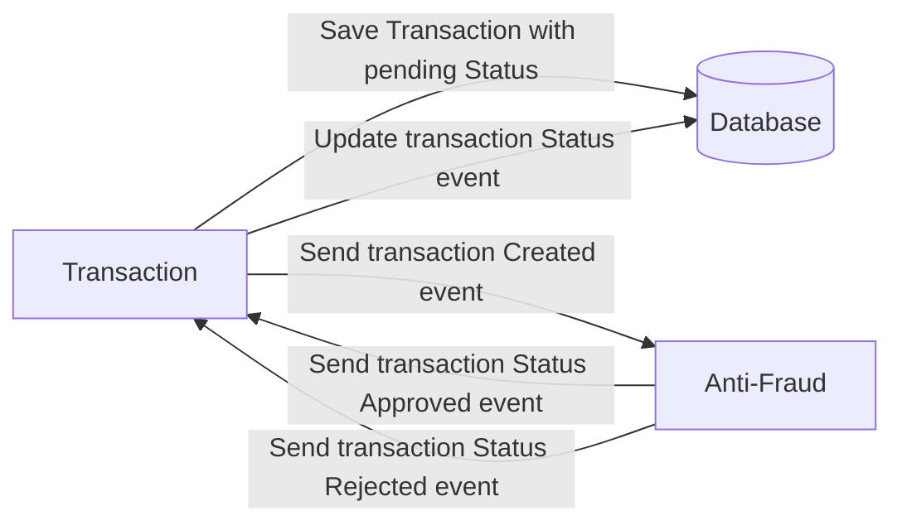

# Yape Code Challenge - Jesus Rodriguez

Our code challenge will let you marvel us with your Jedi coding skills :smile:. 

Don't forget that the proper way to submit your work is to fork the repo and create a PR :wink: ... have fun !!

- [Problem](#problem)
- [Tech Stack](#tech_stack)
- [Send us your challenge](#send_us_your_challenge)

# Problem

Every time a financial transaction is created it must be validated by our anti-fraud microservice and then the same service sends a message back to update the transaction status.
For now, we have only three transaction statuses:

<ol>
  <li>pending</li>
  <li>approved</li>
  <li>rejected</li>  
</ol>

Every transaction with a value greater than 1000 should be rejected.



# Tech Stack

<ol>
  <li>Node. You can use any framework you want (i.e. Nestjs with an ORM like TypeOrm or Prisma) </li>
  <li>Any database</li>
  <li>Kafka</li>    
</ol>

We do provide a `Dockerfile` to help you get started with a dev environment.

You must have two resources:

1. Resource to create a transaction that must containt:

```json
{
  "accountExternalIdDebit": "Guid",
  "accountExternalIdCredit": "Guid",
  "tranferTypeId": 1,
  "value": 120
}
```

2. Resource to retrieve a transaction

```json
{
  "transactionExternalId": "Guid",
  "transactionType": {
    "name": ""
  },
  "transactionStatus": {
    "name": ""
  },
  "value": 120,
  "createdAt": "Date"
}
```

## Optional

You can use any approach to store transaction data but you should consider that we may deal with high volume scenarios where we have a huge amount of writes and reads for the same data at the same time. How would you tackle this requirement?

You can use Graphql;

# Send us your challenge

When you finish your challenge, after forking a repository, you **must** open a pull request to our repository. There are no limitations to the implementation, you can follow the programming paradigm, modularization, and style that you feel is the most appropriate solution.

If you have any questions, please let us know.

# Solution

- Clone the project.
- Copy **.env.example** to **.env**. It will be used as environment variables source.

Run ```docker-compose``` command inside folder.

* Building the containers: ```docker-compose build```

* Starting the services: ```docker-compose up -d```

* Stoping the services: ```docker-compose stop```

By default the api will run under the following port:
- http://localhost:4000


You must have three resources:

1. Resource to create a transaction:

```gql
mutation Mutation($input: TransactionInput) {
  createTransaction(input: $input) {
    code
    message
    success
  }
}
```
```json
{
  "input": {
    "accountExternalIdCredit": "b511ddbe-6a5b-4c31-8db8-a8e8237bd44b",
    "accountExternalIdDebit": "da24cfb3-71e3-49b4-b408-e85d53c2a5c3",
    "tranferTypeId": 1,
    "value": 500
  }
}
```

2. Search a transaction: 

```gql
query SearchTransaction($transactionId: GUID!) {
  searchTransaction(transactionId: $transactionId) {
    message
    success
    code
    result {
      transactionExternalId
      tranferTypeId
      status
      value
      createdAt
    }
  }
}

```
```json
{
  "transactionId": "1a920c5c-56ed-4a17-b0cc-cb7a5b2e1091"
}
```

2. Get all transactions, limited per ten rows (Optional): 
```
query AllTransaction {
  allTransaction {
    transactionExternalId
    tranferTypeId
    status
    value
    createdAt
  }
}
```