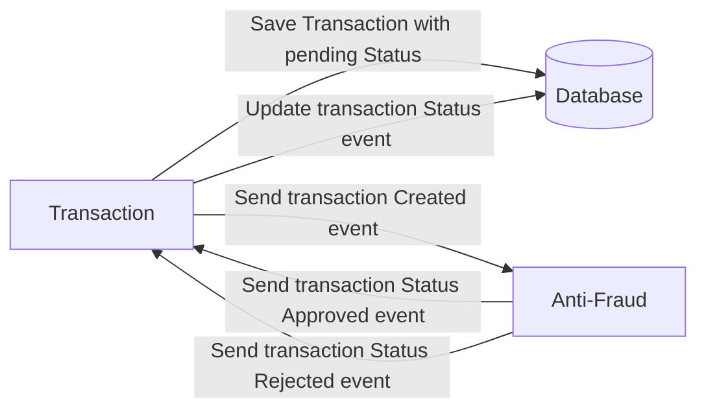

# Yape Code Challenge :rocket:

Our code challenge will let you marvel us with your Jedi coding skills :smile:.

Don't forget that the proper way to submit your work is to fork the repo and create a PR :wink: ... have fun !!

- [Problem](#problem)
- [Tech Stack](#tech_stack)
- [Send us your challenge](#send_us_your_challenge)
- [Solution](#solution)

# Problem

Every time a financial transaction is created it must be validated by our anti-fraud microservice and then the same service sends a message back to update the transaction status.
For now, we have only three transaction statuses:

<ol>
  <li>pending</li>
  <li>approved</li>
  <li>rejected</li>  
</ol>

Every transaction with a value greater than 1000 should be rejected.



# Tech Stack

<ol>
  <li>Node. You can use any framework you want (i.e. Nestjs with an ORM like TypeOrm or Prisma) </li>
  <li>Any database</li>
  <li>Kafka</li>    
</ol>

We do provide a `Dockerfile` to help you get started with a dev environment.

You must have two resources:

1. Resource to create a transaction that must containt:

```json
{
  "accountExternalIdDebit": "Guid",
  "accountExternalIdCredit": "Guid",
  "transferTypeId": 1,
  "value": 120
}
```

2. Resource to retrieve a transaction

```json
{
  "transactionExternalId": "Guid",
  "transactionType": {
    "name": ""
  },
  "transactionStatus": {
    "name": ""
  },
  "value": 120,
  "createdAt": "Date"
}
```

## Optional

You can use any approach to store transaction data but you should consider that we may deal with high volume scenarios where we have a huge amount of writes and reads for the same data at the same time. How would you tackle this requirement?

You can use Graphql;

# Send us your challenge

When you finish your challenge, after forking a repository, you **must** open a pull request to our repository. There are no limitations to the implementation, you can follow the programming paradigm, modularization, and style that you feel is the most appropriate solution.

If you have any questions, please let us know.

# Solution

## Technology Stack

- NestJS with TypeORM
- Kafka
- PostgreSQL
- JMeter for stress testing. [Demo](https://drive.google.com/file/d/14koX_Yan6kMUkf8N5wItH-8lK0F7dl7k/view?usp=sharing).

## Setting up the Docker Container

Deploy the project in a Docker container using the following command:

```bash
docker-compose up --build -d
```

## Workflow Process

1.  Initiate a call to the `/graphql` service using the following mutation:

    ```graphql
    mutation CreateTransaction($input: CreateTransactionDTO!) {
      createTransaction(createTransactionInput: $input) {
        transactionExternalId
        accountExternalIdDebit
        accountExternalIdCredit
        value
      }
    }
    ```

    ```json
    {
      "input": {
        "accountExternalIdDebit": "123",
        "accountExternalIdCredit": "456",
        "transferTypeId": 1,
        "value": 120
      }
    }
    ```

    

2.  A new transaction is created with a 'pending' status in the `TransactionsService`. A new event is then published to the `validate-transaction` topic, containing the transaction's body and external ID.

3.  The `AntifraudService` listens for this event and validates the transaction value. If the value is less than or equal to 1000, the transaction status is updated to 'approved'; otherwise, it is set to 'rejected'. After that a new event is published to the `update-transaction` topic with the transaction's external ID and its new status.

4.  The `TransactionsService` listens for the updated status event and updates the transaction record in the database.

5.  Finally, you can get the transaction by it's external ID.

    ```graphql
    query GetTransaction($transactionExternalId: String!) {
      transaction(transactionExternalId: $transactionExternalId) {
        transactionExternalId
        accountExternalIdDebit
        accountExternalIdCredit
        transferTypeId
        value
        createdAt
        status
      }
    }
    ```

    ```json
    {
      "transactionExternalId": "id"
    }
    ```


