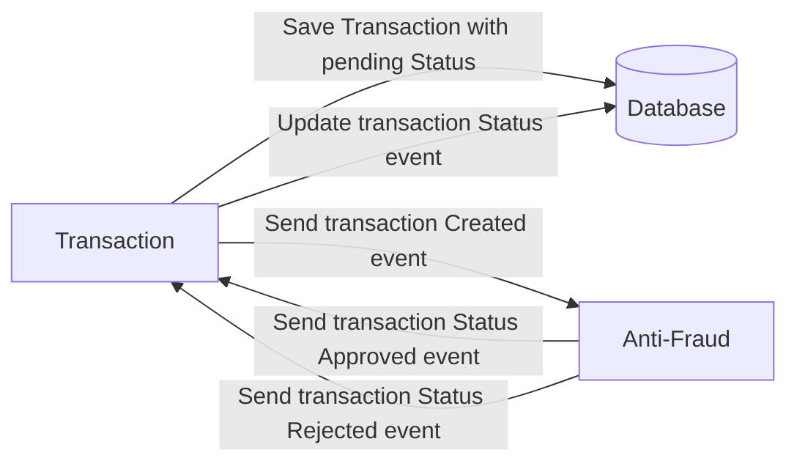

# Yape Code Challenge :rocket:

- [Problem](#problem)
- [Tech Stack](#tech_stack)
- [Send us your challenge](#send_us_your_challenge)

# Problem

Every time a financial transaction is created it must be validated by our anti-fraud microservice and then the same service sends a message back to update the transaction status.
For now, we have only three transaction statuses:

<ol>
  <li>pending</li>
  <li>approved</li>
  <li>rejected</li>  
</ol>

Every transaction with a value greater than 1000 should be rejected.



# Tech Stack

<ol>
  <li>Node. You can use any framework you want (i.e. Nestjs with an ORM like TypeOrm or Prisma) </li>
  <li>Any database</li>
  <li>Kafka</li>    
</ol>

We do provide a `Dockerfile` to help you get started with a dev environment.

You must have two resources:

1. Resource to create a transaction that must containt:

```json
{
  "accountExternalIdDebit": "Guid",
  "accountExternalIdCredit": "Guid",
  "transferTypeId": 1,
  "value": 120
}
```

2. Resource to retrieve a transaction

```json
{
  "transactionExternalId": "Guid",
  "transactionType": {
    "name": ""
  },
  "transactionStatus": {
    "name": ""
  },
  "value": 120,
  "createdAt": "Date"
}
```

## Optional

You can use any approach to store transaction data but you should consider that we may deal with high volume scenarios where we have a huge amount of writes and reads for the same data at the same time. How would you tackle this requirement?

You can use Graphql;

# Send us your challenge

When you finish your challenge, after forking a repository, you can open a pull request to our repository. There are no limitations to the implementation, you can follow the programming paradigm, modularization, and style that you feel is the most appropriate solution.

If you have any questions, please let us know.


# Code
* Use of CLEAN ARCHITECTURE
* Layout or packaging
  * adapter
    * input
      * messaging
      * web
        * dto
        * converter
    * output
      * messaging
      * db
  * application
  * domain  
    * models
    * usecases
* Multiple commits following a step-by-step logical construction of the conceptual sequence diagram
  (so there is no magic one-shot commit) In this sense, the project can be used as a tool of teaching newcomers.
  * transaction microservice
    1. clean architecture skeleton
    2. creation endpoint
    3. db repository, saving of transaction
    4. messaging producer
    5. notify antifraud to check transaction
  * antifraud microservice
    1. clean architecture skeleton
    2. messaging consumer
    3. consume event
    4. validate transaction
    5. messaging producer
    6. notify transaction with validation result
  * transaction microservice
    1. messaging consumer
    2. db repository, update of transaction using optimistic concurrency
    3. update transaction in accordance to validation result

# Advantages of CLEAN ARCHITECTURE
* Separate domain from infrastructure, technology
* Understanding WHAT the system does by looking at its usecases
* Have a big picture of the architecture,
  participants, actors, dependencies, kind of help to build a mental context diagram
* Maintenability, evolvability, readbility, comprehensibility (mainly by newcomers)
* Structure not imposed by frameworks and so resilient to framework changes.
* Currently used by Yape on Java projects

# Design
* This pattern concerns our scenario
  * [ASYNCHRONOUS REQUEST-REPLY PATTERN](https://learn.microsoft.com/en-us/azure/architecture/patterns/async-request-reply)
* The sequence is two-fold:
  * blocking sequence, process
    * creation of transaction and return as 'pending'. Behind the scenes, the next sequence is started
  * asynchronous process
    * validation of transaction
    * result of validation is post-processed. It 'takes' time.
* Let's do an analogy of this two-fold sequence (related to content and form, "fondo y forma" in Spanish)
  * It's like an administrative task, making a request to a government institution
    * Your request is accepted 'immediately'. The right template of your requests is analyzed. The form is analyzed quickly, not the content. Kind of blocking call. Your request is accepted, it doesn't mean it is validated.
    * The content of your request ("el fondo del asunto" in Spanish) is post analyzed, it takes time. It's the asynchronous part of your request.
* For tackling a huge amount of writes:
  * Use optimistic concurrency. Advantage: no need to wrap up a resource update with a database transaction.
  * Transactions are fine but represent a performance penalty in data-intensive scenarios.
* For tackling a huge amount of reads:
  * Address read-only queries (CQRS) by configuring the microservices to read from read-only database replicas.

## Conceptual sequence diagram


## Detailed sequence diagram of Transaction microservice


## Detaile sequence diagram of Antifraud microservice


# Technical notes
docker-compose -f docker-compose.yml down
docker-compose -f docker-compose.yml up

psql -U postgres -p 5434 -h localhost -W
psql -U postgres -p 5434 -h localhost -d transaction_db  -W

# Integration test
cd transaction_project

./test/scripts/create-tx.sh <amount>
./test/scripts/create-tx.sh 1500

# Notes to organize
* Code formatted with ESLint
* Sequence of commits (tool of teaching)