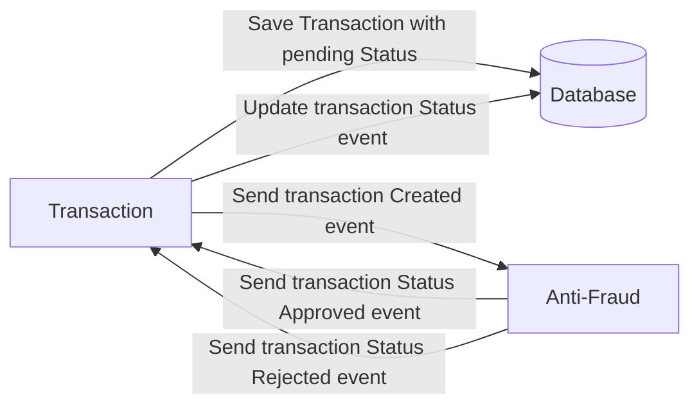

# Yape Code Challenge :rocket:

# Solución - César Torres Lara

# Diagrama de Aplicaciones


# Herramientas

He usado las siguiente herramientas para el desarrollo de mi reto técnico.

<ol>
  <ul><strong>VS Code</strong>: Editor de código fuente</ul>
  <ul><strong>NodeJS</strong>: Entorno de ejecución Javascript</ul>
  <ul><strong>Typescript</strong>: Lenguaje de programación como extensión de Javascript, para el tipado de datos</ul>
  <ul><strong>MongoDB</strong>: Sistema de datos NoSQL para el almacenamientos de datos</ul>
  <ul><strong>Docker</strong>: Virtualiza las aplicaciones en contenedores para ejecutar en diferentes entornos</ul>
  <ul><strong>Docker-compose</strong>: Permite gestionar multicontenedores de Docker mediante un archivo YAML</ul>
  <ul><strong>Kafka</strong>: Proporciona una arquitectura de transmisión de datos entre microservicios</ul>
  <ul><strong>Swagger</strong>: Permite diseñar, construir y documentar APIs de manera sencilla.</ul>   
</ol>


# Requerimientos Previos:

Para poder ejecutar y ver los logs del proyecto, recomiendo descargar **Docker Desktop** para tener una interfaz gráfica mas intuitiva de como se estan manejando los contenedores y ver los logs del sistema.

Link de la página oficial para poder descargarlo: [Docker Desktop]("https://www.docker.com/products/docker-desktop/")

No olvides tener los puertos **3001** y **3002** para poder ejecutar los microservicios.

# Instalación y Ejecución

Para poder ejecutar la aplicación debe ubicar en la ruta raiz del proyecto y ejecutar en la consola el siguiente comando: `docker-compose up -d`. De esta forma se empezaran a iniciar en segundo plano los contenedores definidos en el archivo **docker-compose.yml**.

**NOTA:** para poder entrar como cliente, se hace uso de Swagger donde esta documentado el API REST y así poder crear transacciones de manera manual.

SWagger se encuentra ubicado en `http://localhost:3001/documentation/`.


Our code challenge will let you marvel us with your Jedi coding skills :smile:. 

Don't forget that the proper way to submit your work is to fork the repo and create a PR :wink: ... have fun !!

- [Problem](#problem)
- [Tech Stack](#tech_stack)
- [Send us your challenge](#send_us_your_challenge)

# Problem

Every time a financial transaction is created it must be validated by our anti-fraud microservice and then the same service sends a message back to update the transaction status.
For now, we have only three transaction statuses:

<ol>
  <li>pending</li>
  <li>approved</li>
  <li>rejected</li>  
</ol>

Every transaction with a value greater than 1000 should be rejected.



# Tech Stack

<ol>
  <li>Node. You can use any framework you want (i.e. Nestjs with an ORM like TypeOrm or Prisma) </li>
  <li>Any database</li>
  <li>Kafka</li>    
</ol>

We do provide a `Dockerfile` to help you get started with a dev environment.

You must have two resources:

1. Resource to create a transaction that must containt:

```json
{
  "accountExternalIdDebit": "Guid",
  "accountExternalIdCredit": "Guid",
  "tranferTypeId": 1,
  "value": 120
}
```

2. Resource to retrieve a transaction

```json
{
  "transactionExternalId": "Guid",
  "transactionType": {
    "name": ""
  },
  "transactionStatus": {
    "name": ""
  },
  "value": 120,
  "createdAt": "Date"
}
```

## Optional

You can use any approach to store transaction data but you should consider that we may deal with high volume scenarios where we have a huge amount of writes and reads for the same data at the same time. How would you tackle this requirement?

You can use Graphql;

# Send us your challenge

When you finish your challenge, after forking a repository, you **must** open a pull request to our repository. There are no limitations to the implementation, you can follow the programming paradigm, modularization, and style that you feel is the most appropriate solution.

If you have any questions, please let us know.
