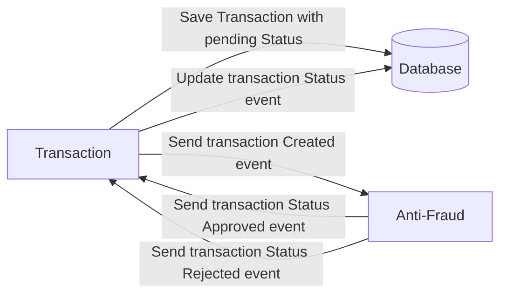

# Yape Code Challenge :rocket:

Our code challenge will let you marvel us with your Jedi coding skills :smile:. 

Don't forget that the proper way to submit your work is to fork the repo and create a PR :wink: ... have fun !!

- [Problem](#problem)
- [Tech Stack](#tech_stack)
- [Send us your challenge](#send_us_your_challenge)

# Problem

Every time a financial transaction is created it must be validated by our anti-fraud microservice and then the same service sends a message back to update the transaction status.
For now, we have only three transaction statuses:

<ol>
  <li>pending</li>
  <li>approved</li>
  <li>rejected</li>  
</ol>

Every transaction with a value greater than 1000 should be rejected.



# Tech Stack

<ol>
  <li>Node. You can use any framework you want (i.e. Nestjs with an ORM like TypeOrm or Prisma) </li>
  <li>Any database</li>
  <li>Kafka</li>    
</ol>

We do provide a `Dockerfile` to help you get started with a dev environment.

You must have two resources:

1. Resource to create a transaction that must containt:

```json
{
  "accountExternalIdDebit": "Guid",
  "accountExternalIdCredit": "Guid",
  "tranferTypeId": 1,
  "value": 120
}
```

2. Resource to retrieve a transaction

```json
{
  "transactionExternalId": "Guid",
  "transactionType": {
    "name": ""
  },
  "transactionStatus": {
    "name": ""
  },
  "value": 120,
  "createdAt": "Date"
}
```

## Optional

You can use any approach to store transaction data but you should consider that we may deal with high volume scenarios where we have a huge amount of writes and reads for the same data at the same time. How would you tackle this requirement?

You can use Graphql;

# Send us your challenge

When you finish your challenge, after forking a repository, you **must** open a pull request to our repository. There are no limitations to the implementation, you can follow the programming paradigm, modularization, and style that you feel is the most appropriate solution.

If you have any questions, please let us know.

# Challenge Solution

### Step 1: Start the `ms-antifraud` Microservice

```bash
docker-compose up ms-antifraud
```

This command launches the `postgres, kafka, and ms-antifraud` services as defined in the docker-compose.yml file.

### Step 2: Seed the Database

Enter the container's terminal and execute the following command to seed the database:

```bash
npm run seed:run
```

### Step 3: Open the GraphQL Interface in the Browser

```
http://localhost:3000/graphql
```

### Step 4: Retrieve Transactions using GraphQL Query

Send a GraphQL query to retrieve transactions:

```graphql
query GetAllTransactions {
    getAllTransactions {
        value
        createdAt
        transactionType {
            name
        }
        transactionStatus {
            name
        }
        transactionExternalId
    }
}
```

### Step 5: Insert a New Transaction using GraphQL Mutation

Transaction Approval
```graphql
mutation {
  createTransaction(input: {
    accountExternalIdDebit: "a5e7be8d-12a5-4a3e-abfa-03ea7bc520l9",
    accountExternalIdCredit: "9cdef21b-b973-4860-adc5-7eda63e0e1j9",
    transferTypeId: 1
    value: 120
  }) {
    transactionExternalId
    transactionType {
        name
    }
    transactionStatus {
        name
    }
    value
    createdAt
  }
}
```

Transaction Rejection
```graphql
mutation {
  createTransaction(input: {
    accountExternalIdDebit: "a5e7be8d-12a5-4a3e-abfa-03ea7bc520d1",
    accountExternalIdCredit: "9cdef21b-b973-4860-adc5-7eda63e0e1e1",
    transferTypeId: 1
    value: 1500
  }) {
    transactionExternalId
    transactionType {
        name
    }
    transactionStatus {
        name
    }
    value
    createdAt
  }
}
```

Check the console of ms-antifraud, and you will see logs like the following.
```bash
ms-antifraud-1  | Received message from topic yape.transactions, partition 0: {"transactionExternalId":"306eace1-27c6-42de-b32c-1e414980c626","accountExternalIdDebit":"a5e7be8d-12a5-4a3e-abfa-03ea7bc520r9","accountExternalIdCredit":"9cdef21b-b973-4860-adc5-7eda63e0e1p9","value":"1500.00","transferTypeId":1,"transferStatusId":1,"createdAt":"2024-02-11T04:38:57.770Z","updatedAt":"2024-02-11T04:38:57.770Z","transactionType":{"id":1,"name":"Interbancaria"},"transactionStatus":{"id":1,"name":"pending"}}
ms-antifraud-1  | Transaction 306eace1-27c6-42de-b32c-1e414980c626 has been rejected
ms-antifraud-1  | Received message from topic yape.transactions, partition 0: {"transactionExternalId":"52b8e182-cb03-4f67-bba8-0345cece8c9f","accountExternalIdDebit":"a5e7be8d-12a5-4a3e-abfa-03ea7bc520a1","accountExternalIdCredit":"9cdef21b-b973-4860-adc5-7eda63e0e1b1","value":"500.00","transferTypeId":1,"transferStatusId":1,"createdAt":"2024-02-11T05:38:49.084Z","updatedAt":"2024-02-11T05:38:49.084Z","transactionType":{"id":1,"name":"Interbancaria"},"transactionStatus":{"id":1,"name":"pending"}}
ms-antifraud-1  | Transaction 52b8e182-cb03-4f67-bba8-0345cece8c9f has been approved
```
