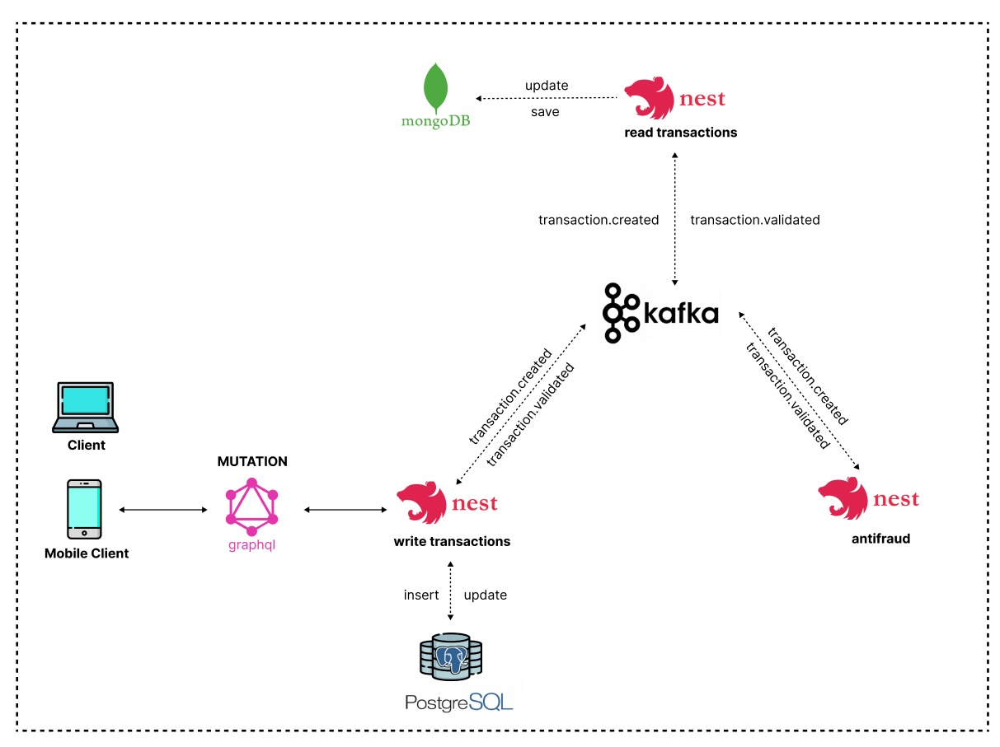
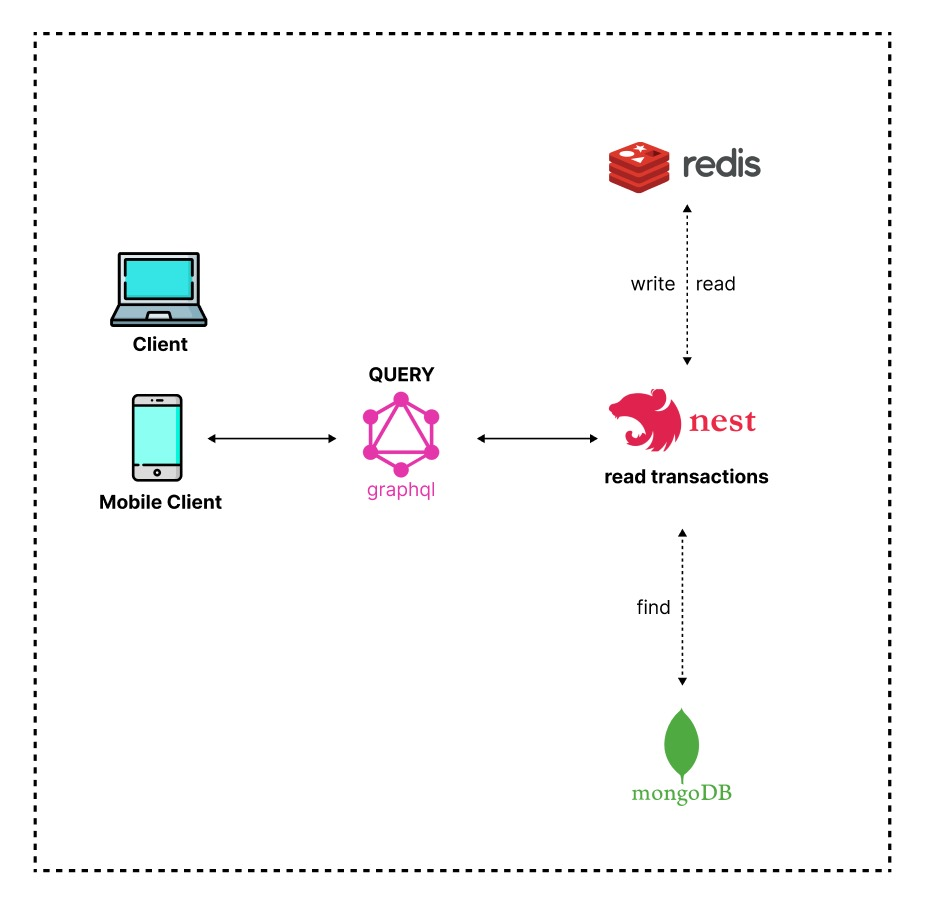

# <p align="center"> TRANSACTIONS MONOREPO 🏦</p>

<p align="center">
</p>

This is a monorepo that contains 3 applications (write-transaction, read-transaction and antifraud) that will run simultaneously to create, validate and obtain a transaction. All of this was developed following good practices and under the hexagonal architecture, to address high-volume writing and reading scenarios, following the CQRS pattern with event sourcing and cache. I attach a reference image so that you can see in more detail the design of both processes, as well as the technologies used and the steps to follow for their execution.

#### Creation Diagram


#### Obtaining Diagram


### Tools🛠

[▪️ Nest](https://github.com/nestjs/nest) framework TypeScript starter repository.
[▪️ GraphQL](https://graphql.org/) query language for APIs.
[▪️ TypeORM](https://typeorm.io/) an ORM (Object-Relational Mapping).
[▪️ Docker](https://www.docker.com/) platform for developing, packaging, and running applications in portable, isolated containers.
[▪️ Kafka](https://kafka.apache.org/) open-source distributed event streaming platform.
[▪️ PostgreSQL](https://www.postgresql.org/) open source object-relational database system.
[▪️ MongoDB](https://www.mongodb.com/) NoSQL database that stores data in flexible, JSON-like documents.
[▪️ Redis](https://redis.io/) The open source, in-memory data store.

### Previous requirements 👀

Make sure you have the following tools installed: [Node](https://nodejs.org/es/download), [Git](https://git-scm.com/downloads) and [Docker](https://www.docker.com/products/docker-desktop/) (in this case, it should also be running)

### Installation and Execution 💻

1. *Clone the Repository:*

  ```bash
    $ git clone https://github.com/Rsmj99/app-nodejs-codechallenge.git
  ```

2. *Locate yourself in the project directory*

  ```bash
    $ cd app-nodejs-codechallenge
  ```

3. *Run all necessary services*

  ```bash
    $ docker-compose up -d
  ```

4. *Next run the command*

  ```bash
    $ npm run start:all
  ```

5. *Once all services are up, you can now create new transactions from: <http://localhost:3000/graphql>, and you can query by id from: <http://localhost:3001/graphql>*

### Note💡:
- You can use the following tools to view data storage: [Redis Insight](https://redis.com/redis-enterprise/redis-insight/), [Studio 3T](https://robomongo.org/), [pgAdmin](https://www.pgadmin.org/download/)

### Stop and Clean🧹

To stop and delete created containers:

  ```bash
    $ docker-compose down
  ```

If you want to remove the containers and downloaded images, run the following instead of the above:

```bash
  $ docker-compose down --rmi all
```

### License📄

Nest is [MIT licensed](LICENSE).
