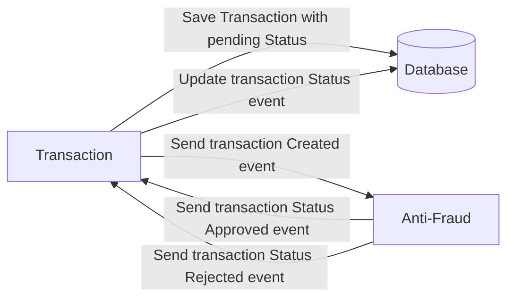

# Solution

:writing_hand: For the solution, I have decided to create two microservices. One called anti-fraud-services and another called transaction-services. Let's see what function each of them fulfills to solve the problem.

- [anti-fraud-services](#anti-fraud-services)
- [transaction-services](#transaction-service)
- [considerations](#considerations)


### anti-fraud-services

This is a service that works as a validator that fraud is not taking place. Basically it is a Kafka consumer that verifies the integrity of a UUID and updates a transaction to "approved" if it meets the requirements

In the real world, you would have to check against rules and policies, which could be government or your own. It should have machine learning models, identity management, for example, visual verification, audits and other modules.

infrastructure:

* One Module
* Prisma ORM
* Cliente Kafka -> Consumer


### transaction-service

This is the orchestrator of the transactions. Here we have an API service, which uses graphql to communicate, using a clean and hexagonal architecture. It also has a Kafka producer module that sends a message to validate integrity against fraud.

infrastructure:

* Two module
* Clean and Hexagonal Arquitecture
* Cliente Kafka -> Producer
* TypeORM 

### Considerations

I have used dependency inversion to keep the concrete import of a decoupled class. For example: 

```typescript
@Resolver()
export class TransactionsResolver {

    constructor(@Inject('ITransactionsServiceUseCase') private transactionService :ITransactionsServiceUseCase){}
}
```

Also, I have decided to apply a folder structure:

├── trasaction
│   ├── aplication
│   ├── domain
│   ├── infrastructure

Being aware that there are many other ways to do it, but for this problem, I think it is the most accurate.

In the case of the infrastructure layer, it could be even more decoupled from nest, to be able to change technology without problems if necessary, but for educational reasons I have decided not to do so. In any case I can explain how to do this decoupling.


### Starting

In the case of anti-fraud-service runs on port 3000 and transaction-service runs on port 4000

You can start with the command:

* Run the docker compose file

```sh
docker-compose up -d
```

```sh
  npm i 
  npm run start:dev
```

the postgres database is being used, in the real world we would use a transaction call for example


# Yape Code Challenge :rocket:

Our code challenge will let you marvel us with your Jedi coding skills :smile:. 

Don't forget that the proper way to submit your work is to fork the repo and create a PR :wink: ... have fun !!

- [Problem](#problem)
- [Tech Stack](#tech_stack)
- [Send us your challenge](#send_us_your_challenge)

# Problem

Every time a financial transaction is created it must be validated by our anti-fraud microservice and then the same service sends a message back to update the transaction status.
For now, we have only three transaction statuses:

<ol>
  <li>pending</li>
  <li>approved</li>
  <li>rejected</li>  
</ol>

Every transaction with a value greater than 1000 should be rejected.



# Tech Stack

<ol>
  <li>Node. You can use any framework you want (i.e. Nestjs with an ORM like TypeOrm or Prisma) </li>
  <li>Any database</li>
  <li>Kafka</li>    
</ol>

We do provide a `Dockerfile` to help you get started with a dev environment.

You must have two resources:

1. Resource to create a transaction that must containt:

```json
{
  "accountExternalIdDebit": "Guid",
  "accountExternalIdCredit": "Guid",
  "tranferTypeId": 1,
  "value": 120
}
```

2. Resource to retrieve a transaction

```json
{
  "transactionExternalId": "Guid",
  "transactionType": {
    "name": ""
  },
  "transactionStatus": {
    "name": ""
  },
  "value": 120,
  "createdAt": "Date"
}
```

## Optional

You can use any approach to store transaction data but you should consider that we may deal with high volume scenarios where we have a huge amount of writes and reads for the same data at the same time. How would you tackle this requirement?

You can use Graphql;

# Send us your challenge

When you finish your challenge, after forking a repository, you **must** open a pull request to our repository. There are no limitations to the implementation, you can follow the programming paradigm, modularization, and style that you feel is the most appropriate solution.

If you have any questions, please let us know.
