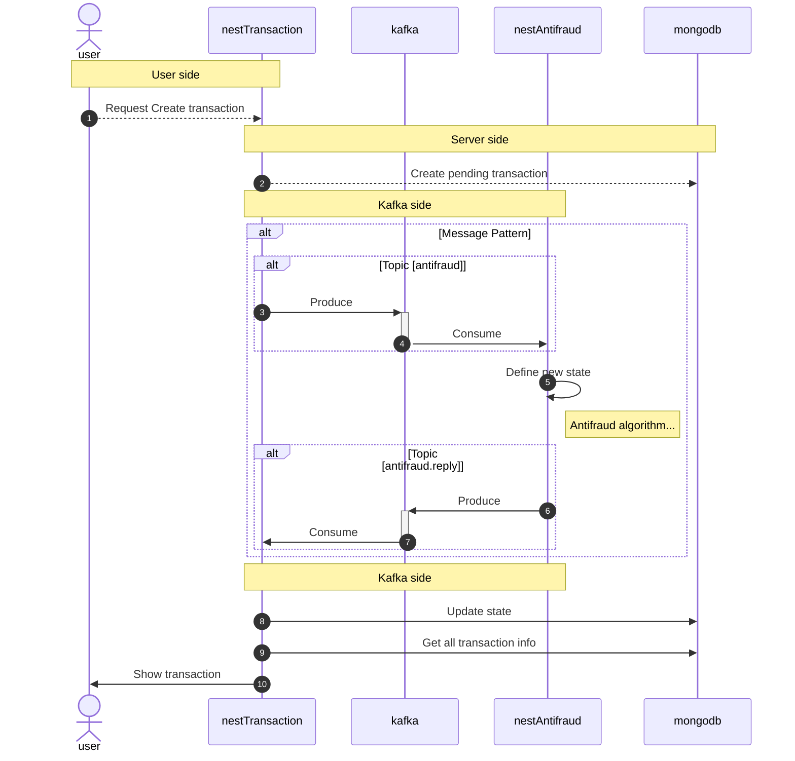

# Yape - Challenge Solution :rocket:

- [Descripción](#Descripción)
- [Instalación](#Instalación)
- [Diagrama de Arquitectura](#Diagrama_de_Arquitectura)

# Descripción

Se realizó una solución que disponibiliza un conjunto de apis que internamente se comunican
con un microservicio antifraude, al cual se comunica mediante kafka, toda información generada se almacena en mongobd.

- MongoDb: Base de datos.
- NestJS (Transaction): Funciona como backend y apiGateway entre internet y el microservicio
- NestJS (antifraud): Microservicio que implementa una conexión Kafka para la comunicación
- confluentinc/cp-kafka: Kafka server.
- provectuslabs/kafka-ui: Web app para administración y GUI de kafka.

# Instalación

- [Instalación en local](./docs/local-deploy.md)
- [Capturas](./docs/software-description.md)

# Diagrama de Arquitectura

El software incluye una implementación de un apiGateway (backend) que se comunica con el microservicio mediante TRANSPORT.KAFKA.

