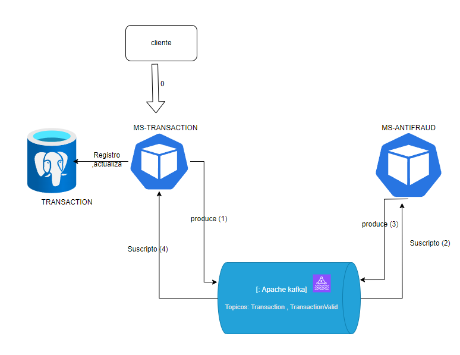

# Yape Code Challenge :heavy_check_mark:	

La propuesta de solucion se basa en la comunicacion de microservicios basados en eventos y/o mensajes, usando un patron de adaptadores con una capa de infraestructura para las comunicaciones.

- Componentes:
  <ol>
    <li>Microservicios: ms-transaction , ms-anti-fraud</li>
    <li>Apache kafka</li>
    <li>Postgres</li>  
    
</ol>

    - Los microservicios se desarrollaron con nestjs y node con express, se usaron la librerias de kafka js , typeorm y logger para el traceo de la interaccion.
    - El setup de desarrollo bajo el entorno Docker para agilizar el uso al software y volver portable la solucion.

# Solucion



* el cliente solicitara la creacion de una transaccion (0)
* el ms-transaction registra en la base de datos la transaccion con estado PENDING,posterior a ello procede a emitir un mensaje al topico kafka de "Transaction"(1).
*  el microservicio de ms-antifraud esta suscripto en kafka al topico anterior lo cual le permite obtener todos los mensajes emitidos(2).
*  el microservicio ms-anti-fraud al recibir el mensaje procesa la validacion,la validacion consta de que el monto no puede ser mayor a 1000 caso contrario la transaccion sera rechazada, y emite la respuesta en el topico de "TransactionValid"(3) .
* el microservicio ms-transaction esta (4)suscripto al anterior topico y procede a actualizar el estado de la transaccion
* finalmente al obtener la transaccion estara con el nuevo estado.

# Uso

**Pre-requisitos: Docker ,Node y un terminal bash** 

  1. Levantar el setup Docker:

  ```
      docker compose -f "docker-compose.yml" up -d --build
  ```

  2. Levantar microservicio ms-transaction: navegar en la carpeta del ms
  ```bash
      cd ms-transaction

  ```
  3. Instalar dependenccias
   ```bash
      npm install 

  ```
  4. Levantar servidor 
   ```bash
      npm run start:dev

  ```

  5. Levantar microservicio ms-anti-fraud: navegar en la carpeta del ms
  ```bash
      cd ms-anti-fraud

  ```

  6. Instalar dependenccias
   ```bash
      npm install 

  ```
  7. Levantar servidor 
   ```bash
      npm run start:dev

  ```
  8. microservers it's alive :smile:

# Ejecucion

**Pre-requisitos:terminal bash y tener curl** 

1. Registro de transacion 
    - monto menor a 1000
  ```bash
    curl --location 'http://localhost:3005/transaction' \
    --header 'Content-Type: application/json' \
    --data '{
      "accountExternalIdDebit": "6616566d-7246-4a88-bf9b-72659d22fa4a",
      "accountExternalIdCredit": "39db9f3a-41d6-49ab-bc3f-48fa478f573e",
      "tranferTypeId": 2,
      "value": 123
    }'
  ```
   
  - monto mayor a 100


  ```bash
      curl --location 'http://localhost:3005/transaction' \
      --header 'Content-Type: application/json' \
      --data '{
        "accountExternalIdDebit": "6616566d-7246-4a88-bf9b-72659d22fa4a",
        "accountExternalIdCredit": "39db9f3a-41d6-49ab-bc3f-48fa478f573e",
        "tranferTypeId": 1,
        "value": 1005
      }'
  ```

  - response 

  ```json
    {
      "id": "956b2917-c9be-4f07-88fe-c5d5724fb8e9",
      "accountExternalIdDebit": "6616566d-7246-4a88-bf9b-72659d22fa4a",
      "accountExternalIdCredit": "39db9f3a-41d6-49ab-bc3f-48fa478f573e",
      "tranferTypeId": 2,
      "value": 123,
      "status": "PENDING",
      "createdAt": "2024-01-28T07:53:44.475Z",
      "updatedAt": "2024-01-28T07:53:44.475Z"
    }
  ```


2. Obtener transaccion
  - Del response anterior obtener el id:

  ```bash
     curl --location 'http://localhost:3005/transaction/{{id}}'
  ```

  - Response 
  ```json
  {
      "transactionExternalId": "e6062e92-e0ca-4d60-a9d6-d2cc436cdb9d",
      "transactionType": {
          "name": "typeTwo"
      },
      "transactionStatus": {
          "name": "APPROVED"
      },
      "value": 123,
      "createdAt": "2024-01-28T07:35:25.761Z"
  }
```

# Consideracion:
Para el problema de muchos solicitudes al mismo tiempo se podria tomar diversas estrategias como el usar una base de datos con mayor eficiencia de lectura(ejemplo: MongoDb),asi mismo tambien la solucion propuesta al procesar la transaccion en segundo plano no genera intermitencia en un gran lote de solicitudes.
