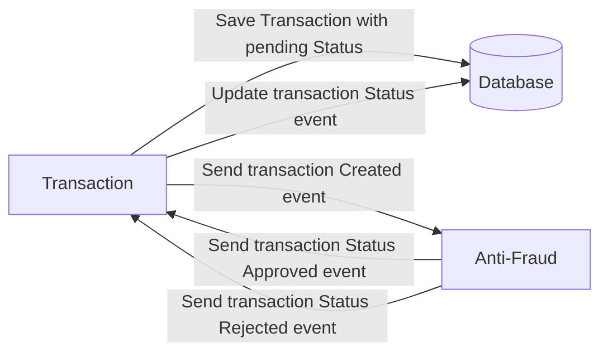

# Yape Code Challenge :rocket:

Our code challenge will let you marvel us with your Jedi coding skills :smile:. 

Don't forget that the proper way to submit your work is to fork the repo and create a PR :wink: ... have fun !!

- [Problem](#problem)
- [Tech Stack](#tech_stack)
- [Send us your challenge](#send_us_your_challenge)

# Problem

Every time a financial transaction is created it must be validated by our anti-fraud microservice and then the same service sends a message back to update the transaction status.
For now, we have only three transaction statuses:
# Solución
Se realiza la implementacion de dos micro-servicios para la gestion de las transacciones y el almacenamiento en base de datos, realizando lo logica si la cantidad es mayor a 1000 automanticamente es rechazada, en el caso contrario es gestionada con un status de pendiente y despues de la evaluacion aprovada. 

Las tecnologias implementadas son las siguientes: 

<ol>
  <li>NodeJs</li>
  <li>Nestjs</li>
  <li>Kafka</li>    
  <li>TypeOrm</li>
  <li>GraphQL</li>
  <li>PostgreSQL</li>
</ol>

<ol>
  <li>pending</li>
  <li>approved</li>
  <li>rejected</li>  
</ol>

Every transaction with a value greater than 1000 should be rejected.



# Tech Stack

We do provide a `Dockerfile` to help you get started with a dev environment.

You must have two resources:

1. Resource to create a transaction that must containt:
# Requemientos previos del proyecto
<ol>
   <li>Node.js versión minima v18.14.2</li>
   <li>Docker</li>
</ol>

```json
{
  "accountExternalIdDebit": "Guid",
  "accountExternalIdCredit": "Guid",
  "tranferTypeId": 1,
  "value": 120
}
```
# Instrucciones de Configuración y Ejecución

2. Resource to retrieve a transaction
## Configuración del Proyecto

```json
{
  "transactionExternalId": "Guid",
  "transactionType": {
    "name": ""
  },
  "transactionStatus": {
    "name": ""
  },
  "value": 120,
  "createdAt": "Date"
}
```
### Paso 1: Iniciar Servicios Docker
En raíz del proyecto, ejecutar el comando para dar inicio a Docker:   

**docker-compose up**

### Paso 2: Configuración del Servicio de Antifraud
<ol>
  <li>En la carpeta antifraud.</li>
  <li>Instala las dependencias con:
    npm install
</li>
  <li>Inicia el servicio con:
    npm run start
  </li>  
</ol>

### Paso 3: Configuración del Servicio de Transaction
<ol>
  <li>En la carpeta transaction.</li>
  <li>Instala las dependencias con:
       npm install
</li>
  <li>Inicia el servicio con:
       npm run start
  </li>  
</ol>

### Paso 4: Se adjunta collection postman
La coleccion ya tiene implementado el request y un ejemplo del response.

### Se adjunta una carpeta con imagenes de las pruebas.

