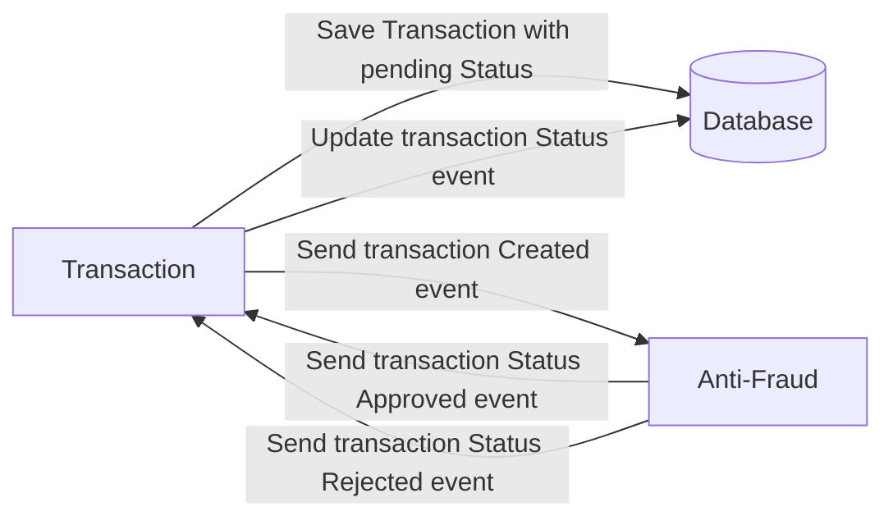

# Yape Code Challenge :rocket:
[The solution is in the end](#SolutionChallenge)

Our code challenge will let you marvel us with your Jedi coding skills :smile:. 

Don't forget that the proper way to submit your work is to fork the repo and create a PR :wink: ... have fun !!

- [Problem](#problem)
- [Tech Stack](#tech_stack)
- [Send us your challenge](#send_us_your_challenge)

# Problem

Every time a financial transaction is created it must be validated by our anti-fraud microservice and then the same service sends a message back to update the transaction status.
For now, we have only three transaction statuses:

<ol>
  <li>pending</li>
  <li>approved</li>
  <li>rejected</li>  
</ol>

Every transaction with a value greater than 1000 should be rejected.



# Tech Stack

<ol>
  <li>Node. You can use any framework you want (i.e. Nestjs with an ORM like TypeOrm or Prisma) </li>
  <li>Any database</li>
  <li>Kafka</li>    
</ol>

We do provide a `Dockerfile` to help you get started with a dev environment.

You must have two resources:

1. Resource to create a transaction that must containt:

```json
{
  "accountExternalIdDebit": "Guid",
  "accountExternalIdCredit": "Guid",
  "tranferTypeId": 1,
  "value": 120
}
```

2. Resource to retrieve a transaction

```json
{
  "transactionExternalId": "Guid",
  "transactionType": {
    "name": ""
  },
  "transactionStatus": {
    "name": ""
  },
  "value": 120,
  "createdAt": "Date"
}
```

## Optional

You can use any approach to store transaction data but you should consider that we may deal with high volume scenarios where we have a huge amount of writes and reads for the same data at the same time. How would you tackle this requirement?

You can use Graphql;

# Send us your challenge

When you finish your challenge, after forking a repository, you **must** open a pull request to our repository. There are no limitations to the implementation, you can follow the programming paradigm, modularization, and style that you feel is the most appropriate solution.

If you have any questions, please let us know.

## SolutionChallenge

Resolved  By: Gustavo Condezo
Linkedin: https://www.linkedin.com/in/gustavo-condezo-camayo-52ab3b196/

##### See Postman collction in root folder: Changelle Yape.postman_collection.json
The solution consist of:
* shared-libreary-challenge:
  Shared event library, code, published on npm
* transaction: 
   Microservice made with nestjs, typeorm con transacciones, Kafka

* Exposes two APIs:
  http://localhost:3000/transaction

    * POST /transaction :To create a transaction (Store in postgres using sql transac) and emit event to kafka on 'transationCreated' topic
    * GET /transaction/{uuid_transaction} : Gets by previously created Id

He is subscribed to two Kafka topics:
  * transactionApproved : Receives the approved transaction id and saves in BD
  * transactionRejected : Receives the rejected transaction id and saves to BD


* antifraud: It is a microservice made with NestJs y kafka

This micro is subscribed to a kafka topic:
  * transactionCreated: Receives a transaction and according to logic approves or rejects a transaction, then emits an event, 'transactionApproved' or 'transactionRejected' respectively.

### 1. Run docker compose with postgress and kafka.
   will automatically run a script (script.sql) to create the db and populate data in postgres
````shell
docker-compose up
````
wait for kafka to initialize successfully.

If the postgres server is in the cloud, or elsewhere, you must run the provided srcipt.sql
### 2. Run each micro service, inside the antifraud folders, transactions, run the following scripts:

In a CMD for each Micro, in its corresponding root folder:

2.1. Install dependencies

   ````shell
    npm install
  ````
2.2. Run

   ````shell
    npm run start:dev
   ````
Wait for the micros to initialize correctly

2.3. Open postman collection to calls apis or execute this curl
with power shell
````shell
$headers = New-Object "System.Collections.Generic.Dictionary[[String],[String]]"
$headers.Add("Content-Type", "application/x-www-form-urlencoded")

$body = "accountExternalIdDebit=9035832f-5590-4e93-b13e-0f68b81217a7&accountExternalIdCredit=4f60f1ad-9f4d-4448-8e7c-bb363f9e345f&transferTypeId=1&value=10000"

$response = Invoke-RestMethod 'http://localhost:3000/transaction' -Method 'POST' -Headers $headers -Body $body
$response | ConvertTo-Json
````
with curl
````shell
curl --location 'http://localhost:3000/transaction' \
--header 'Content-Type: application/x-www-form-urlencoded' \
--data-urlencode 'accountExternalIdDebit=9035832f-5590-4e93-b13e-0f68b81217a7' \
--data-urlencode 'accountExternalIdCredit=4f60f1ad-9f4d-4448-8e7c-bb363f9e345f' \
--data-urlencode 'transferTypeId=1' \
--data-urlencode 'value=10000'
````


## Pruebas E2E
Each micro comes with e2e tests. An in-memory Postgres DB is used.
Inside each folder of each micro run
````shell
npm run test:e2e
````
