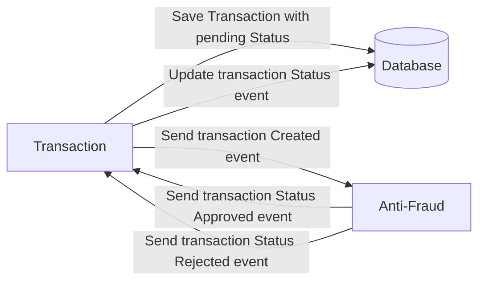

# Yape Code Challenge :rocket:

- [Problem](#problem)
- [Tech Stack](#tech_stack)
- [Send us your challenge](#send_us_your_challenge)

# Solution
for this challenge I created two applications one for data entry as api manager and another to deal with the anti-fraud both talking to the postgres database and communicating with kafka.

To start the application you first need to start the development environment with docker-compose:

```bash
$ docker-compose up -d
```

[Nest](https://github.com/nestjs/nest) framework TypeScript starter repository.
this application uses the nestJS framework so you will need to install the cli:

```bash
$ npm install -g @nestjs/cli
```

To start the applications just follow the command:

```bash
$ cd core
$ npm i
$ nest start core
```

```bash
$ cd core
$ nest start anti-fraud
```

with the applications started, you will be able to access the address http://localhost:3000/api through the browser and through the swagger itself you will be able to create a transaction and list changed transactions

# Problem

Every time a financial transaction is created it must be validated by our anti-fraud microservice and then the same service sends a message back to update the transaction status.
For now, we have only three transaction statuses:

<ol>
  <li>pending</li>
  <li>approved</li>
  <li>rejected</li>  
</ol>

Every transaction with a value greater than 1000 should be rejected.



# Tech Stack

<ol>
  <li>Node. You can use any framework you want (i.e. Nestjs with an ORM like TypeOrm or Prisma) </li>
  <li>Any database</li>
  <li>Kafka</li>    
</ol>

We do provide a `Dockerfile` to help you get started with a dev environment.

You must have two resources:

1. Resource to create a transaction that must containt:

```json
{
  "accountExternalIdDebit": "Guid",
  "accountExternalIdCredit": "Guid",
  "tranferTypeId": 1,
  "value": 120
}
```

2. Resource to retrieve a transaction

```json
{
  "transactionExternalId": "Guid",
  "transactionType": {
    "name": ""
  },
  "transactionStatus": {
    "name": ""
  },
  "value": 120,
  "createdAt": "Date"
}
```

## Optional

You can use any approach to store transaction data but you should consider that we may deal with high volume scenarios where we have a huge amount of writes and reads for the same data at the same time. How would you tackle this requirement?

You can use Graphql;

# Send us your challenge

When you finish your challenge, after forking a repository, you can open a pull request to our repository. There are no limitations to the implementation, you can follow the programming paradigm, modularization, and style that you feel is the most appropriate solution.

If you have any questions, please let us know.
