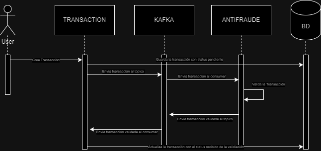

# Yape Code Challenge Solución - Christian Calderon 🥳 

La solución que he propuesto fue desarrollar dos microservicios los cuales usan como base el framework NestJs.

El primer microservicio llamado **transaction** utiliza además de NestJs, TypeORM para la conexión con la base de datos cuyo motor es Postgres, además de Graphql en la cual se tiene 2 query para consultar las transacciones y una mutación para la creación de una transacción, la cual al ser creada envia a un topico de **KAFKA** llamado **VALIDATE_TRANSACTION** y recibe la respues de verificación del topico llamdo **TRANSACTION_VALIDATED**, para luego hacer la actualización de su estado.

El segundo microservicio llamado **antifraude** realiza la validación de las transacciones en base a el value, para lo cual se encuentra escuchando el topico **VALIDATE_TRANSACTION** y envia una respuesta con el nuevo estado al topico **TRANSACTION_VALIDATED**.


## 🤓 Diagrama

<div align="center">
    
</div>


# Instalación y uso ⚙️👨‍💻
Los dos microservicios se encuentran dockerizados para su uso

1.- Realizar el build de la imagen de docker

```bash
  docker-compose build
```

2.- Levantar la imagen generado

```bash
  docker-compose up -d
```

3.- Antes de utilizar los microservicios se deben correr las migraciones y seeds de la base de datos

- Nos dirigimos al directorio del microservicio transaction 
```bash
  cd transaction/
```
- Realizamos la instalación de las librerias con yarn o npm
```bash
  yarn install
  npm run install
```
- Generamos el archivo **.env**, realizando y renombrando el archivo **.env.example**
- Ejecutamos los comando migration:run y migration:seed para ejecutar la migracion y las seed

```bash
  yarn migration:run
  yarn migration:seed
```
**En las seeds vienen registrados los status para las transacciones y los type (de momento hay 2 registradas)**

4.- Abrir en el navegador la dirección http://localhost:3000/graphql para poder ingresar al playground y pode interactuar con las querys y mutations

```graphql
query {
  allTransactions: transactions{
    transactionExternalId
    transactionType {
      name
    }
    transactionStatus {
      name
    }
    value
    createdAt
  }
  

  transactionByID: transaction(input:{
    id: "ID-PARA-CONSULTAR"
  }){
    transactionExternalId
    transactionType {
      name
    }
    transactionStatus {
      name
    }
    value
    createdAt
    
  }
}
```

```graphql
mutation {
  createTransaction(input: {
    accountExternalIdDebit: "genear-un-uuid",
    accountExternalIdCredit: "genear-un-uuid",
    value: 15,
    transactionTypeId: 2 # de momento solo existe el ID 1 y 2
  }) {
    transactionExternalId,
    value
  }
}
```