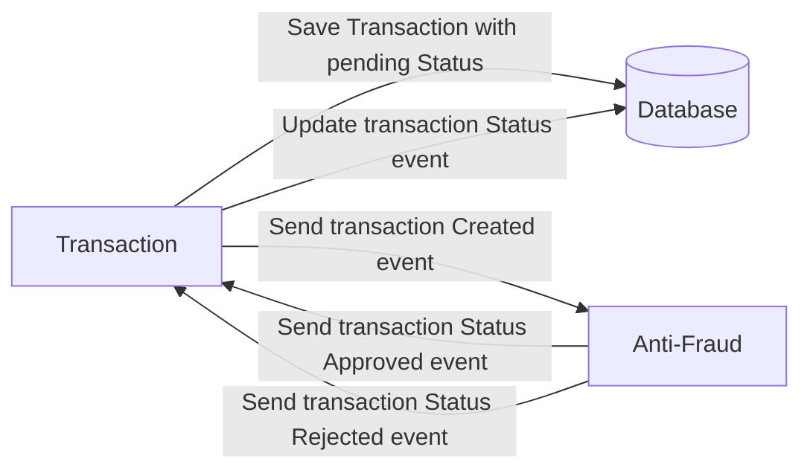

# Solucion

¡Hola Yaperos!

Quería informarles que he completado con éxito la prueba técnica asignada. He integrado los flujos necesarios y además he implementado un servicio de monitoreo y auditoría para las transacciones.

Dada mi amplia experiencia como desarrollador, principalmente en el sector financiero, comprendo la vital importancia de monitorear y detectar posibles fallos o irregularidades. En este sentido, he creado tres microservicios: uno para gestionar transacciones, otro para la detección de fraudes y uno más para el registro de actividades. Además, he diseñado un panel de control que permite supervisar el uso de la solución.

En cuanto a la implementación, he considerado diversas herramientas como Datadog, Dynatrace, Grafana, entre otras, que podrían integrarse según las necesidades específicas del proyecto.

Con nueve años de experiencia como desarrollador, con más de seis de ellos dedicados al sector financiero en diferentes partes de Latinoamérica, me siento preparado para contribuir significativamente al equipo de Yape. Mi objetivo es formar parte de esta empresa, ya que percibo que su enfoque en el bienestar y la cultura organizacional resuena profundamente conmigo. Durante más de un año, he estado preparándome específicamente para esta oportunidad.

Les agradezco la oportunidad y les deseo mucha suerte en el proceso de selección. Estoy seguro de que pronto me uniré como otro miembro orgulloso del equipo de Yape.

¡Saludos cordiales!

# Yape Code Challenge :rocket:

Our code challenge will let you marvel us with your Jedi coding skills :smile:. 

Don't forget that the proper way to submit your work is to fork the repo and create a PR :wink: ... have fun !!

- [Problem](#problem)
- [Tech Stack](#tech_stack)
- [Send us your challenge](#send_us_your_challenge)

# Problem

Every time a financial transaction is created it must be validated by our anti-fraud microservice and then the same service sends a message back to update the transaction status.
For now, we have only three transaction statuses:

<ol>
  <li>pending</li>
  <li>approved</li>
  <li>rejected</li>  
</ol>

Every transaction with a value greater than 1000 should be rejected.



# Tech Stack

<ol>
  <li>Node. You can use any framework you want (i.e. Nestjs with an ORM like TypeOrm or Prisma) </li>
  <li>Any database</li>
  <li>Kafka</li>    
</ol>

We do provide a `Dockerfile` to help you get started with a dev environment.

You must have two resources:

1. Resource to create a transaction that must containt:

```json
{
  "accountExternalIdDebit": "Guid",
  "accountExternalIdCredit": "Guid",
  "tranferTypeId": 1,
  "value": 120
}
```

2. Resource to retrieve a transaction

```json
{
  "transactionExternalId": "Guid",
  "transactionType": {
    "name": ""
  },
  "transactionStatus": {
    "name": ""
  },
  "value": 120,
  "createdAt": "Date"
}
```

## Optional

You can use any approach to store transaction data but you should consider that we may deal with high volume scenarios where we have a huge amount of writes and reads for the same data at the same time. How would you tackle this requirement?

You can use Graphql;

# Send us your challenge

When you finish your challenge, after forking a repository, you **must** open a pull request to our repository. There are no limitations to the implementation, you can follow the programming paradigm, modularization, and style that you feel is the most appropriate solution.

If you have any questions, please let us know.
