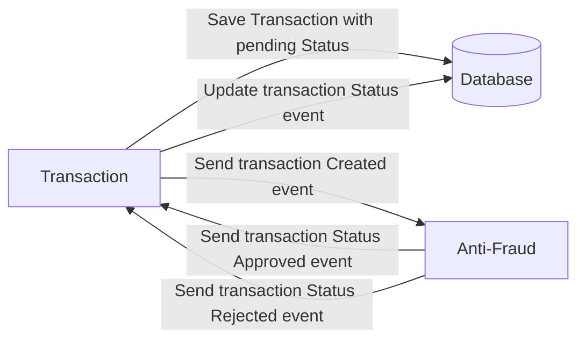

# Yape Code Challenge :rocket:

Our code challenge will let you marvel us with your Jedi coding skills :smile:. 

Don't forget that the proper way to submit your work is to fork the repo and create a PR :wink: ... have fun !!

- [Problem](#problem)
- [Tech Stack](#tech_stack)
- [Send us your challenge](#send_us_your_challenge)

# Problem

Every time a financial transaction is created it must be validated by our anti-fraud microservice and then the same service sends a message back to update the transaction status.
For now, we have only three transaction statuses:

<ol>
  <li>pending</li>
  <li>approved</li>
  <li>rejected</li>  
</ol>

Every transaction with a value greater than 1000 should be rejected.



# Tech Stack

<ol>
  <li>NestJS (Typescript) with TypeORM </li>
  <li>Postgres</li>
  <li>Kafka</li>    
</ol>

# How to run
1. To run the whole project using docker run the following command:

    ```
    docker-compose up
    ```

2. Run locally with the following commands 
    ```
    # For transactions-api
    cd transactions-api
    npm install
    npm run start:dev

    # For anti-fraud-service
    cd anti-fraud-service
    npm install
    npm run start:dev
    ```

# Playground

## Show API Swagger Documentation

Entered to http://localhost:3000/explorer to show Swagger or call request to transaction controller

## Api Transaction

### Create transaction

When call resource POST /transactions to register a transaction that must containt:


```json 
Transaction approved

{
  "accountExternalIdDebit": "9f09d5fd-4021-4ed0-83b0-178ad56cdab1",
  "accountExternalIdCredit": "9f09d5fd-4021-4ed0-83b0-178ad56cdab1",
  "transferTypeId": 1,
  "value": 50
}
```

```json 
Transaction rejected

{
  "accountExternalIdDebit": "9f09d5fd-4021-4ed0-83b0-178ad56cdab1",
  "accountExternalIdCredit": "9f09d5fd-4021-4ed0-83b0-178ad56cdab1",
  "tranferTypeId": 1,
  "value": 120
}
```

### Get transaction


When call resource GET /transactions/:transactionExternalId to get a transaction detail

```json
{
  "transactionExternalId": "Guid",
  "transactionType": {
    "name": 1
  },
  "transactionStatus": {
    "name": "APPROVED"
  },
  "value": 50,
  "createdAt": "2023-05-06T02:08:55.635Z"
}
```

## Optional

You can use any approach to store transaction data but you should consider that we may deal with high volume scenarios where we have a huge amount of writes and reads for the same data at the same time. How would you tackle this requirement?

R: To face it the high-volume scenarios requirement, may considered implementing a database clustering solution to distribute the load across multiple database instances. We can also use caching techniques such as Redis to reduce the load on the database, aditional to kafka running services to handle the high volume of transactions. 

You can use Graphql;

# Send us your challenge

When you finish your challenge, after forking a repository, you **must** open a pull request to our repository. There are no limitations to the implementation, you can follow the programming paradigm, modularization, and style that you feel is the most appropriate solution.

If you have any questions, please let us know.
