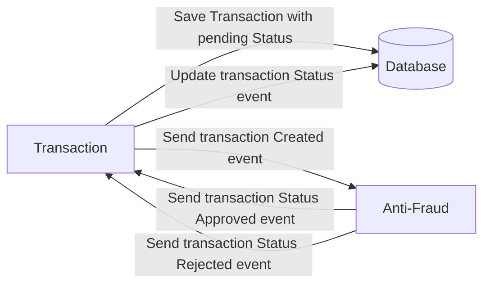

# Yape Code Challenge :rocket:

Our code challenge will let you marvel us with your Jedi coding skills :smile:. 

Don't forget that the proper way to submit your work is to fork the repo and create a PR :wink: ... have fun !!

- [Problem](#problem)
- [Tech Stack](#tech_stack)
- [Send us your challenge](#send_us_your_challenge)

# Problem

Every time a financial transaction is created it must be validated by our anti-fraud microservice and then the same service sends a message back to update the transaction status.
For now, we have only three transaction statuses:

<ol>
  <li>pending</li>
  <li>approved</li>
  <li>rejected</li>  
</ol>

Every transaction with a value greater than 1000 should be rejected.



# Tech Stack

<ol>
  <li>Node. You can use any framework you want (i.e. Nestjs with an ORM like TypeOrm or Prisma) </li>
  <li>Any database</li>
  <li>Kafka</li>    
</ol>

We do provide a `Dockerfile` to help you get started with a dev environment.

You must have two resources:

1. Resource to create a transaction that must containt:

```json
{
  "accountExternalIdDebit": "Guid",
  "accountExternalIdCredit": "Guid",
  "tranferTypeId": 1,
  "value": 120
}
```

2. Resource to retrieve a transaction

```json
{
  "transactionExternalId": "Guid",
  "transactionType": {
    "name": ""
  },
  "transactionStatus": {
    "name": ""
  },
  "value": 120,
  "createdAt": "Date"
}
```

## Optional

You can use any approach to store transaction data but you should consider that we may deal with high volume scenarios where we have a huge amount of writes and reads for the same data at the same time. How would you tackle this requirement?

You can use Graphql;

# Send us your challenge

When you finish your challenge, after forking a repository, you **must** open a pull request to our repository. There are no limitations to the implementation, you can follow the programming paradigm, modularization, and style that you feel is the most appropriate solution.

If you have any questions, please let us know.

# Note

Create .env file based with the .env.testing file in the two microservices

Before tests in postman, create the table at the database

```shell
CREATE TABLE IF NOT EXISTS transactions (
	"id" SERIAL,
	"accountExternalIdDebit" VARCHAR(100) NULL,
	"accountExternalIdCredit" VARCHAR(100) NULL,
	"tranferTypeId" int,
	"transactionExternalId" VARCHAR(100) NOT NULL,
	"createdAt" VARCHAR(100) NOT NULL,
	"value" int
);
```

Once the tests in postman have finished, they can stop the server, and pass the following command to see the coverage of the microservice at the specific folders

```shell
cd {microservice folder}
npm run test:coverage
```

# Base project

```shell
npm install
```

# Microservice Transactions

Ensure that these steps is executed correctly, types definitions are created by the third command

This microservice was created with Nodejs v18.

```shell
cd micro-transactions/
npm install
npm run tsc:interface
npm run dev
```

# Microservice Antifraud Transaction

Ensure that these steps is executed correctly, types definitions are created by the third command.

This microservice was created with Nodejs v18.

```shell
cd micro-antifraud-transactions/
npm install
npm run tsc:interface
npm run dev
```

# Thanks for the challenge
Sended by Piero Cusi Ruiz - @pcusir

