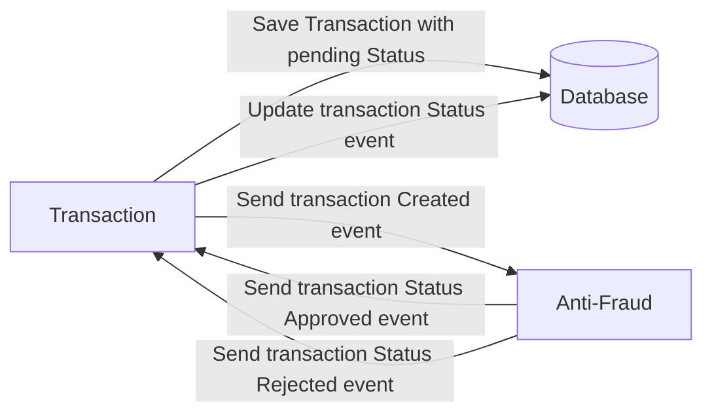

# Yape Code Challenge :rocket:

Our code challenge will let you marvel us with your Jedi coding skills :smile:.

Don't forget that the proper way to submit your work is to fork the repo and create a PR :wink: ... have fun !!

- [Problem](#problem)
- [Tech Stack](#tech_stack)
- [Send us your challenge](#send_us_your_challenge)

# Problem

Every time a financial transaction is created it must be validated by our anti-fraud microservice and then the same service sends a message back to update the transaction status.
For now, we have only three transaction statuses:

<ol>
  <li>pending</li>
  <li>approved</li>
  <li>rejected</li>  
</ol>

Every transaction with a value greater than 1000 should be rejected.



# Tech Stack

<ol>
  <li>Node. You can use any framework you want (i.e. Nestjs with an ORM like TypeOrm or Prisma) </li>
  <li>Any database</li>
  <li>Kafka</li>    
</ol>

We do provide a `Dockerfile` to help you get started with a dev environment.

You must have two resources:

1. Resource to create a transaction that must containt:

```json
{
  "accountExternalIdDebit": "Guid",
  "accountExternalIdCredit": "Guid",
  "tranferTypeId": 1,
  "value": 120
}
```

2. Resource to retrieve a transaction

```json
{
  "transactionExternalId": "Guid",
  "transactionType": {
    "name": ""
  },
  "transactionStatus": {
    "name": ""
  },
  "value": 120,
  "createdAt": "Date"
}
```

## Optional

You can use any approach to store transaction data but you should consider that we may deal with high volume scenarios where we have a huge amount of writes and reads for the same data at the same time. How would you tackle this requirement?

You can use Graphql;

# Send us your challenge

When you finish your challenge, after forking a repository, you **must** open a pull request to our repository. There are no limitations to the implementation, you can follow the programming paradigm, modularization, and style that you feel is the most appropriate solution.

If you have any questions, please let us know.

# Solution

I proposed a solution with an event-driven architecture composed of 2 services communicated through Kafka.


## Transaction-api

The first service is the transaction-api that plays the role of an api for the user, in this case implemented with Graphql. This service receives the information of the creation of a transaction and stores it in the DB to later publish a message in the transaction-created topic in order to provide the anti-fraud-service the information of the created transaction.
After the validation, this service listens to the update-transaction topic to update the result calculated by the anti-fraud-service in DB.

## Anti-fraud-service

This service keeps listening to the transaction-created topic to validate whether a transaction is fraudulent or not. At this moment, the only condition to consider a transaction fraudulent is if it is for an amount greater than 1000. If this is the case the status of the transaction is designated as 'REJECTED', otherwise it is defined as 'APPROVED'.

### Deployment

1. Replace the values of the environment variables in the .env file of each service with the corresponding values of your environment. You can use the example.env file as a guide.
2. Run the docker-compose up command to deploy the services.

```
docker-compose up
```

3. In a new terminal, run the following command to deploy a transaction. If you didnt change the values of the environment variables, you will see the api exposed at http://localhost:3000/graphql

```
cd transaction-api
npm run start
```

4. In a new terminal, run the following command to deploy the anti-fraud-service. This service will listen to the transaction-created topic and will publish the result in the update-transaction topic.

```
cd anti-fraud-service
npm run start
```

5. Open the browser and go to http://localhost:3000/graphql to access the api. You can use the following mutation to create a transaction.

```
mutation {
  createTransaction(transactionInput: {
    accountExternalIdDebit: "a0eebc99-9c0b-4ef8-bb6d-6bb9bd380a11",
    accountExternalIdCredit: "caf8fcd7-3e2f-4351-a66a-71fb7b2e784a",
    transferType: 2,
    value: 500
  }){
    id
    transferType
    value
    createdAt
    updatedAt
  }
}
```

6. You can use the following query to retrieve the transaction created.

```
{
  transactions{
    id,
    accountExternalIdDebit,
    accountExternalIdCredit,
    status,
    transferType,
    value,
    createdAt,
    updatedAt,
  }
}
```

7. As an example, you can use the following mutation to create a transaction with a value greater than 1000.

```
mutation {
  createTransaction(transactionInput: {
    accountExternalIdDebit: "a0eebc99-9c0b-4ef8-bb6d-6bb9bd380a11",
    accountExternalIdCredit: "caf8fcd7-3e2f-4351-a66a-71fb7b2e784a",
    transferType: 2,
    value: 5000
  }){
    id
    transferType
    value
    createdAt
    updatedAt
  }
}
```

8. You can see the result of the services in terminal like in the next image


