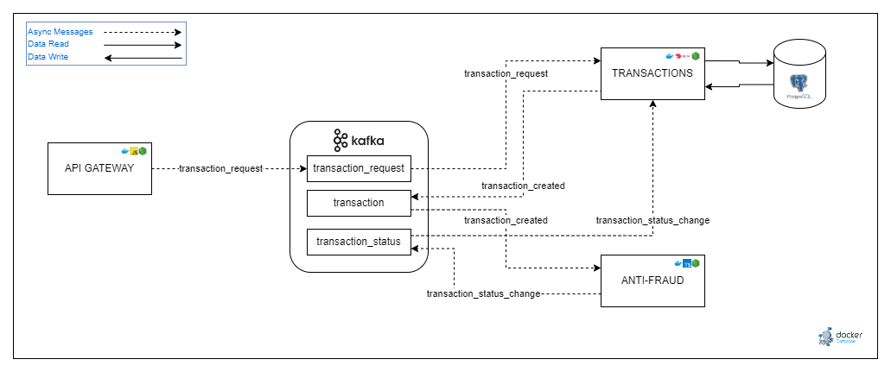
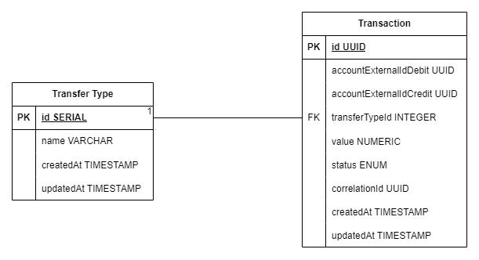

# Documento de Análisis de Requisitos para Yape Code Challenge

## Tabla de Contenidos

1. [Introducción](#introducción)
2. [Descripción General del Sistema](#descripción-general-del-sistema)
3. [Arquitectura y Componentes del Sistema](#arquitectura-y-componentes-del-sistema)
   - 3.1 [API Gateway](#api-gateway)
   - 3.2 [MS-Transaction](#ms-transaction)
   - 3.3 [MS-Anti-Fraud](#ms-anti-fraud)
   - 3.4 [MS-Error-Report](#ms-error-report)
   - 3.5 [MS-Transaction-Query](#ms-transaction-query)
4. [Requisitos Funcionales](#requisitos-funcionales)
5. [Requisitos No Funcionales](#requisitos-no-funcionales)
6. [Modelo de Datos](#modelo-de-datos)
7. [Casos de Uso](#casos-de-uso)
8. [Pruebas Realizadas](#pruebas-realizadas)
9. [Documentación](#documentación)
10. [Criterios de Aceptación y Pruebas](#criterios-de-aceptación-y-pruebas)
11. [Conclusiones y Reflexiones Finales](#conclusiones-y-reflexiones-finales)
12. [Reflexión Personal y Compromiso](#reflexión-personal-y-compromiso)

## Introducción

Este documento representa un análisis exhaustivo y detallado del proyecto desarrollado para el Yape Code Challenge. Su propósito principal es describir la solución implementada para el sistema de transacciones financieras, destacando los aspectos técnicos, arquitectónicos y funcionales clave. 

El desafío consistió en crear un sistema robusto y escalable capaz de manejar transacciones financieras, asegurando su validación y actualización de estado a través de un conjunto de microservicios interconectados. La solución aborda no solo las necesidades inmediatas del procesamiento y validación de transacciones sino también contempla aspectos críticos como la seguridad, el rendimiento, la escalabilidad y la gestión de errores.

Este análisis se enriquece con detalles técnicos profundos, descripciones de arquitectura, y una perspectiva de ingeniería sistemática, proporcionando una guía integral para la comprensión y evaluación del sistema desarrollado. El documento está destinado a las partes interesadas del proyecto, facilitando así una comprensión clara y completa de la solución implementada en el **Yape Code Challenge**.

*[Volver a la tabla de contenidos.](#tabla-de-contenidos)*

## Descripción General del Sistema

El sistema desarrollado para el Yape Code Challenge es una solución para la gestión de transacciones financieras, diseñada para ejecutar y validar operaciones financieras en un entorno de alta concurrencia y demanda. Este ecosistema integra un API Gateway, varios microservicios independientes y una infraestructura de mensajería basada en Kafka, asegurando un flujo continuo, seguro y eficiente de datos.

## Objetivos del Sistema

- Cumplir con el **Yape Code Challenge**
- **Eficiencia en la Validación de Transacciones**: Garantizar una validación rápida y precisa, cumpliendo con las políticas de control de fraude y manejo de errores.
- **Transparencia y Trazabilidad en el Proceso de Transacciones**: Ofrecer actualizaciones en tiempo real del estado de las transacciones, asegurando transparencia y trazabilidad a lo largo de todo el proceso.
- **Rendimiento Óptimo y Escalabilidad**: Mantener un rendimiento óptimo bajo condiciones de alta demanda y concurrencia, con capacidad para escalar según sea necesario.
- **Seguridad y Manejo de Errores Avanzado**: Asegurar la integridad de los datos y una respuesta robusta a los errores, mediante una gestión de errores efectiva y mecanismos de seguridad sólidos.

### Características Principales

- **Arquitectura Basada en Microservicios**: Cada microservicio, tiene responsabilidades claramente definidas. Esta estructura promueve la escalabilidad, el mantenimiento sencillo y una rápida iteración de desarrollo.
- **Procesamiento y Validación de Transacciones**: El núcleo del sistema es su capacidad para procesar y validar transacciones financieras. Utilizando reglas de negocio implementadas en el microservicio anti-fraude, cada transacción es evaluada y clasificada como `pendiente`, `aprobada` o `rechazada`. Las transacciones que excedan un valor específico son automáticamente rechazadas.
- **Comunicación Asíncrona a Través de Kafka**: Kafka actúa como un sistema de mensajería central, facilitando la comunicación asincrónica y robusta entre los microservicios. Esto mejora la desacoplación y la resiliencia del sistema.
- **Alta Disponibilidad y Escalabilidad Horizontal**: Diseñado para soportar un alto volumen de transacciones y aumentos en la demanda para garantizar una alta disponibilidad, pensado en que pueda escalar horizontalmente para manejar aumentos en la demanda y el crecimiento del sistema.
- **Persistencia de Datos con PostgreSQL y MongoDB**: Se utiliza PostgreSQL para la persistencia de transacciones y sus estados, mientras que MongoDB gestiona la información relacionada con los errores. Ambas bases de datos ofrecen robustez, integridad y capacidad para consultas complejas.
- **Interfaz de Usuario y Documentación**: A través de un API Gateway, el sistema ofrece una interfaz clara y documentada para la creación y consulta de transacciones, mejorando la experiencia de los clientes.

### Estructura del Proyecto

El proyecto se ha organizado en un monorepo, facilitando la gestión, el desarrollo y la integración de los distintos componentes del sistema.

#### Monorepo y Estructura General

El uso del monorepo permite un enfoque cohesivo para el manejo de múltiples servicios y librerías relacionadas. La estructura general del repositorio es la siguiente:

- **Directorio Raíz**: Contiene configuraciones comunes y documentación para todo el proyecto.
- **Subdirectorios de Servicios y Librerías**: Cada microservicio y librería tiene su propio subdirectorio, manteniendo su código fuente, configuraciones y dependencias de forma aislada.

```sh
.
├── README.md
├── common
├── docker-compose.yml
├── documents
├── gateway
├── ms-anti-fraud
├── ms-error-report
├── ms-transaction
├── ms-transaction-query
└── promtail-config.yaml
```

### Prácticas de Desarrollo

Se han seguido prácticas de desarrollo consistentes y profesionales a lo largo del proyecto, asegurando la calidad y la mantenibilidad del código.

#### Conventional Commits

- **Adopción de Conventional Commits**: Se ha adoptado el estándar de Conventional Commits para los mensajes de commit en el repositorio. Este enfoque estandariza los mensajes de commit, facilita la generación de changelogs y mejora la legibilidad del historial de cambios.
- **Ejemplo de Commit**: Un mensaje de commit típico siguiendo este estándar puede verse así: `feat(gateway): Añadir autenticación por token para la API de transacciones`.

La adopción de Conventional Commits es una de las muchas prácticas de desarrollo que subrayan mi compromiso con la calidad y la eficiencia en el proceso de desarrollo de software.

*[Volver a la tabla de contenidos.](#tabla-de-contenidos)*

## Arquitectura y Componentes del Sistema



### API Gateway

- **Descripción**: El `API Gateway` actúa como el punto de entrada principal para todas las solicitudes externas. Está construido con JavaScript (JS) vanilla y Express, proporcionando una interfaz para la interacción con los distintos componentes del sistema.
- **Autenticación y Seguridad**: Implementa un sistema de autenticación que emite tokens de corta duración, basados únicamente en un email (Por fines prácticos). Estos tokens, con una duración de 2 minutos, son esenciales para realizar transacciones.
- **Creación de Transacciones**: Permite la creación de transacciones financieras de forma asincrónica. Las validaciones de esquema se realizan para asegurar la integridad de los datos recibidos antes de procesarlos.
- **Integración con Kafka**: Publica las transacciones en el topic `transaction-request` de Kafka, desde donde los microservicios relevantes pueden procesarlas más adelánte.
- **Recuperación de Transacciones**: Expone un endpoint para recuperar transacciones, utilizando un enfoque basado en criterios flexibles y retornando datos estructurados para fácil navegación y análisis.
- **Documentación Swagger**: Ofrece documentación completa y accesible a través de Swagger, facilitando la comprensión y utilización de los endpoints disponibles.

### MS-Transaction

- **Descripción**: El microservicio `MS-Transaction`, desarrollado con NestJS y TypeScript, es fundamental para el manejo de las transacciones financieras dentro del sistema.
- **Conexión con la Base de Datos**: Se conecta directamente a la base de datos `transaction_status` en PostgreSQL, gestionando la persistencia de las transacciones y sus estados.
- **Gestión de Transacciones**: Este microservicio se encarga de procesar las solicitudes de transacciones que llegan a través del topic `transaction-request` en Kafka. Cada transacción se registra inicialmente con un estado `pendiente`.
- **Integración con Kafka**: Después de registrar una transacción, el microservicio publica un mensaje en el topic `verify-transaction` para su validación por el microservicio `MS-Anti-Fraud`.
- **Manejo de Errores**: En caso de errores durante el proceso de registro, la información relevante se envía al topic `transaction-error`, que es gestionado por el microservicio `MS-Error-Report`.
- **Actualización de Estados de Transacción**: También consume mensajes del topic `transaction-status`, permitiendo actualizar el estado de las transacciones a `aprobado`, `rechazado` o `error` según las validaciones realizadas por `MS-Anti-Fraud` o los reintentos gestionados por `MS-Error-Report`.

### MS-Anti-Fraud

- **Descripción**: `MS-Anti-Fraud` es un microservicio clave, implementado en TypeScript con Express. Su función principal es la validación de las transacciones para detectar y prevenir posibles fraudes.
- **Proceso de Validación**: Este microservicio examina cada transacción, aplicando criterios específicos para determinar si es potencialmente fraudulenta. La regla es la restricción de transacciones con un valor superior a un límite preestablecido segun el reto.
- **Comunicación con Kafka**: Una vez que una transacción es validada, `MS-Anti-Fraud` publica el resultado en el topic `transaction-status` de Kafka. Esto incluye la actualización del estado de la transacción a `aprobado` o `rechazado`.
- **Manejo de Errores**: En caso de errores durante la validación, `MS-Anti-Fraud` envía información detallada sobre el error al topic `transaction-error` para su posterior procesamiento por `MS-Error-Report`.
- **Interacción con Otros Microservicios**: Trabaja en estrecha colaboración con `MS-Transaction` para actualizar el estado de las transacciones y con `MS-Error-Report` para gestionar situaciones de error.

### MS-Error-Report

- **Descripción**: `MS-Error-Report`, desarrollado en JavaScript con Express, es crucial para el manejo y registro de errores dentro del sistema. Se conecta a la base de datos `transactions-errors` en MongoDB, optimizada para el registro de información relacionada con errores.
- **Funcionalidad de Registro de Errores**: Este microservicio recibe información de errores a través del topic `transaction-error` en Kafka. Cada error se asocia con datos relevantes de la transacción, ya sea registrada o no en la base de datos, y se categoriza según su tipo y origen.
- **Gestión de Reintentos de Transacciones**: `MS-Error-Report` gestiona los reintentos de transacciones fallidas. Si una transacción ha sido registrada en la base de datos pero falla en etapas posteriores, el sistema intenta procesarla nuevamente hasta tres veces con intervalos de tiempo incrementales.
- **Integración con Bull y Redis**: Para manejar los reintentos de forma eficiente, utiliza Bull y Redis. Esta combinación permite programar y ejecutar tareas de reintento con la precisión temporal requerida.
- **Comunicación de Estado Final de Transacción**: Si una transacción falla después de los reintentos, `MS-Error-Report` publica un mensaje en el topic `transaction-status` con un estado de `error`, indicando que la transacción no pudo completarse satisfactoriamente.

### MS-Transaction-Query

- **Descripción**: `MS-Transaction-Query` es un microservicio diseñado para manejar específicamente las consultas de transacciones. Escrito en JavaScript con Express, este servicio se conecta a la misma base de datos PostgreSQL `transaction_status` que `MS-Transaction`.
- **Separación de Responsabilidades**: La creación de `MS-Transaction-Query` obedece a la decisión de separar las funcionalidades de consulta y actualización/creación de transacciones. Esta separación es estratégica para optimizar el rendimiento en escenarios de alta concurrencia.
- **Especialización en Consultas**: Este microservicio se centra únicamente en la recuperación y presentación de datos de transacciones, mejorando la eficiencia y la velocidad de respuesta en las operaciones de lectura.
- **Validación de Esquemas de Consulta**: Utiliza esquemas de validación detallados para asegurar que las solicitudes de consulta cumplan con los criterios esperados, garantizando así la integridad y relevancia de los datos recuperados.
- **Uso de HATEOAS para Navegación de Recursos**: Implementa el principio HATEOAS (Hypermedia as the Engine of Application State) para proporcionar una interfaz de usuario más rica y dinámica, permitiendo una fácil navegación entre los recursos relacionados.
- **Comunicación con el API Gateway**: La única vía de comunicación de `MS-Transaction-Query` es con el `API Gateway`, utilizando un broker de mensajería para recibir solicitudes de datos y enviar respuestas.

### Comunicación y Conectividad

Además de las funcionalidades específicas de cada microservicio, se desarrollaron librerías especializadas para estandarizar y optimizar la comunicación dentro del sistema:

- **Librería de Conexión a Kafka**: Se implementó una librería personalizada para normalizar y simplificar cómo los diferentes servicios se conectan y comunican a través de Kafka, garantizando una integración coherente y eficiente.

- **Broker Asíncrono con Axios**: Para la comunicación entre el `API Gateway` y el microservicio `MS-Transaction-Query`, se desarrolló un broker asíncrono utilizando Axios. Este broker facilita la gestión de solicitudes y respuestas entre estos componentes, mejorando la eficiencia y la fiabilidad de las operaciones del sistema.

*[Volver a la tabla de contenidos.](#tabla-de-contenidos)*


## Requisitos Funcionales

Los requisitos funcionales describen las capacidades y acciones específicas que el sistema debe ser capaz de realizar para cumplir con sus objetivos. Estos requisitos se derivan de la comprensión detallada de las necesidades del proyecto, las expectativas de los usuarios y mis ganas de llamar la atención al equipo de reclutamiento de Yape.

### RF1: Creación y Gestión de Transacciones

- El sistema debe permitir la creación de transacciones financieras, asegurando un identificador único y un estado inicial de "pendiente".
- Cada transacción creada es procesada por `MS-Transaction` y luego validada por `MS-Anti-Fraud`.

### RF2: Validación y Actualización de Estado de Transacciones

- Las transacciones deben ser validadas según reglas de negocio específicas, incluyendo la restricción de transacciones por encima de un valor determinado.
- `MS-Transaction` debe actualizar el estado de la transacción a `aprobado` o `rechazado` basándose en la validación realizada por `MS-Anti-Fraud`.

### RF3: Manejo de Errores y Reintentos de Transacciones

- El sistema debe gestionar eficazmente los errores en las transacciones, clasificándolos y registrándolos a través de `MS-Error-Report`.
- Debe existir un mecanismo de reintentos para las transacciones fallidas, gestionado por `MS-Error-Report`.

### RF4: Consulta de Estado y Detalles de Transacciones

- Los usuarios deben poder consultar el estado actual y los detalles de cualquier transacción a través de `MS-Transaction-Query`.
- Las consultas deben ser eficientes y proporcionar información precisa y actualizada.

### RF5: Seguridad y Autenticación

- El `API Gateway` debe manejar la autenticación y autorización, emitiendo tokens de seguridad para acceso a las funcionalidades del sistema.
- Debe garantizarse la seguridad en la transferencia y almacenamiento de datos.

### RF6: Comunicación Asíncrona y Gestión de Eventos

- El sistema debe emplear `Kafka` para la comunicación asíncrona entre microservicios, asegurando una gestión efectiva de eventos y reduciendo el acoplamiento entre componentes.

### RF7: Documentación y Accesibilidad

- El sistema debe proporcionar documentación clara y accesible, incluyendo una especificación Swagger a través del `API Gateway`.
- Debe facilitarse un conjunto de pruebas de Postman para demostrar y validar las funcionalidades del sistema.

*[Volver a la tabla de contenidos.](#tabla-de-contenidos)*

## Requisitos No Funcionales

Los requisitos no funcionales son cruciales para garantizar la calidad, eficiencia y fiabilidad del sistema. Estos requisitos abarcan aspectos que no están directamente relacionados con las funciones específicas del sistema, sino más bien con sus atributos de calidad.

### RNF1: Rendimiento y Escalabilidad

- El sistema debe ser capaz de manejar un volumen alto de transacciones, soportando alta concurrencia de transacciones sin degradación significativa en la respuesta o el procesamiento.
- Debe diseñarse para permitir un escalado horizontal, facilitando el manejo de picos de demanda y crecimiento futuro.

### RNF2: Alta Disponibilidad y Resiliencia

- Se requiere una alta disponibilidad, utilizando estrategias como redundancia y recuperación ante desastres.
- El sistema debe ser resistente, capaz de recuperarse rápidamente de fallos y continuar operando eficazmente.

### RNF3: Seguridad

- Los datos deben ser almacenados y transmitidos de manera segura.
- Deben implementarse medidas robustas de autenticación y autorización para acceder a las funciones del sistema.

### RNF4: Mantenibilidad y Extensibilidad

- El código fuente y la arquitectura deben seguir las mejores prácticas de ingeniería de software, asegurando que el sistema sea fácil de mantener y extender.
- Debe facilitarse la actualización y adición de nuevas características o componentes sin afectar significativamente la operación del sistema.

### RNF5: Monitoreo y Registro

- El sistema debe incluir capacidades de monitoreo en tiempo real y registro detallado de actividades para facilitar el diagnóstico y la resolución rápida de problemas.
- Los registros y métricas del sistema deben ser claros, consistentes y fácilmente accesibles para el análisis.

### RNF6: Documentación y Usabilidad

- La documentación del sistema debe ser completa, actualizada y fácil de entender, incluyendo guías de usuario, especificaciones técnicas y documentación de API.
- La interfaz de usuario, especialmente a través del API Gateway, debe ser intuitiva y fácil de usar, asegurando una experiencia positiva para los reclutadores de Yape.

*[Volver a la tabla de contenidos.](#tabla-de-contenidos)*

## Modelo de Datos

El sistema utiliza dos bases de datos principales, PostgreSQL y MongoDB, cada una con esquemas específicos que respaldan diferentes aspectos del procesamiento y registro de transacciones y errores.

### Modelo de Datos en PostgreSQL

El modelo de datos en PostgreSQL se centra en la gestión de transacciones y tipos de transferencia.



#### Transaction

- `id` (UUID): Identificador único para cada transacción.
- `accountExternalIdDebit` (UUID): Referencia a la cuenta de débito.
- `accountExternalIdCredit` (UUID): Referencia a la cuenta de crédito.
- `correlationId` (UUID): Identificador de correlación para eventos y seguimiento.
- `transferTypeId` (Number): Clave foránea que enlaza con `TransferType`.
- `value` (Decimal): Monto de la transacción.
- `status` (Enum): Estado de la transacción, valores posibles `pending`, `approved`, `rejected`, `error`.
- `createdAt` (CreateDateColumn): Fecha y hora de creación.
- `updatedAt` (UpdateDateColumn): Fecha y hora de la última actualización.

#### TransferType

- `id` (PrimaryGeneratedColumn): Identificador único y secuencial para cada tipo de transferencia.
- `name` (String): Nombre del tipo de transferencia.
- `transactions` (OneToMany): Relación con `Transaction`.

### Modelo de Datos en MongoDB

El modelo de datos en MongoDB está diseñado para el registro y seguimiento de errores.

#### ErrorReport

- `errorType` (String): Tipo de error.
- `reportedBy` (String): Microservicio o componente que reporta el error.
- `transactionId` (String): Identificador de la transacción asociada, si aplica.
- `correlationId` (String): Identificador de correlación para eventos y seguimiento.
- `attempts` (Number): Número de intentos de procesamiento de la transacción.
- `error`: Detalles específicos del error.
  - `name` (String): Nombre del error.
  - `message` (String): Mensaje descriptivo del error.
  - `stack` (Object): Pila de llamadas del error.
- `unrecordedTransaction`: Datos de la transacción no registrada.
  - `accountExternalIdDebit` (String): Referencia a la cuenta de débito.
  - `accountExternalIdCredit` (String): Referencia a la cuenta de crédito.
  - `transferTypeId` (Number): Identificador del tipo de transferencia.
  - `value` (Number): Monto de la transacción.

### Consideraciones de Diseño

- **Especialización de Bases de Datos**: PostgreSQL se utiliza para gestionar datos transaccionales con alta integridad, mientras que MongoDB maneja eficientemente los registros de errores y datos no estructurados.
- **Normalización y Relaciones**: En PostgreSQL, se mantiene la normalización y se establecen relaciones claras para garantizar la integridad de los datos.
- **Flexibilidad y Documentación de Datos**: MongoDB ofrece flexibilidad para almacenar y recuperar registros de errores con estructuras variadas.

*[Volver a la tabla de contenidos.](#tabla-de-contenidos)*

## Casos de Uso

Los casos de uso son escenarios que describen las interacciones típicas entre los usuarios/clientes y el sistema, proporcionando una comprensión clara de cómo se espera que el sistema funcione en situaciones de la vida real.

### CU1: Creación de Transacción

- **Actor Principal**: Usuario o sistema externo.
- **Precondiciones**: Autenticación exitosa a través del `API Gateway`.
- **Flujo Principal**:
  1. El usuario envía una solicitud de obtención de token al `API Gateway`.
  2. El `API Gateway` genera un token de autenticación.
  3. El usuario envía una solicitud de creación de transacción al `API Gateway` con el token.
  4. El `API Gateway` valida la solicitud y se envía al microservicio `MS-Transaction` a través de Kafka.
  5. `MS-Transaction` registra la transacción en la base de datos con un estado `pendiente`.
  6. `MS-Transaction` publica un evento en el topic `verify-transaction` para su validación por MS-Anti-Fraud.

### CU2: Validación de Transacción por MS-Anti-Fraud

- **Actor Principal**: `MS-Anti-Fraud`.
- **Precondiciones**: Recibo de una nueva transacción para validación.
- **Flujo Principal**:
  1. `MS-Anti-Fraud` recibe el evento de la nueva transacción.
  2. Se ejecutan reglas de negocio para validar la transacción.
  3. `MS-Anti-Fraud` publica el resultado de la validación en el topic `transaction-status`.

### CU3: Actualización de Estado de Transacción

- **Actor Principal**: `MS-Transaction`.
- **Precondiciones**: Recibo del resultado de validación de `MS-Anti-Fraud`.
- **Flujo Principal**:
  1. `MS-Transaction` recibe el mensaje con el resultado de la validación.
  2. Actualiza el estado de la transacción en la base de datos a `aprobado` o `rechazado`.

### CU4: Consulta de Estado de Transacción

- **Actor Principal**: Usuario o sistema externo.
- **Precondiciones**: La transacción ha sido creada y tiene un identificador único.
- **Flujo Principal**:
  1. El usuario realiza una solicitud de estado de transacción al `API Gateway`.
  2. El `API Gateway` envía la solicitud a `MS-Transaction-Query`.
  3. `MS-Transaction-Query` recupera y devuelve el estado y detalles de la transacción.

### CU5: Manejo de Errores y Reintentos

- **Actor Principal**: `MS-Error-Report`.
- **Precondiciones**: Ocurrencia de un error durante el procesamiento de una transacción.
- **Flujo Principal**:
  1. `MS-Error-Report` recibe información de error desde `MS-Transaction` o `MS-Anti-Fraud`.
  2. Registra el error y determina si es necesario un reintento.
  3. En caso de reintento, programa la tarea correspondiente y, tras el intervalo de tiempo, reintenta el procesamiento.

*[Volver a la tabla de contenidos.](#tabla-de-contenidos)*

## Pruebas Realizadas

En este proyecto, se han implementado varios tipos de pruebas para garantizar que el sistema cumple con los requisitos y funciona como se espera.

### Pruebas de Carga con JMeter

- **Objetivo**: Verificar la capacidad del sistema para manejar un volumen alto de transacciones sin degradación del rendimiento.
- **Metodología**: Utilización de JMeter para simular un entorno de alto tráfico, generando múltiples solicitudes de transacción para evaluar el rendimiento del sistema bajo carga.
- **Resultados Esperados**: El sistema debe ser capaz de procesar todas las transacciones de manera eficiente, manteniendo tiempos de respuesta rápidos y sin errores significativos.

### Pruebas de Seguridad

- **Objetivo**: Confirmar que el sistema es resistente a amenazas de seguridad comunes y protege adecuadamente los datos sensibles.
- **Metodología**: Implementación de pruebas para validar la autenticación, autorización y manejo seguro de la información.
- **Resultados Esperados**: El sistema debe demostrar su capacidad para proteger contra accesos no autorizados y garantizar la confidencialidad e integridad de los datos.

### Pruebas de Funcionalidad

- **Objetivo**: Comprobar que cada función del sistema opera según lo especificado en los requisitos.
- **Metodología**: Ejecución de pruebas unitarias y funcionales para cada microservicio y componente, asegurando que cumplen con su comportamiento esperado.
- **Resultados Esperados**: Cada componente y microservicio debe funcionar de acuerdo con su especificación, realizando las operaciones requeridas y respondiendo adecuadamente a los diferentes escenarios.

*[Volver a la tabla de contenidos.](#tabla-de-contenidos)*

## Documentación

Esta sección describe los recursos de documentación disponibles y las herramientas de prueba proporcionadas.

### Documentación Swagger del API Gateway

- **Descripción**: El `API Gateway` ofrece una documentación completa a través de Swagger. Esta documentación proporciona una visión detallada de todos los endpoints disponibles, sus parámetros, formatos de solicitud y respuesta, y otros detalles relevantes.
- **Accesibilidad**: La documentación Swagger está accesible públicamente a través de la URL`/v1/api-docs`.

### Colección de Postman

- **Descripción**: Se ha preparado un colección Postman para demostrar y validar las funcionalidades del sistema.

### Prácticas de Documentación en código

- **Enfoque**: La documentación se ha elaborado con un enfoque en la claridad, la precisión técnica y la facilidad de uso.

*[Volver a la tabla de contenidos.](#tabla-de-contenidos)*

## Criterios de Aceptación y Pruebas

Estos criterios sirven como una guía para la evaluación y validación de cada componente del sistema.

### Criterios de Aceptación

- **CA1: Funcionalidad Completa**: Todas las características y funciones del sistema deben operar según lo especificado en los requisitos funcionales. Esto incluye la correcta ejecución de transacciones, la validación eficiente de las mismas y el manejo adecuado de errores y reintentos.

- **CA2: Cumplimiento de Requisitos No Funcionales**: El sistema debe cumplir con los requisitos no funcionales establecidos, incluyendo rendimiento, escalabilidad, seguridad, mantenibilidad y usabilidad.

- **CA3: Integración y Fluidez de Procesos**: Los distintos microservicios y componentes del sistema deben integrarse y funcionar juntos de manera fluida y sin errores.

*[Volver a la tabla de contenidos.](#tabla-de-contenidos)*

## Conclusiones y Reflexiones Finales

Este proyecto ha sido un ejercicio exhaustivo en el diseño e implementación de un sistema de procesamiento de transacciones eficiente y seguro. A través de la adopción de una arquitectura basada en microservicios, el sistema logra un equilibrio entre rendimiento, escalabilidad y mantenibilidad.

### Lecciones Aprendidas

- La importancia de una planificación y diseño arquitectónico cuidadosos.
- La eficacia de una estrategia de pruebas exhaustiva y planificada.
- La necesidad de adaptabilidad y flexibilidad en el desarrollo de software.

### Futuras Mejoras

- Exploración de tecnologías emergentes para optimización adicional como cacheo.
- Ampliación de la suite de pruebas para cubrir más escenarios y casos de uso.
- CronJobs para mejorar la recuperación de transacciones que no logran ser procesadas.
- Análisis automatizado del registro de errores para tomar decisiones informadas.

*[Volver a la tabla de contenidos.](#tabla-de-contenidos)*

## Reflexión Personal y Compromiso

Antes de concluir este documento, es importante dedicar un espacio para una reflexión personal sobre el proceso y la metodología adoptados en el desarrollo de este proyecto.

### Justificación del Proyecto

El desarrollo de este proyecto ha sido una labor de gran **compromiso** y **pasión**, reflejando un enfoque meticuloso en la calidad y las buenas prácticas. Cada decisión tomada, cada línea de código escrita, y cada estructura de datos implementada, ha estado imbuida con un espíritu de excelencia y atención al detalle. La elección de utilizar una variedad de lenguajes de programación, frameworks como NestJS, y sistemas de bases de datos distintos ha sido deliberada y estratégica, con el objetivo de demostrar flexibilidad técnica y una comprensión profunda de diversas herramientas y paradigmas de desarrollo.

El uso de JWT para la autenticación, junto con un sistema robusto de recuperación de transacciones utilizando Bull y Redis, no solo muestra una habilidad para integrar tecnologías complementarias sino también un enfoque proactivo para la resiliencia y seguridad del sistema. Estas elecciones, junto con la implementación de prácticas avanzadas como Conventional Commits y el diseño cuidadoso de un monorepo, están **diseñadas** para **resaltar** una competencia de nivel `Jedi` en ingeniería de software.

Este proyecto no es solo la solución a un reto; **es una carta de presentación**, una demostración palpable de *amor* por la ingeniería y una muestra de la dedicación que puedo aportar a Yape. Cada elemento ha sido construido con la visión de no solo cumplir con los requisitos, sino de exceder las expectativas, estableciendo un estándar de lo que soy capaz de entregar.

Al considerar este trabajo, uno puede ver claramente la combinación de **pasión**, **precisión** y **profundidad técnica** que **caracteriza** mi enfoque del **desarrollo de software** y la solución de problemas complejos, se pretende no solo demostrar una habilidad técnica refinada sino también transmitir el nivel de compromiso y pasión por el desarrollo de soluciones de software que sean robustas, escalables y, sobre todo, construidas con un propósito claro y una dedicación que va más allá de las expectativas.

---
Gracias por llegar hasta aquí.

*Made with love by giothcode*
