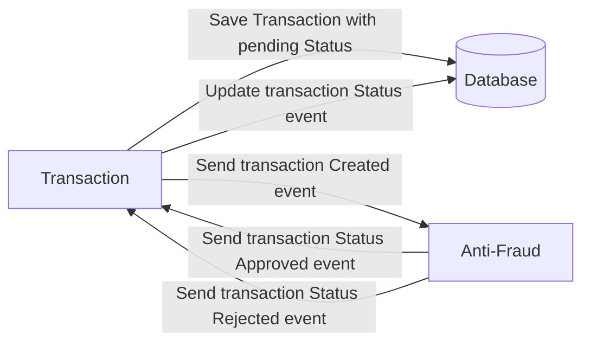

# Yape Code Challenge :rocket:

- [Problem](#problem)
- [Tech Stack](#tech_stack)
- [Send us your challenge](#send_us_your_challenge)

# Problem

Every time a financial transaction is created it must be validated by our anti-fraud microservice and then the same service sends a message back to update the transaction status.
For now, we have only three transaction statuses:

<ol>
  <li>pending</li>
  <li>approved</li>
  <li>rejected</li>  
</ol>

Every transaction with a value greater than 1000 should be rejected.



# Tech Stack

<ol>
  <li>Node. You can use any framework you want (i.e. Nestjs with an ORM like TypeOrm or Prisma) </li>
  <li>Any database</li>
  <li>Kafka</li>    
</ol>

We do provide a `Dockerfile` to help you get started with a dev environment.

You must have two resources:

1. Resource to create a transaction that must containt:

```json
{
  "accountExternalIdDebit": "Guid",
  "accountExternalIdCredit": "Guid",
  "tranferTypeId": 1,
  "value": 120
}
```

2. Resource to retrieve a transaction

```json
{
  "transactionExternalId": "Guid",
  "transactionType": {
    "name": ""
  },
  "transactionStatus": {
    "name": ""
  },
  "value": 120,
  "createdAt": "Date"
}
```

## Optional

You can use any approach to store transaction data but you should consider that we may deal with high volume scenarios where we have a huge amount of writes and reads for the same data at the same time. How would you tackle this requirement?

You can use Graphql;

# Send us your challenge

When you finish your challenge, after forking a repository, you can open a pull request to our repository. There are no limitations to the implementation, you can follow the programming paradigm, modularization, and style that you feel is the most appropriate solution.

If you have any questions, please let us know.


# Update By Miguel Grillo

## Technologies:
- Docker
- GraphQL
- Kafka
- NestJS (TypeScript)
- PostgreSQL
- Prisma
- Zookeeper

### After reading the [transaction](https://github.com/Ineffable22/app-nodejs-codechallenge/tree/main/transaction) and the [anti-fraud](https://github.com/Ineffable22/app-nodejs-codechallenge/tree/main/anti-fraud) readme, you can submit transactions in this format.

```GraphQL
mutation {
  createTransaction(
    input: {
      accountExternalIdDebit: "Guid"
      accountExternalIdCredit: "Guid"
      tranferTypeId: 1
      value: 100
    }
  ) {
    transactionExternalId
    transactionType {
      name
    }
    transactionStatus {
      name
    }
    value
    createdAt
  }
}
```
After to sent, the previous transaction is sent to the transaction service.  This will create a history in the database and send it to an anti-fraud service that validates the transaction (Approve is returned, otherwise rejected) and is saved in the database this update handles a history more completely and return the following data.

```GraphQL
{
  "data": {
    "transactionExternalId": "Guid",
    "transactionType": {
      "name": ""
    },
    "transactionStatus": {
      "name": ""
    },
    "value": 120,
    "createdAt": "Date"
  }
}
```

To see all the documentation enter localhost mode at the following address `http://localhost:3000/graphql`.

## Author:
<div align="center">
<a href="https://www.linkedin.com/in/miguel-enrique-grillo-orellana/">
</a>

<a href="https://medium.com/@Miguel_Grillo"></a>
</div>