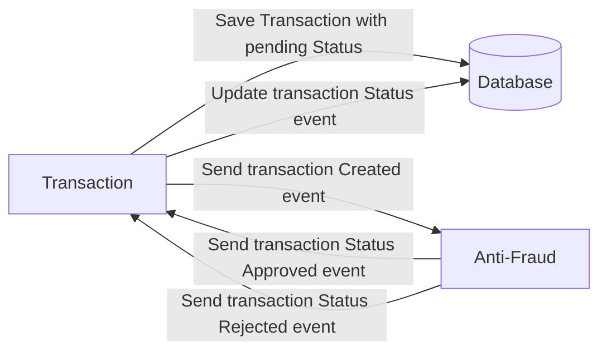

# Yape Code Challenge :rocket:
## Table of Contents
- [Yape Code Challenge :rocket:](#yape-code-challenge-rocket)
  - [Table of Contents](#table-of-contents)
  - [Candidate Information](#candidate-information)
  - [Problem](#problem)
  - [Tech Stack](#tech-stack)
  - [Resources](#resources)

## Candidate Information
- **Name**: David Andrés Garza Medina
- **LinkedId Profile**: https://www.linkedin.com/in/david-garza-medina/
- **Personal Website**: https://davidgarza.me/
- **Email**: contact@davidgarza.me

## Problem
Every time a financial transaction is created it must be validated by our anti-fraud microservice and then the same service sends a message back to update the transaction status.
For now, there are only three transaction statuses:

1. Pending
2. Approved
3. Rejected

Every transaction with a value greater than 1000 should be rejected.



## Tech Stack
1. **Backend**: Node.js with Express.js as the framework and Sequelize as ORM.
2. **Database**: PostgreSQL.
3. **Message Broker**: Kafka.

## Resources
1. Transaction creation:

```json
{
  "accountExternalIdDebit": "Guid",
  "accountExternalIdCredit": "Guid",
  "tranferTypeId": 1,
  "value": 120
}
```

2. Transaction retrieval:

```json
{
  "transactionExternalId": "Guid",
  "transactionType": {
    "name": ""
  },
  "transactionStatus": {
    "name": ""
  },
  "value": 120,
  "createdAt": "Date"
}
```
