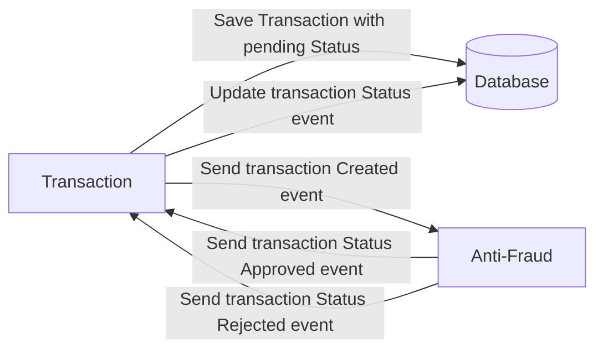

# Yape Code Challenge :rocket:

Our code challenge will let you marvel us with your Jedi coding skills :smile:. 

Don't forget that the proper way to submit your work is to fork the repo and create a PR :wink: ... have fun !!

- [Problem](#problem)
- [Tech Stack](#tech_stack)
- [Send us your challenge](#send_us_your_challenge)
- [Solution by carlosdizx](#solution)

# Problem

Every time a financial transaction is created it must be validated by our anti-fraud microservice and then the same service sends a message back to update the transaction status.
For now, we have only three transaction statuses:

<ol>
  <li>pending</li>
  <li>approved</li>
  <li>rejected</li>  
</ol>

Every transaction with a value greater than 1000 should be rejected.



# Tech Stack

<ol>
  <li>Node. You can use any framework you want (i.e. Nestjs with an ORM like TypeOrm or Prisma) </li>
  <li>Any database</li>
  <li>Kafka</li>    
</ol>

We do provide a `Dockerfile` to help you get started with a dev environment.

You must have two resources:

1. Resource to create a transaction that must contain:

    ```json
    {
      "accountExternalIdDebit": "Guid",
      "accountExternalIdCredit": "Guid",
      "transferTypeId": 1,
      "value": 120
    }
    ```

2. Resource to retrieve a transaction

    ```json
    {
    "transactionExternalId": "Guid",
    "transactionType": {
    "name": ""
    },
    "transactionStatus": {
    "name": ""
    },
    "value": 120,
    "createdAt": "Date"
    }
    ```

## Optional

You can use any approach to store transaction data, but you should consider that we may deal with high volume scenarios where we have a huge amount of writes and reads for the same data at the same time. How would you tackle this requirement?

You can use Graphql;

# Send us your challenge

When you finish your challenge, after forking a repository, you **must** open a pull request to our repository. There are no limitations to the implementation, you can follow the programming paradigm, modularization, and style that you feel is the most appropriate solution.

If you have any questions, please let us know.


# Solution

## Introduction
This repository contains a NestJS project designed for managing and processing transactions. It includes a main application that handles transaction storage and listing, and a microservice dedicated to transaction processing and updating.

## Getting Started

### Prerequisites
- Node.js and npm installed
- Docker and Docker Compose installed

### Installation

**Install dependencies**:
   Run the following command to install the necessary Node.js dependencies:

```shell
npm i
```


 **Docker Compose**:
   To set up the necessary infrastructure (databases (postgres), kafka, zookeeper, pgAdmin (optional), kadrof (optional)), use Docker Compose:

```shell
docker-compose up -d
```


### API Endpoints
The API endpoints for this project can be found in a Postman collection JSON file located in this repository. This collection provides a comprehensive guide to interacting with the project's APIs.

or [Postman in web](https://milio-payment.postman.co/workspace/Learning~f1c56b68-de3a-4fd2-b435-a66757d3c44c/collection/29333578-3bc848c0-052e-4bcd-acc1-3ba9226e6338?action=share&creator=29333578&active-environment=29333578-390c5b74-1f2d-49c0-b93a-04e4e3730119)

> file: Yape.postman_collection.json


## Author

- [Github Carlosdizx](https://github.com/carlosdizx)
- [Linkedin Carlos Ernesto Diaz Basante](https://www.linkedin.com/in/carlos-ernesto-diaz-basante/)
