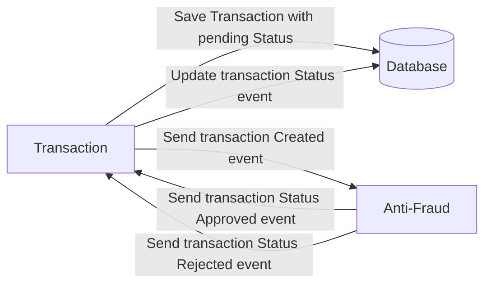
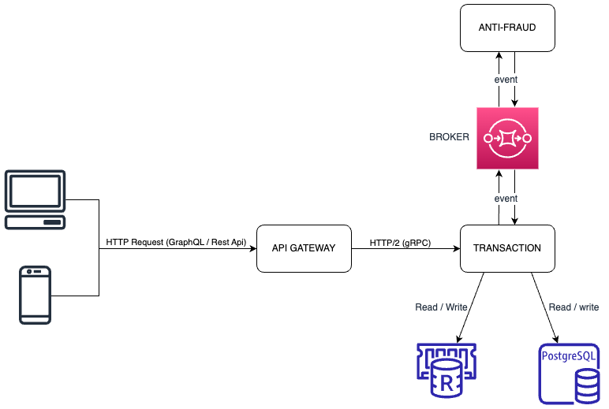
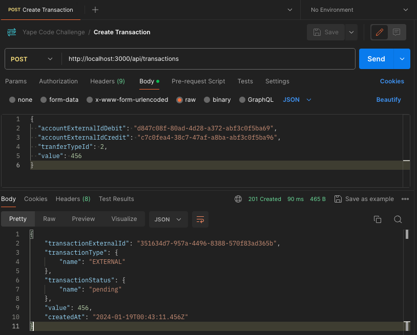
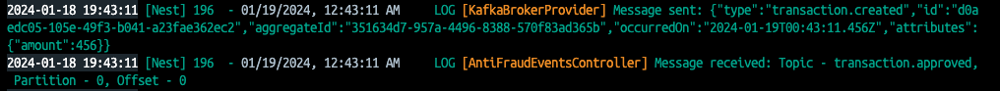
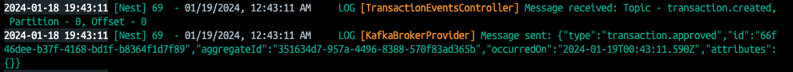
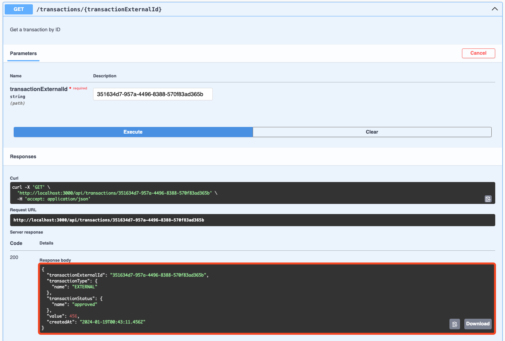
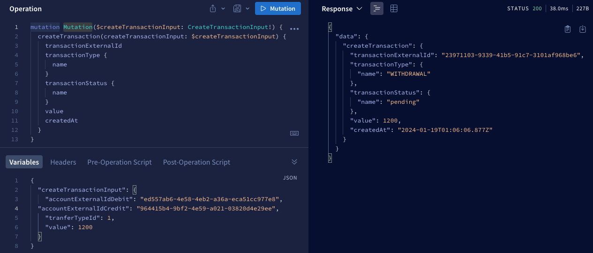
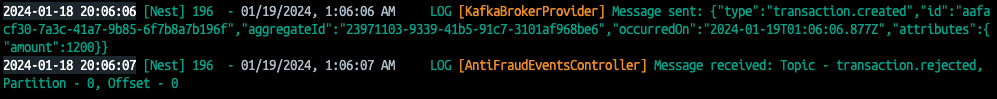
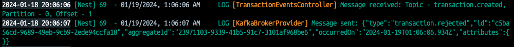
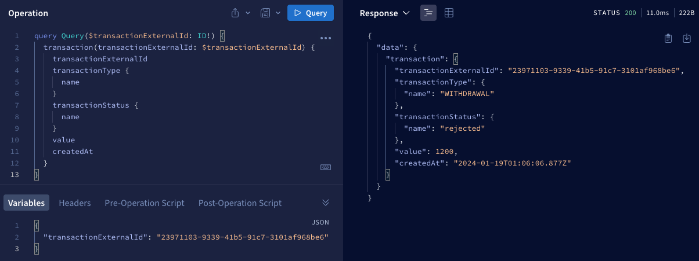

# Yape Code Challenge :rocket:

Our code challenge will let you marvel us with your Jedi coding skills :smile:. 

Don't forget that the proper way to submit your work is to fork the repo and create a PR :wink: ... have fun !!

- [Problem](#problem)
- [Tech Stack](#tech_stack)
- [Send us your challenge](#send_us_your_challenge)

# Problem

Every time a financial transaction is created it must be validated by our anti-fraud microservice and then the same service sends a message back to update the transaction status.
For now, we have only three transaction statuses:

<ol>
  <li>pending</li>
  <li>approved</li>
  <li>rejected</li>  
</ol>

Every transaction with a value greater than 1000 should be rejected.



# Tech Stack

<ol>
  <li>Node. You can use any framework you want (i.e. Nestjs with an ORM like TypeOrm or Prisma) </li>
  <li>Any database</li>
  <li>Kafka</li>    
</ol>

We do provide a `Dockerfile` to help you get started with a dev environment.

You must have two resources:

1. Resource to create a transaction that must containt:

```json
{
  "accountExternalIdDebit": "Guid",
  "accountExternalIdCredit": "Guid",
  "tranferTypeId": 1,
  "value": 120
}
```

2. Resource to retrieve a transaction

```json
{
  "transactionExternalId": "Guid",
  "transactionType": {
    "name": ""
  },
  "transactionStatus": {
    "name": ""
  },
  "value": 120,
  "createdAt": "Date"
}
```

## Optional

You can use any approach to store transaction data but you should consider that we may deal with high volume scenarios where we have a huge amount of writes and reads for the same data at the same time. How would you tackle this requirement?

You can use Graphql;

# Send us your challenge

When you finish your challenge, after forking a repository, you **must** open a pull request to our repository. There are no limitations to the implementation, you can follow the programming paradigm, modularization, and style that you feel is the most appropriate solution.

If you have any questions, please let us know.

# Code Challenge

## Diagram
<ol>
  <li>The client consumes the endpoints exposed in RESTful API or GraphQL</li>
  <li>The api gateway call to Transaction microservice using gRPC</li>
  <li>The transaction microservice intercept query requests, if it exists in cache (Redis) then it responds automatically</li>
  <li>Otherwise Read / Write a PostgreSQL Database</li>
  <li>When a transaction is created then produce event to "transaction.created" topic</li>
  <li>The anti-fraud microservice consume events of the "transaction.created" topic and after validating them produce event to "transaction.approved" or "transaction.rejected" topic</li>
  <li>The transaction microservice consume event of the "transaction.approved" or "transaction.rejected" topcis and then update the transaction in the database</li>
</ol>



## Running the challenge

### Quick start:
1. Build and start all services
```bash
# build and start all with docker
$ npm run docker:run
```
2. Test the challenge using postman or any other tool.

### Manual start:
1. Edit and run ```docker-compose.yml```
2. Execute the steps indicated in ```README.md``` of each microservice
3. Test the challenge using postman or any other tool.


## Testing the challenge

### Approved (value = 456)
1. POST: ```http://localhost:3000/api/transactions```
```json
{
  "accountExternalIdDebit": "d847c08f-80ad-4d28-a372-abf3c0f5ba69",
  "accountExternalIdCredit": "c7c0fea4-38c7-47af-a8ba-abf3c0f5ba96",
  "tranferTypeId": 2,
  "value": 456
}
```


2. Transaction microservice log



3. Anti-fraud microservice log



4. GET: ```http://localhost:3000/api/transactions/{id}```



## Rejected (value = 1200)
1. Mutation ```createTransaction```



2. Transaction microservice log



3. Anti-fraud microservice log



4. Query ```transaction```

