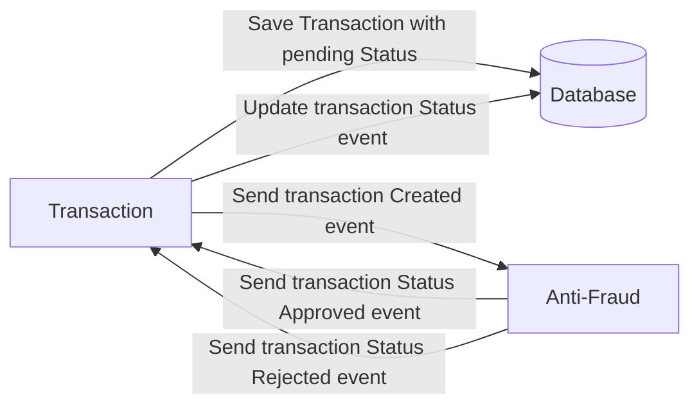

# Yape Code Challenge :rocket:
# Problem

Every time a financial transaction is created it must be validated by our anti-fraud microservice and then the same service sends a message back to update the transaction status.
For now, we have only three transaction statuses:

<ol>
  <li>pending</li>
  <li>approved</li>
  <li>rejected</li>  
</ol>

Every transaction with a value greater than 1000 should be rejected.

# Solution

The proposed solution involves the implementation of two microservices, developed under the Clean Architecture approach. These microservices communicate with each other through a messaging platform based on Kafka. It is worth noting that the first microservice, in addition to supporting message queue communication, can also receive HTTP requests, thanks to its hybrid nature.

# Run solution
1. Run the following command: docker-compose up
2. Test the following endpoints: 
## Save Transaction
curl --location 'http://localhost:3000/transactions/' \
--header 'Content-Type: application/json' \
--data '{
    "accountExternalIdDebit": "59e06a29-c84c-49cb-b920-9771d2765c79",
    "accountExternalIdCredit": "59e06a29-c84c-49cb-b920-9771d2765c79",
    "transferTypeId": 2,
    "value": 1001
}'

## Get Transaction
curl --location 'http://localhost:3000/transactions/a334b3ef-b45b-45cb-a2d5-2403bd46b960'