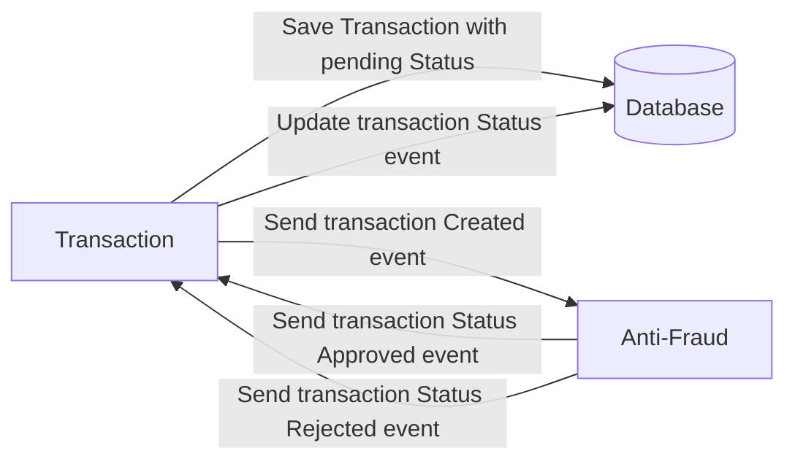

# Yape Code Challenge :rocket:

Our code challenge will let you marvel us with your Jedi coding skills :smile:. 

Don't forget that the proper way to submit your work is to fork the repo and create a PR :wink: ... have fun !!

- [Problem](#problem)
- [Tech Stack](#tech_stack)
- [Send us your challenge](#send_us_your_challenge)

# Problem

Every time a financial transaction is created it must be validated by our anti-fraud microservice and then the same service sends a message back to update the transaction status.
For now, we have only three transaction statuses:

<ol>
  <li>pending</li>
  <li>approved</li>
  <li>rejected</li>  
</ol>

Every transaction with a value greater than 1000 should be rejected.



# Tech Stack

<ol>
  <li>Node. You can use any framework you want (i.e. Nestjs with an ORM like TypeOrm or Prisma) </li>
  <li>Any database</li>
  <li>Kafka</li>    
</ol>

We do provide a `Dockerfile` to help you get started with a dev environment.

You must have two resources:

1. Resource to create a transaction that must containt:

```json
{
  "accountExternalIdDebit": "Guid",
  "accountExternalIdCredit": "Guid",
  "tranferTypeId": 1,
  "value": 120
}
```

2. Resource to retrieve a transaction

```json
{
  "transactionExternalId": "Guid",
  "transactionType": {
    "name": ""
  },
  "transactionStatus": {
    "name": ""
  },
  "value": 120,
  "createdAt": "Date"
}
```

## Optional

You can use any approach to store transaction data but you should consider that we may deal with high volume scenarios where we have a huge amount of writes and reads for the same data at the same time. How would you tackle this requirement?

You can use Graphql;

# Send us your challenge

When you finish your challenge, after forking a repository, you **must** open a pull request to our repository. There are no limitations to the implementation, you can follow the programming paradigm, modularization, and style that you feel is the most appropriate solution.

If you have any questions, please let us know.

# Pasos para levantar e iniciar el proyecto

1. Una vez descargado el repositorio y estando en la raíz ejecutamos la siguiente linea de comando
```
npm i
```

2. Nos movemos a hacia la carpeta anti-fraud y ejecutamos la siguiente linea de comando
```
pnpm install
```

3. Nos movemos a hacia la carpeta api-transaction y ejecutamos la siguiente linea de comando
```
pnpm install
```

4. Abrimos 3 diferentes terminales una para la carpeta raíz, otra para la carpeta anti-fraud y otra para la carpeta, api-transaction y ejecutamos las siguientes lineas de comando, es importante resaltar que debe esperarse que el docker levante correctamente antes de levantar las aplicaciones de nestjs
```
#para la raiz
#validar que se tiene el docker activo e iniciado
docker compose up

#para anti-fraud
pnpm run start:dev

#para api-transaction
pnpm run start:dev
```

## Nota importante:
El sistema se realizo como una prueba de desarrollo, por ello todo lo que sucede en el mismo está para un ambiente que no implica produccion, siendo esto una prueba concepto y teniendo dicho comportamiento.

En la raiz del repositorio se encuentra un archivo de peticiones de insonmia para testear el flujo solicitado.
